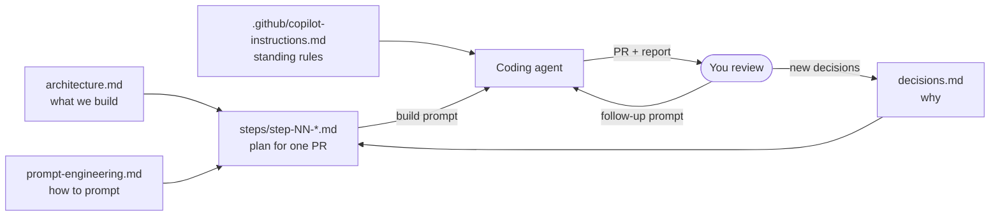

# Documentation

Start here. The docs are written to be read by people **and** pointed at by
coding agents: every step prompt tells the agent to read these files first.

| Document | What it is | Read it when |
| -------- | ---------- | ------------ |
| [architecture.md](architecture.md) | The system: goals, two profiles, C4 views, project structure, ports, data model, index and ACL model, nine sequence diagrams, API, security, observability, config, deployment, SLOs | Before any step; whenever a prompt says "architecture §n" |
| [decisions.md](decisions.md) | Architecture decision records D-01…D-20, plus per-step decisions (D-&lt;step&gt;-nn) | When you wonder "why this and not that" |
| [prompt-engineering.md](prompt-engineering.md) | How to prompt a coding agent: workflow, prompt anatomy, twelve principles (P1–P12), template, follow-ups, anti-patterns | Before Step 0, then whenever a "why this is a good prompt" row cites a principle |
| [steps/README.md](steps/README.md) | The 13-step roadmap: one plan page per step, each with a copy-paste build prompt and an explanation of why the prompt works | To build the project |
| [../.github/copilot-instructions.md](../.github/copilot-instructions.md) | Standing repository conventions loaded by Copilot automatically | Keep it up to date as decisions change |

## How the pieces fit

## Reading order for learning

1. [architecture.md](architecture.md) §1–5 (goals, context, containers per profile, solution structure, components).
2. [prompt-engineering.md](prompt-engineering.md) in full.
3. [steps/README.md](steps/README.md), then Step 0.
4. For each step: read the page, run the prompt, review with the checklist,
   then read the "Why this is a good prompt" table again after seeing the result.
