# Architecture

Target architecture for **Knowledge Copilot (.NET)**: a permission-aware RAG
copilot with generative UI, built on .NET 10 and Aspire 13, with a Python
evaluation harness. One codebase, two deployment profiles (`free` and `azure`).

Every step page in [`docs/steps`](steps/README.md) builds a slice of this
picture. Design choices and their alternatives are in
[decisions.md](decisions.md).

- [1. Goals and quality attributes](#1-goals-and-quality-attributes)
- [2. System context](#2-system-context)
- [3. Containers per profile](#3-containers-per-profile)
- [4. Solution structure](#4-solution-structure)
- [5. Components inside api and worker](#5-components-inside-api-and-worker)
- [6. Ports and adapters](#6-ports-and-adapters)
- [7. Data model](#7-data-model)
- [8. Search index schema and ACL model](#8-search-index-schema-and-acl-model)
- [9. Sequence diagrams](#9-sequence-diagrams)
- [10. API surface](#10-api-surface)
- [11. Security model](#11-security-model)
- [12. Observability](#12-observability)
- [13. Configuration](#13-configuration)
- [14. Deployment](#14-deployment)
- [15. Initial SLOs and budgets](#15-initial-slos-and-budgets)

---

## 1. Goals and quality attributes

| Goal                                                  | How the architecture achieves it                                                                                         |
| ----------------------------------------------------- | ------------------------------------------------------------------------------------------------------------------------ |
| Users only ever see content they are allowed to see   | ACL filter is pushed **into** every index query; tenant is mandatory; caches are keyed by principal set                  |
| Answers are grounded and cite their sources           | Retrieved chunks are the only context; citations are validated against the retrieved set; refuse when context is empty |
| Rich answers (charts, tables, actions), not just text | Typed tool calls streamed in the AI SDK UI message stream and rendered as React components                               |
| Side effects never happen without a human             | Action tools require an approval round-trip that the server verifies                                                     |
| Swap cloud for local OSS with a config change         | Hexagonal core; `Profile` selects adapters at the composition root only                                                  |
| Quality is measured, not guessed                      | Python RAGAS harness runs the same golden set against both profiles; CI gate                                             |
| Cheap to run                                          | `free` costs $0; `azure` targets ~$10–25/month using free tiers and scale-to-zero                                        |
| Observable end to end                                 | OpenTelemetry from day one via Aspire ServiceDefaults; GenAI spans, TTFT and cost metrics                                |

## 2. System context

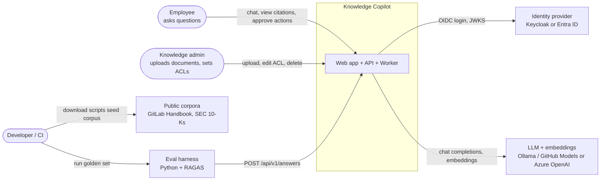

## 3. Containers per profile

Both profiles run the **same three app images** (`web`, `api`, `worker`). Only
the backing services behind each port differ.

### 3.1 `Profile=Free` (local, OSS, $0), orchestrated by the Aspire AppHost

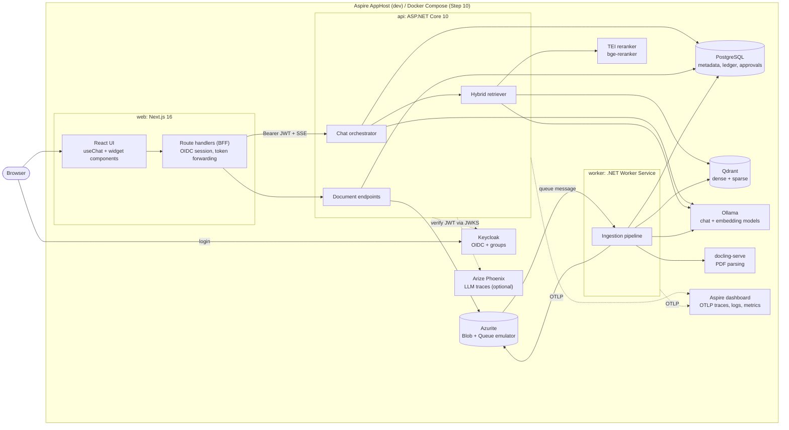

### 3.2 `Profile=Azure` (managed, scale-to-zero)

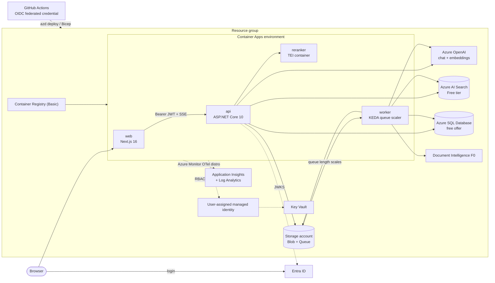

## 4. Solution structure

```text
knowledge-copilot-dotnet/
├── global.json                      # pins .NET 10 SDK
├── KnowledgeCopilot.slnx            # solution (XML .slnx format)
├── Directory.Build.props            # net10.0, nullable, warnings-as-errors, analyzers
├── Directory.Packages.props         # central package versions
├── Makefile                         # setup · build · lint · test · dev · contracts · eval
├── src/
│   ├── KnowledgeCopilot.AppHost/            # Aspire orchestration for both profiles
│   ├── KnowledgeCopilot.ServiceDefaults/    # OTel, health, resilience, service discovery
│   ├── KnowledgeCopilot.Contracts/          # C# records: the single source of truth for payloads
│   ├── KnowledgeCopilot.Domain/             # ports (interfaces) + pure domain logic, no vendor SDKs
│   ├── KnowledgeCopilot.Application/        # use cases: ingestion, retrieval, chat, approvals
│   ├── KnowledgeCopilot.Persistence/        # EF Core DbContext + entities
│   ├── KnowledgeCopilot.Persistence.Migrations.Postgres/
│   ├── KnowledgeCopilot.Persistence.Migrations.SqlServer/
│   ├── KnowledgeCopilot.Adapters.Common/    # Storage Blob/Queue, TEI reranker, Markdown parser
│   ├── KnowledgeCopilot.Adapters.Free/      # Qdrant, Ollama, docling-serve
│   ├── KnowledgeCopilot.Adapters.Azure/     # AI Search, Azure OpenAI, Doc Intelligence, Graph overage
│   ├── KnowledgeCopilot.Adapters.Fakes/     # in-memory test doubles for every port
│   ├── KnowledgeCopilot.Api/                # minimal API host + composition root
│   └── KnowledgeCopilot.Worker/             # queue consumer host + composition root
├── tests/
│   ├── KnowledgeCopilot.Domain.Tests/
│   ├── KnowledgeCopilot.Application.Tests/
│   ├── KnowledgeCopilot.Adapters.ContractTests/   # one abstract suite per port, run per adapter
│   ├── KnowledgeCopilot.Architecture.Tests/       # dependency rules
│   ├── KnowledgeCopilot.Api.Tests/
│   └── KnowledgeCopilot.AppHost.Tests/      # Aspire.Hosting.Testing end-to-end
├── web/                                     # Next.js 16 app (pnpm)
│   └── src/contracts/                       # generated TS types + zod schemas
├── evals/                                   # Python 3.12 + uv + RAGAS
│   └── src/knowledge_evals/contracts/       # generated Pydantic models
├── contracts/schema/                        # generated, committed OpenAPI + JSON Schema
├── tools/                                   # codegen + dataset download scripts
├── infra/                                   # Bicep (Step 11)
├── deploy/                                  # Compose output, Keycloak realm, seed data (Step 10)
├── loadtests/                               # k6 scenarios (Step 12)
└── docs/
```

**Dependency rule** (enforced by an architecture test in Step 2):

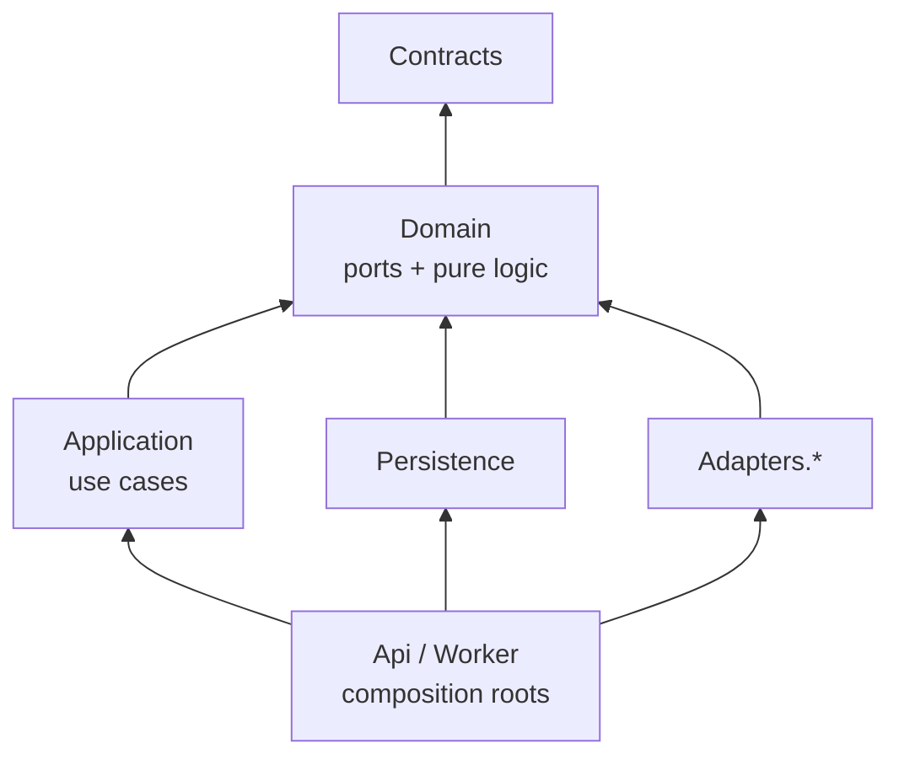

`Domain` and `Application` never reference a vendor SDK. Only the hosts know
which adapter implements which port.

## 5. Components inside api and worker

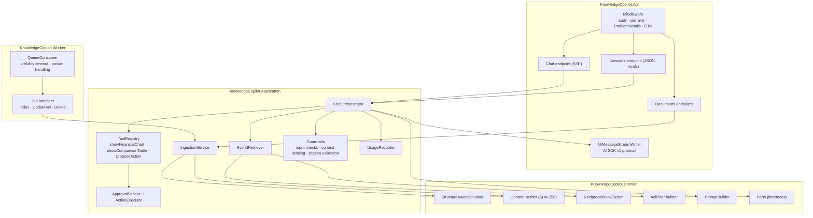

## 6. Ports and adapters

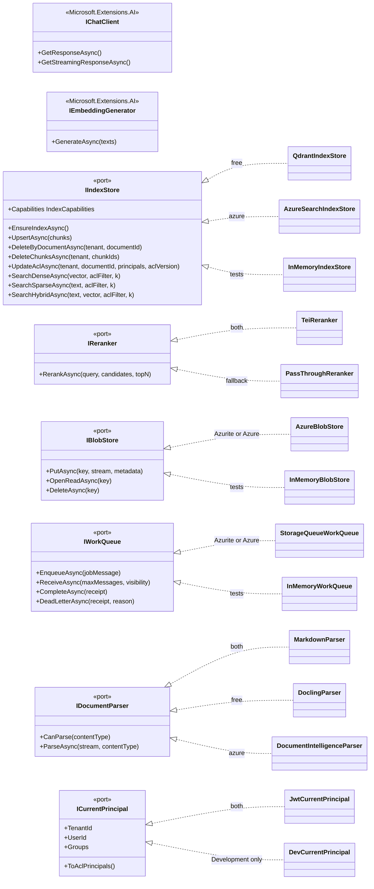

| Port                  | `Free` adapter                                   | `Azure` adapter                        | Test double              |
| --------------------- | ------------------------------------------------ | -------------------------------------- | ------------------------ |
| `IChatClient`         | OllamaSharp (or GitHub Models via OpenAI client) | Azure OpenAI via `Azure.AI.OpenAI`     | `ScriptedChatClient`     |
| `IEmbeddingGenerator` | OllamaSharp embedding model                      | Azure OpenAI `text-embedding-3-small`  | `HashEmbeddingGenerator` |
| `IIndexStore`         | Qdrant (dense + sparse BM25 with IDF modifier)   | Azure AI Search (vector + BM25, RRF)   | `InMemoryIndexStore`     |
| `IReranker`           | TEI container                                    | TEI container on ACA                   | `PassThroughReranker`    |
| `IBlobStore`          | Azure Blob SDK → Azurite                         | Azure Blob SDK → Storage account       | `InMemoryBlobStore`      |
| `IWorkQueue`          | Storage Queue SDK → Azurite                      | Storage Queue SDK → Storage account    | `InMemoryWorkQueue`      |
| `IDocumentParser`     | Markdown (built-in) + docling-serve              | Markdown (built-in) + Doc Intelligence | Markdown only            |
| Metadata DB           | EF Core + Npgsql → PostgreSQL                    | EF Core + SqlServer → Azure SQL        | EF Core SQLite in-memory |
| Identity              | JwtBearer → Keycloak                             | JwtBearer → Entra ID (+ Graph overage) | `DevCurrentPrincipal`    |
| Telemetry exporter    | OTLP → Aspire dashboard / Phoenix                | Azure Monitor OTel distro              | in-memory exporter       |

`IndexCapabilities` lets the retriever choose: if `NativeHybrid` is true and
the request does not ask for manual fusion, call `SearchHybridAsync`; otherwise
run dense and sparse in parallel and fuse with the domain `ReciprocalRankFusion`.

## 7. Data model

The metadata database is the system of record for documents, ACLs, ingestion
state, approvals and usage. The search index is a **derived** projection and
can be rebuilt from the database plus blob storage.

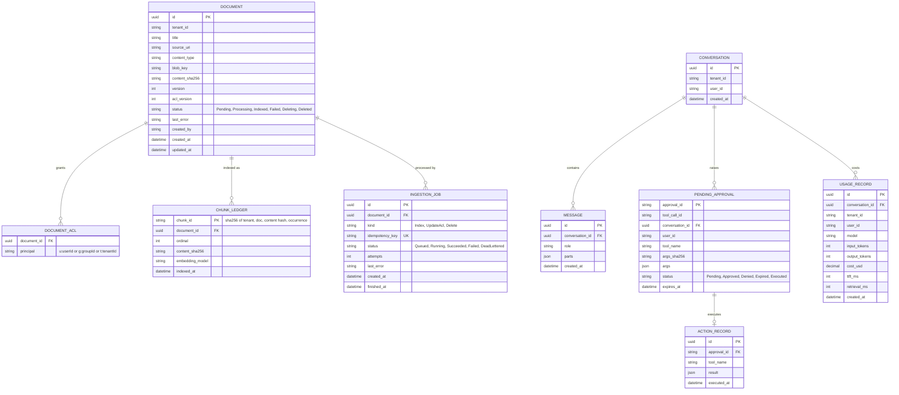

## 8. Search index schema and ACL model

One index (`kc-chunks`) per environment. Every chunk carries its tenant and ACL
principals, so the filter runs **inside** the search engine (pre-filtering).
Filtering after retrieval would both leak (scores, counts, timing) and starve
top-k.

| Field                           | Type                        | Purpose                                                      |
| ------------------------------- | --------------------------- | ------------------------------------------------------------ |
| `chunk_id`                      | key                         | Deterministic; makes upserts idempotent                      |
| `tenant_id`                     | keyword, filterable         | Mandatory filter; Qdrant payload index with `is_tenant=true` |
| `document_id`                   | keyword, filterable         | Delete and ACL update by document                            |
| `acl_principals`                | keyword[], filterable       | `u:…`, `g:…`, `t:…` (whole tenant)                           |
| `acl_version`                   | int                         | Detects stale ACL projections                                |
| `title`, `heading_path`, `page` | text / keyword              | Citations and display                                        |
| `text`                          | text (BM25)                 | Sparse/keyword retrieval and LLM context                     |
| `content_sha256`                | keyword                     | Change detection                                             |
| `dense`                         | vector (dims from embedder) | Semantic retrieval                                           |
| `sparse`                        | sparse vector (Qdrant only) | BM25-style term weights; Qdrant applies the IDF modifier     |

**Filter, built once in `Domain.AclFilter` and translated by each adapter:**

```text
tenant_id == principal.TenantId
AND acl_principals ANY OF [ "u:{userId}", "g:{group1}", …, "t:{tenantId}" ]
```

- Qdrant: `must: [ match tenant_id, match_any acl_principals ]`
- Azure AI Search: `tenant_id eq 'T' and acl_principals/any(p: search.in(p, 'u:x,g:y,t:T', ','))`

**Capacity note.** AI Search Free allows 50 MB of storage. At 1536 dimensions ×
4 bytes a vector is ~6 KB, so a few thousand chunks fill it. The `azure`
profile therefore requests 512-dimension embeddings
(`text-embedding-3-small` supports reduced dimensions) and the seed corpus is
capped. See [D-08](decisions.md#d-08-embeddings-dimensions-and-sparse-vectors).

## 9. Sequence diagrams

### 9.1 Local developer startup (Aspire)

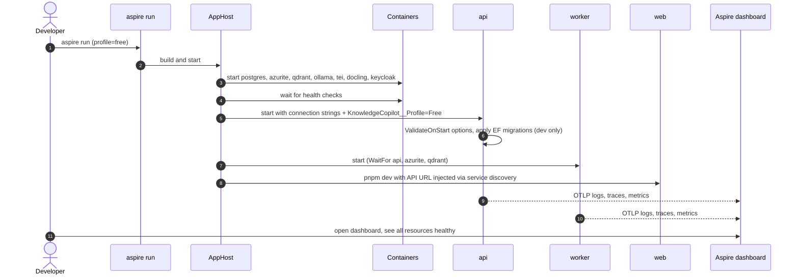

### 9.2 Document upload

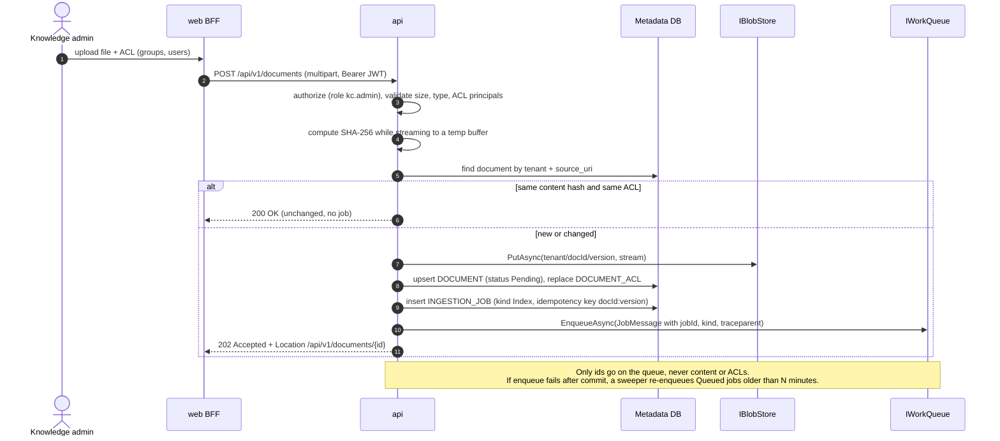

### 9.3 Worker indexing (idempotent, at-least-once)

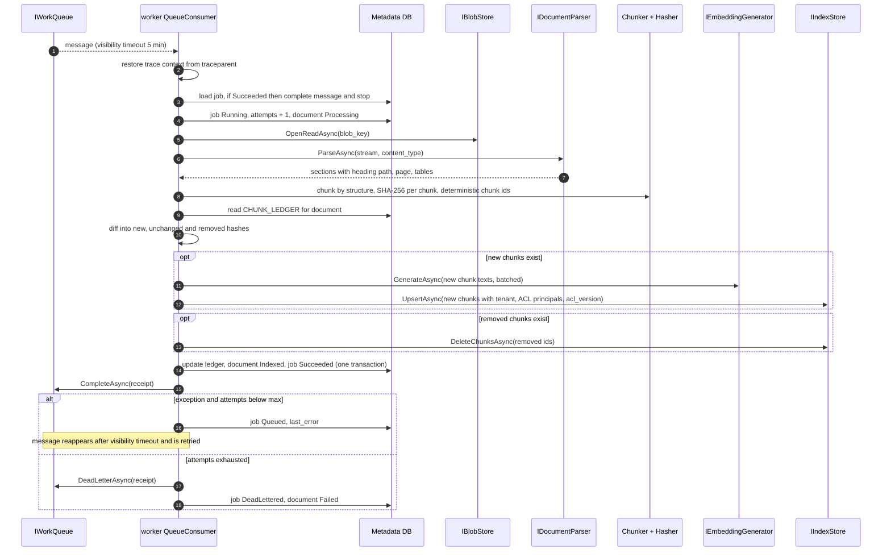

Re-running the same message is safe: chunk ids are deterministic, upserts
overwrite, and the ledger diff makes a second run embed zero chunks.

### 9.4 ACL change and delete (not hidden by content hashing)

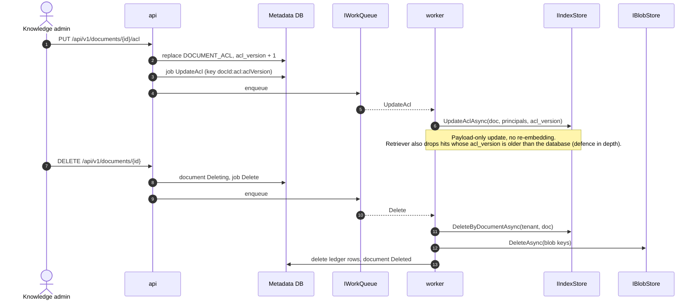

### 9.5 Login and token flow (Backend-for-Frontend)

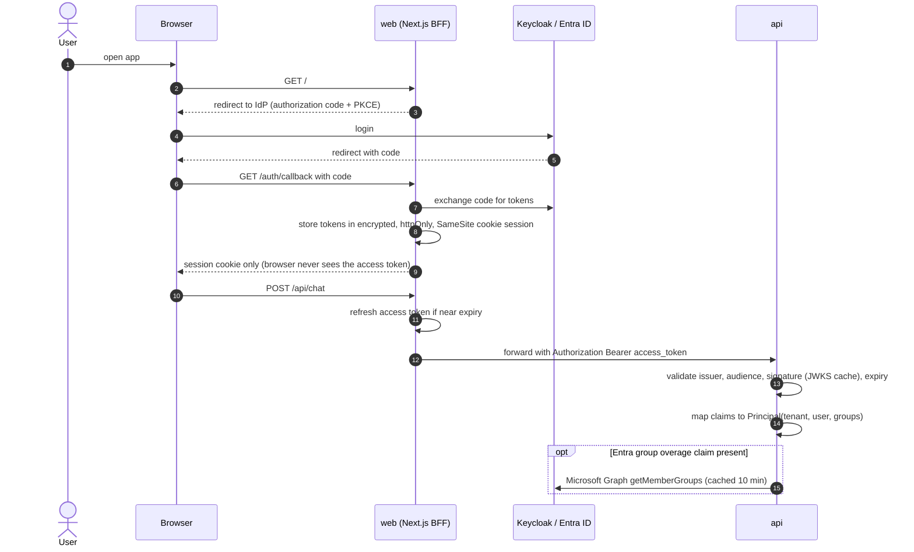

### 9.6 Chat: retrieval, streaming and widget tools

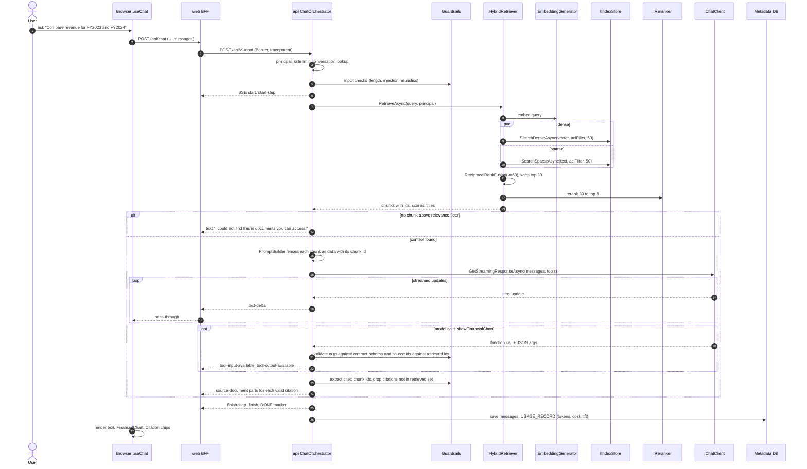

### 9.7 Action approval (human in the loop, server-verified)

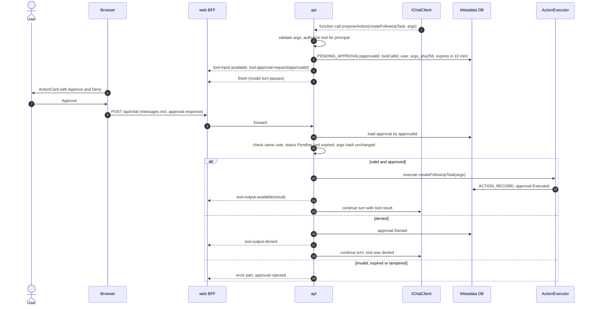

### 9.8 Evaluation run

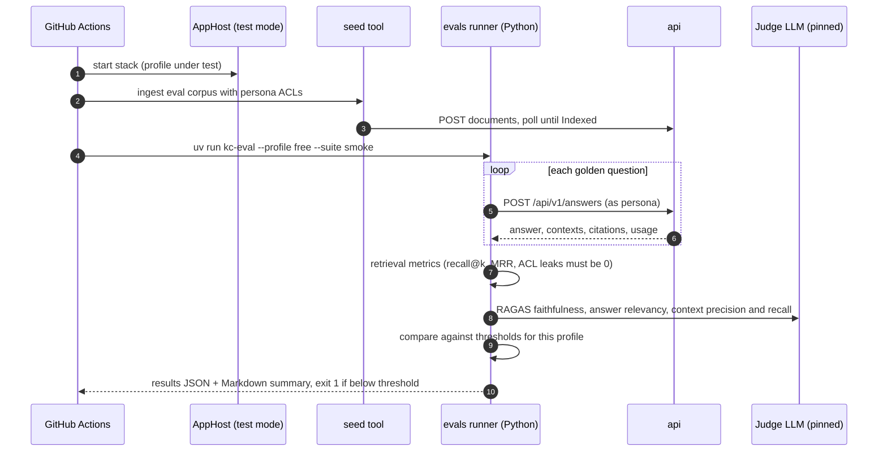

### 9.9 Azure deployment

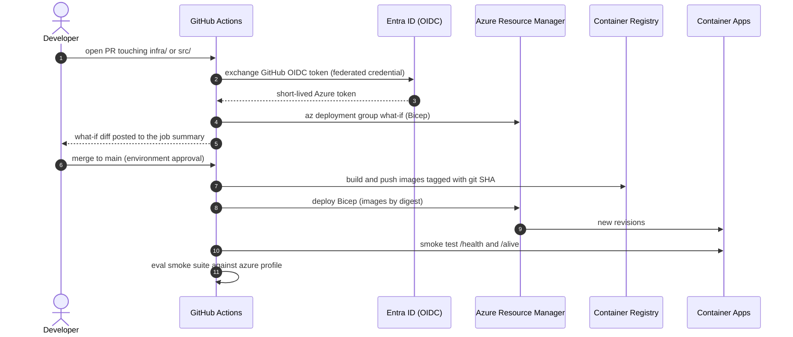

## 10. API surface

| Method & path                    | Auth                | Purpose                                         | Step |
| -------------------------------- | ------------------- | ----------------------------------------------- | ---- |
| `GET /alive`                     | anonymous           | Liveness: process is up                         | 0    |
| `GET /health`                    | anonymous           | Readiness: dependencies reachable               | 0    |
| `GET /openapi/v1.json`           | dev only            | OpenAPI 3.1 document                            | 1    |
| `POST /api/v1/documents`         | `kc.admin`          | Upload + ACL; 202 with job                      | 3    |
| `GET /api/v1/documents`          | user                | List documents the caller can see               | 3    |
| `GET /api/v1/documents/{id}`     | user (ACL)          | Status and metadata                             | 3    |
| `PUT /api/v1/documents/{id}/acl` | `kc.admin`          | Replace ACL; enqueues UpdateAcl                 | 3    |
| `DELETE /api/v1/documents/{id}`  | `kc.admin`          | Enqueues Delete                                 | 3    |
| `POST /api/v1/search`            | user                | Debug retrieval: ranked chunks (dev and evals) | 4    |
| `POST /api/v1/chat`              | user                | SSE, AI SDK UI message stream v1                | 5    |
| `POST /api/v1/answers`           | user / eval persona | Non-streaming answer + contexts for evals       | 5    |

Errors use RFC 9457 `ProblemDetails`. All business endpoints are versioned
under `/api/v1`.

## 11. Security model

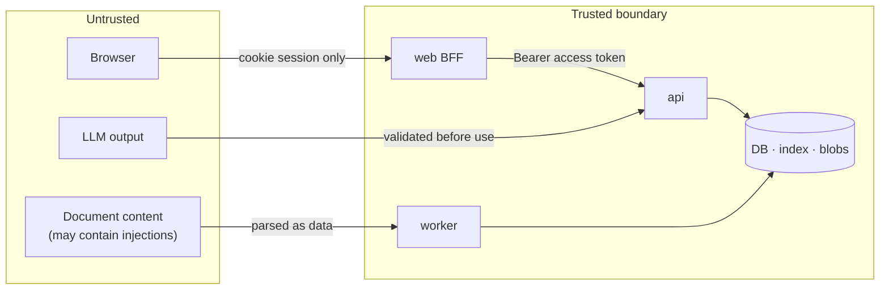

| Threat                                  | Mitigation                                                                                                   | Step  |
| --------------------------------------- | ------------------------------------------------------------------------------------------------------------ | ----- |
| Cross-user or cross-tenant data leak    | ACL pre-filter in index query; tenant mandatory; ACL leak tests for every adapter; `acl_version` check        | 4, 8  |
| Stale permissions after ACL change      | Separate `UpdateAcl` job; `acl_version` compared at query time                                                | 3, 4  |
| Indirect prompt injection via documents | Context fenced as data with ids; system prompt says documents are untrusted; tools cannot exfiltrate; tests  | 5     |
| Forged or replayed approvals            | Server-side `PENDING_APPROVAL` bound to user, tool call, args hash, expiry; single use                        | 5, 7  |
| Hallucinated citations                  | Citations must reference retrieved chunk ids; others are dropped                                              | 5     |
| Token theft in the browser              | BFF pattern: httpOnly encrypted cookie; access token only server-side                                         | 8     |
| Dev auth shortcut reaching production   | `DevCurrentPrincipal` registered only in `Development`; startup fails otherwise                               | 2     |
| Semantic cache leak                     | Cache key includes tenant + sorted principal-set hash + model + prompt version                                | 12    |
| Cost or DoS abuse                       | Per-user and per-tenant rate limits, max tokens, upload size limits                                           | 12    |
| Secrets in repo or CI                   | Managed identity, Key Vault, GitHub OIDC; no keys in config; secret scanning                                  | 0, 11 |
| Malicious uploads                       | Content-type allow-list, size cap, parser isolated in its own container                                       | 3     |

## 12. Observability

- **Traces:** ASP.NET Core, HttpClient, EF Core, Azure SDK, and
  `Microsoft.Extensions.AI` `UseOpenTelemetry()` (GenAI semantic conventions
  such as `gen_ai.request.model` and `gen_ai.usage.input_tokens`). Trace
  context is carried through the queue in the message's `traceparent`.
- **Custom spans:** `retrieval.dense`, `retrieval.sparse`, `retrieval.fuse`,
  `retrieval.rerank`, `ingest.parse`, `ingest.chunk`, `ingest.embed`,
  `ingest.index`.
- **Metrics:** `kc.chat.ttft` (histogram, ms), `kc.retrieval.duration`,
  `kc.llm.cost` (USD counter by model and tenant), `kc.ingest.chunks`
  (embedded vs skipped), `kc.queue.age`.
- **Every signal** carries `app.profile`, `deployment.environment` and
  `service.version`.
- **Exporters:** OTLP → Aspire dashboard (always in dev) and optionally Phoenix;
  Azure Monitor distro in `azure`.
- **Prompt and completion content** is not recorded by default; enable it only
  in dev via `KnowledgeCopilot:Telemetry:CaptureContent=true`.

## 13. Configuration

Options classes are bound from configuration sections and validated with
`ValidateOnStart()`, so a misconfigured profile fails at boot rather than on the
first request.

| Section                      | Keys (examples)                                                          | Profiles |
| ---------------------------- | ------------------------------------------------------------------------ | -------- |
| `KnowledgeCopilot`           | `Profile` (`Free` / `Azure`)                                             | both     |
| `KnowledgeCopilot:Llm`       | `ChatModel`, `EmbeddingModel`, `EmbeddingDimensions`, `MaxOutputTokens`  | both     |
| `KnowledgeCopilot:Retrieval` | `DenseK`, `SparseK`, `RrfK`, `RerankTopN`, `MinRelevance`                | both     |
| `KnowledgeCopilot:Ingestion` | `MaxUploadMb`, `ChunkTargetTokens`, `ChunkOverlapTokens`, `MaxAttempts`  | both     |
| `KnowledgeCopilot:Auth`      | `Authority`, `Audience`, `TenantClaim`, `GroupsClaim`                    | both     |
| `KnowledgeCopilot:Pricing`   | per-model USD per 1M input and output tokens                             | both     |
| `ConnectionStrings:*`        | injected by Aspire (`kcdb`, `blobs`, `queues`, `qdrant`, …)              | both     |

Locally, secrets go in user secrets or Aspire parameters. In Azure, apps use
managed identity, so no connection string contains a key.

## 14. Deployment

| Concern      | `Free`                                                                 | `Azure`                                                         |
| ------------ | ---------------------------------------------------------------------- | --------------------------------------------------------------- |
| Dev loop     | `aspire run` (AppHost starts every container)                          | `aspire run` with `profile=azure` against a dev resource group |
| Packaging    | .NET SDK container publish (no Dockerfile) + Next.js Dockerfile        | same images                                                     |
| Run anywhere | Docker Compose generated by Aspire's Docker publisher, then committed | Container Apps via Bicep in `infra/`                            |
| CI/CD        | CI builds images and runs the eval smoke suite                         | GitHub OIDC → what-if on PR → deploy on main → smoke + eval     |

## 15. Initial SLOs and budgets

Initial targets, revisited with load-test data in Step 12.

| Metric                                  | `Free` (laptop) | `Azure`                      |
| --------------------------------------- | --------------- | ---------------------------- |
| Time to first token p95                 | < 6 s           | < 2.5 s                      |
| Retrieval (embed + search + rerank) p95 | < 800 ms        | < 500 ms                     |
| Ingestion, 100-page Markdown document   | < 60 s          | < 60 s                       |
| Cost per answered question              | $0              | < $0.002                     |
| Monthly spend                           | $0              | $10–25 (budget alert at $20) |
| ACL leaks in eval suite                 | 0 (hard gate)   | 0 (hard gate)                |
