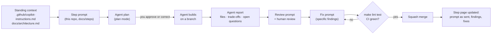

# Prompt engineering guide

This project is built one step at a time, each from **one carefully written
prompt** to a coding agent (GitHub Copilot CLI or the Copilot coding agent),
followed by review, fixes and a merge. Writing those prompts well is half of
what this project teaches.

This page explains the principles every step prompt follows. Each step page
has a **"Why this is a good prompt"** table that refers back to them by number
(P1–P12).

- [The workflow](#the-workflow)
- [Anatomy of a step prompt](#anatomy-of-a-step-prompt)
- [The twelve principles](#the-twelve-principles)
- [Prompt template](#prompt-template)
- [Follow-up prompts: review, fix, explain](#follow-up-prompts-review-fix-explain)
- [Anti-patterns](#anti-patterns)
- [What each step teaches](#what-each-step-teaches)

## The workflow



1. Run the step prompt in **plan mode** first. Read the plan before any code is
   written; correcting a plan is cheap, correcting a PR is not.
2. Let the agent build, then read its **report** (file list, trade-offs, open
   questions) before reading the diff.
3. Run the step's **review prompt** (a second pass that hunts for specific
   failure modes), then your own review.
4. Send **fix prompts** that cite exact findings.
5. Merge, then record the prompt as actually sent, the findings and the fixes
   on the step page. The record is the learning artefact.

## Anatomy of a step prompt

Every step prompt has the same sections, in the same order. The order is part
of the technique: the agent reads context before instructions, instructions
before limits, and limits before the definition of done.

| # | Section                    | Answers the question                                    |
| - | -------------------------- | ------------------------------------------------------- |
| 1 | **Role and context**       | What is this project, and where are we in it?           |
| 2 | **Read first**             | Which files hold the facts I must not contradict?       |
| 3 | **Current state**          | What already exists that I must build on, not redo?     |
| 4 | **Task**                   | What exactly do I build, and where?                     |
| 5 | **Design requirements**    | Which details are already decided?                      |
| 6 | **Constraints**            | Which versions, libraries and patterns are fixed or forbidden? |
| 7 | **Non-goals**              | What must I not build yet?                              |
| 8 | **Acceptance criteria**    | How do we both know it's done?                          |
| 9 | **Process**                | How should I work (plan first, when to stop and ask)?   |
| 10 | **Report**                | What must I hand back, in what shape?                   |

## The twelve principles

### P1. Frame the role and the "why"

Say what the project is for (a learning and interview-prep project that must
still be production-grade) and which step this is. Agents make better trade-offs
when they know the purpose: "production-grade" alone pushes toward
over-engineering; "a learning project with production habits" pushes toward
clarity plus rigor.

### P2. Point to sources of truth instead of pasting them

Reference `docs/architecture.md`, `docs/decisions.md` and
`.github/copilot-instructions.md` by path and section. The prompt stays short,
the facts live in one place, and the agent is told those documents override
its assumptions. Repeat only the few facts that are critical for this step.

### P3. Bound the scope by naming things

Name the projects, folders, files, endpoints and types to create. "Add
ingestion" invites the agent to invent; "add `IngestionService` in
`KnowledgeCopilot.Application/Ingestion/` and `POST /api/v1/documents`" does
not. Named artefacts also make the diff easy to review against the prompt.

### P4. Fix constraints explicitly

Pin versions, libraries and patterns ("xUnit v3", "central package management",
"no MediatR", "`TimeProvider` instead of `DateTime.UtcNow`"). Also say what to
do when a constraint can't be met, for example "verify the API exists in the
installed package version; if not, stop and report rather than guess." This
blocks the most common agent failure: confidently inventing an API.

### P5. State non-goals

List the tempting next things the agent must **not** build ("no auth yet", "no
Dockerfiles", "no RAGAS"). Agents tend to be helpful beyond scope, and
out-of-scope code is unreviewed code that later steps have to work around.

### P6. Give concrete examples and test oracles

Where correctness is subtle, give a worked example the agent must reproduce:
a hand-computed RRF ranking, the exact SSE lines for a tool call, a sample
chunk-id input and its hash. Examples beat adjectives, and they turn into
tests.

### P7. Make "done" binary and checkable

Acceptance criteria are commands and observable behaviour:
`make lint && make test` pass; `curl` returns X; a specific test proves Y.
"Works well" or "is robust" can't be checked; "a second upload of the same
file embeds 0 chunks (asserted in `IngestionIdempotencyTests`)" can.

### P8. Ask for a plan first, and say when to stop and ask

"Before writing code, output a plan: the file tree, the public types, and any
decision not covered by the docs." Add: "If the docs and this prompt conflict,
or a required API doesn't exist, stop and ask." This turns hidden assumptions
into reviewable decisions.

### P9. Define the output contract

Ask for a fixed report: every file created or changed with a one-line reason,
decisions and trade-offs (to append to `docs/decisions.md`), deviations from
the prompt, how to verify, and open questions. This makes the agent's work
reviewable and feeds the step page.

### P10. Prompt for failure modes and security, not just the happy path

Name the threats and failure cases the code must handle and the negative tests
that prove it: forged approvals, cross-tenant queries, redelivered messages,
injected instructions in documents, expired tokens. Agents write happy-path code
unless failure modes are explicit requirements.

### P11. One step, one reviewable PR

Size each prompt so the result fits one PR a human can review in about an hour.
If the step is bigger, split it into sub-prompts (3a, 3b) with their own
acceptance criteria. Large diffs get rubber-stamped, and rubber-stamped code is
where bugs hide.

### P12. Iterate with precise follow-ups

Review and fix prompts cite exact files, lines, findings and the expected
behaviour. "Fix the bugs" fails; "`QueueConsumer.cs` completes the message
before the DB transaction commits. Move `CompleteAsync` after `SaveChangesAsync`
and add a test that kills the handler between the two" succeeds.

## Prompt template

Copy this into a new step and fill each section.

```text
# Role and context
You are working in <repo>, a <one-line purpose>. This is STEP <n> of 13: <title>.
<One or two sentences on why this step matters.>

# Read first (these override your assumptions)
- .github/copilot-instructions.md (conventions)
- docs/architecture.md §<sections>
- docs/decisions.md <ids>
- docs/steps/step-<nn>-<slug>.md (this step's plan)

# Current state
<What exists after the previous step that you must build on.>

# Task
<Numbered list naming projects, files, types, endpoints.>

# Design requirements
<Decided details, worked examples and oracles (P6).>

# Constraints
<Versions, libraries, patterns, forbidden things, what to do if blocked.>

# Non-goals
<Tempting things not to build yet.>

# Acceptance criteria
<Commands that must pass and behaviours proven by named tests.>

# Process
1. Output a plan first: file tree, public types, decisions not covered by the docs.
2. If anything conflicts or a required API does not exist, stop and ask.
3. Work in small commits; keep `make lint test` green.
4. Open a PR titled "Step <n>: <title>".

# Report (in the PR description)
- Every file created or changed, with a one-line reason
- Decisions and trade-offs (as D-<n>-xx entries for docs/decisions.md)
- Deviations from this prompt and why
- How to verify, as commands
- Open questions
```

## Follow-up prompts: review, fix, explain

Every step page includes these follow-ups, tailored to the step.

**Review prompt** (run it in a fresh session or with a review agent, so the
reviewer doesn't share the builder's assumptions):

```text
Review the diff on this branch against docs/steps/step-<nn>-<slug>.md.
Look only for: <3–6 step-specific failure modes>.
For each finding give file:line, why it is wrong, and the smallest fix.
Do not comment on style. If you find nothing in a category, say so.
```

**Fix prompt:**

```text
Fix these review findings, one commit each, with a test that fails before the fix:
1. <file:line> <finding> -> <expected behaviour>
2. ...
Do not change anything else. Re-run make lint test and report results.
```

**Explain prompt** (for learning; ask it after merging):

```text
Explain <concept used in this step> as it is implemented in <file>.
Use our code, not generic examples. Then give me three interview questions
about it, with model answers that reference our design decisions.
```

## Anti-patterns

| Anti-pattern                      | Example                                   | Why it fails                                        | Do this instead                           |
| --------------------------------- | ----------------------------------------- | --------------------------------------------------- | ----------------------------------------- |
| Vague quality words               | "Make it production-grade and robust."    | Not checkable; invites gold-plating                 | Name the failure modes and tests (P7, P10) |
| Kitchen-sink prompt               | "Build ingestion, retrieval and chat."    | Unreviewable diff; shallow everywhere               | One step per PR (P11)                     |
| Silent version choice             | "Use Aspire."                             | Agent uses whatever its training data has           | Pin versions; verify APIs (P4)            |
| Contradicting the docs            | Prompt says Redis; docs say Storage Queues | Agent picks one at random                           | Point to docs as the source of truth (P2) |
| No non-goals                      | "Add the chat endpoint."                  | Agent also adds auth, caching and UI                | List non-goals (P5)                       |
| Adjectives instead of examples    | "Implement RRF correctly."                | "Correct" is ambiguous (k? ties? 0- or 1-based?)    | Give a worked example (P6)                |
| "Fix the bugs"                    | After a failed CI run                     | Agent guesses, often breaks something else          | Cite file, line, expected behaviour (P12) |
| Trusting the summary              | Merging because the report looks good     | Reports describe intent, not behaviour              | Verify with commands and tests (P7)       |

## What each step teaches

Every prompt uses all twelve principles, but each step **highlights** one
technique that matters most for that kind of work.

| Step | Topic                       | Prompt technique highlighted                                           |
| ---- | --------------------------- | ---------------------------------------------------------------------- |
| 0    | Scaffold                    | Scoping by naming artefacts; non-goals (P3, P5)                        |
| 1    | Contracts                   | Single source of truth; generated artefacts plus a drift check (P2, P7) |
| 2    | Ports and fakes             | Interface-first prompting: give signatures, not implementations (P3, P6) |
| 3    | Ingestion                   | Invariants and failure scenarios as requirements (P10)                 |
| 4    | Hybrid retrieval            | Test oracles: hand-computed expected outputs (P6)                       |
| 5    | Chat API                    | Protocol-exact examples (few-shot wire format) (P6)                     |
| 6    | Evaluation harness          | Defining metrics and thresholds precisely; cross-language prompts (P7) |
| 7    | Generative UI               | Enumerating UI states; exhaustiveness checks (P3, P7)                  |
| 8    | Auth and multi-tenancy      | Threat-model prompting with negative tests (P10)                       |
| 9    | Observability               | Naming conventions as constraints (P4)                                 |
| 10   | Free packaging              | Environment parity and "verify, don't assume" (P4, P8)                 |
| 11   | Azure deployment            | Guardrails for cost and destructive actions; human gates (P8, P10)     |
| 12   | Hardening                   | Measure first: hypothesis, experiment, evidence (P7, P12)              |
