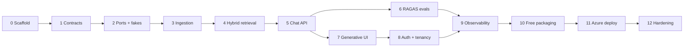

# Build steps

The project is built in 13 steps. Each step is **one prompt → one PR**. Every
step page contains:

1. **Goal, scope and non-goals**: what this step delivers and what it leaves out.
2. **Diagrams**: what the step adds to the architecture (new parts in green)
   and, where useful, a sequence diagram.
3. **Planned files** and **design notes / pitfalls**.
4. **The build prompt**, verbatim and ready to paste.
5. **Why this is a good prompt**: the prompt's sections mapped to principles
   [P1–P12](../prompt-engineering.md#the-twelve-principles).
6. **Follow-up prompts**: a targeted review prompt and a fix-prompt pattern.
7. **Human review checklist**, **how to verify**, and **interview talking points**.
8. **Prompt lesson**: the technique this step highlights.

Before starting, read [prompt-engineering.md](../prompt-engineering.md) once.

## Roadmap

| Step | Page                                                         | Delivers                                                         | Prompt lesson                         |
| ---- | ------------------------------------------------------------ | ---------------------------------------------------------------- | ------------------------------------- |
| 0    | [Scaffold and quality gates](step-00-scaffold.md)            | Solution, AppHost, health, CI, Makefile                          | Scoping by naming; non-goals          |
| 1    | [Contracts and codegen](step-01-contracts.md)                | C# records → OpenAPI/JSON Schema → TS + zod + Pydantic, drift CI | Single source of truth                |
| 2    | [Ports, fakes, composition root](step-02-ports-and-fakes.md) | Ports, fakes, contract suites, architecture tests, profile wiring | Interface-first prompting             |
| 3    | [Persistence and ingestion](step-03-ingestion.md)            | DB, blob, queue, parse, chunk, hash diff, ACL update, delete     | Invariants and failure scenarios      |
| 4    | [Hybrid retrieval](step-04-retrieval.md)                     | Dense ∥ sparse, RRF, rerank, ACL pre-filter, retrieval metrics   | Test oracles                          |
| 5    | [Chat and answers API](step-05-chat-api.md)                  | SSE UI message stream, tools, citations, guardrails, approvals   | Protocol-exact few-shot examples      |
| 6    | [RAGAS evaluation harness](step-06-evals.md)                 | Python harness, golden set, thresholds, CI gate                  | Precise metric definitions            |
| 7    | [Generative UI](step-07-generative-ui.md)                    | Next.js chat, widgets, citations, ActionCard                     | Enumerating UI states                 |
| 8    | [Auth and multi-tenancy](step-08-auth.md)                    | Keycloak/Entra, BFF, tenant isolation tests                      | Threat-model prompting                |
| 9    | [Observability](step-09-observability.md)                    | GenAI spans, queue propagation, cost/TTFT metrics, dashboards    | Naming conventions as constraints     |
| 10   | [Free profile packaging](step-10-free-packaging.md)          | Container images, Compose, Keycloak realm, seed data             | Environment parity                    |
| 11   | [Azure deployment](step-11-azure-deploy.md)                  | Bicep, ACA, managed identity, OIDC, what-if, budget              | Guardrails for costly actions         |
| 12   | [Hardening](step-12-hardening.md)                            | Rate limits, ACL-aware cache, load tests, cost per request       | Measure first                         |

## How to run a step

1. Create a branch `step-<nn>-<slug>` from `main`.
2. Paste the step's build prompt into Copilot CLI in **plan mode**, or assign
   it to the Copilot coding agent as an issue.
3. Review the plan. Correct it before approving.
4. Let it build. Read the report, then the diff.
5. Run the review prompt in a **fresh** session. Fix with targeted prompts.
6. `make lint test` green → squash merge.
7. On the step page, add the prompt as actually sent (if it changed), the
   review findings and what you learned. These notes are your interview prep.

## Versions verified when this plan was written

| Component                       | Version          |
| ------------------------------- | ---------------- |
| .NET SDK                        | 10.0.x (LTS)     |
| Aspire                          | 13.6.x           |
| Microsoft.Extensions.AI         | 10.10.x          |
| xUnit                           | v3               |
| Next.js                         | 16.x             |
| AI SDK (`ai` / `@ai-sdk/react`) | 7.x / 4.x        |
| RAGAS                           | 0.4.x            |
| Python / uv                     | 3.12 / latest    |

Prompts tell the agent to use the **latest patch** of these lines and to
verify APIs against the installed packages.
