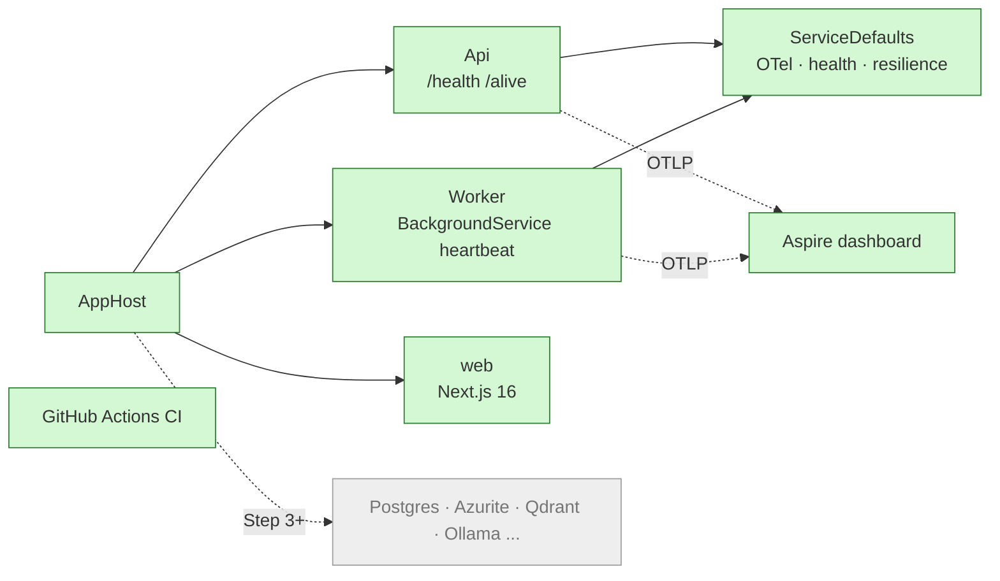

# Step 0: Scaffold and quality gates

| | |
| --- | --- |
| **Depends on** | nothing |
| **Branch** | `step-00-scaffold` |
| **PR size** | ~40 files, mostly generated or boilerplate |
| **Prompt lesson** | Scoping by naming artefacts; explicit non-goals (P3, P5) |

## Goal

A solution that builds, lints, tests and runs with one command, with no
features yet. `aspire run` starts api, worker and web; the dashboard shows all
three healthy. CI enforces the same gates. Every later step adds to this
skeleton instead of fighting it.

## Scope

**In**

- A prerequisites check (SDK, Aspire templates/CLI, Node, pnpm, uv, make)
  before anything is created.
- `global.json` (.NET 10 SDK, `rollForward: latestFeature`,
  `allowPrerelease: false`, Aspire SDK pinned under `msbuild-sdks`, test
  runner = Microsoft.Testing.Platform), `KnowledgeCopilot.slnx`,
  `Directory.Build.props`, `Directory.Packages.props`, `.editorconfig`,
  `Makefile`, `.gitignore` additions.
- Projects: `AppHost`, `ServiceDefaults`, `Api`, `Worker`, plus empty
  `Contracts`, `Domain`, `Application` class libraries so the dependency
  rule has something to point at.
- Test projects: `Api.Tests` (one health test), `AppHost.Tests` (one
  Aspire.Hosting.Testing smoke test).
- `web/`: Next.js 16 (App Router, TypeScript, pnpm) with one page and a
  `/api/health` route handler, started by the AppHost.
- `evals/`: uv project skeleton with one passing pytest.
- `/health` and `/alive` mapped in **all** environments (D-20).
- Options pattern with `ValidateOnStart` for `KnowledgeCopilot:Profile`,
  defined once in ServiceDefaults and used by both hosts. No appsettings file
  sets the profile.
- Lockfiles committed (`pnpm-lock.yaml`, `uv.lock`) and frozen installs in CI.
- JSON console logs outside Development.
- GitHub Actions: CI (`make lint test` for .NET, web, evals), SHA-pinned
  actions, `permissions: contents: read`, concurrency group; Dependabot for
  NuGet, .NET SDK (`global.json`), npm, uv and GitHub Actions.

**Out (non-goals for this step; each is built later)**

| Not in Step 0 | Built in |
| ------------- | -------- |
| Infrastructure containers (Postgres, Azurite, Qdrant, Ollama, TEI, docling, Keycloak) | Steps 3, 4, 8 |
| Domain types, ports, adapters | Step 2 |
| Contracts codegen, OpenAPI | Step 1 |
| Real endpoints | Steps 3–5 |
| Authentication | Step 8 |
| Dockerfiles, Docker Compose | Step 10 |
| Bicep, Azure resources, deployment workflows | Step 11 |
| Separate ADR files (decisions live only in `docs/decisions.md`) | never |

## What this step adds



## Planned files

```text
global.json
KnowledgeCopilot.slnx
Directory.Build.props
Directory.Packages.props
.editorconfig
.gitignore (add .next/, .venv/)
Makefile
src/KnowledgeCopilot.AppHost/{AppHost.cs, *.csproj}
src/KnowledgeCopilot.ServiceDefaults/{Extensions.cs, KnowledgeCopilotOptions.cs, *.csproj}
src/KnowledgeCopilot.Api/{Program.cs, appsettings.json, *.csproj}
src/KnowledgeCopilot.Worker/{Program.cs, HeartbeatService.cs, *.csproj}
src/KnowledgeCopilot.{Contracts,Domain,Application}/*.csproj
tests/KnowledgeCopilot.Api.Tests/{HealthEndpointTests.cs, OptionsValidationTests.cs}
tests/KnowledgeCopilot.AppHost.Tests/AppHostSmokeTests.cs
web/ (create-next-app output: package.json with packageManager, pnpm-lock.yaml,
      eslint.config.mjs, src/app/page.tsx, src/app/api/health/route.ts, vitest config + 1 test)
evals/{pyproject.toml, uv.lock, .python-version, src/knowledge_evals/__init__.py, tests/test_smoke.py}
.github/workflows/ci.yml
.github/dependabot.yml
```

## Design notes and pitfalls

- **Use the templates, then trim.** `dotnet new aspire-apphost`,
  `aspire-servicedefaults`, `webapi`, `worker`, `xunit3`. Remove weather
  samples. Agents sometimes write AppHost code from memory using APIs from
  older Aspire versions, so generating from templates avoids that.
- **Health in all environments.** The ServiceDefaults template wraps
  `MapDefaultEndpoints` in `if (app.Environment.IsDevelopment())`. Remove the
  condition (D-20). Keep `/health` details-free.
- **JavaScript hosting.** In Aspire 13 the Node/JS integration is
  `Aspire.Hosting.JavaScript`. Version 13.6.0 has `AddNextJsApp` (checked in the
  package's XML docs); the pnpm method still has to be checked against the
  installed package, not guessed.
- **Preview SDKs.** With `rollForward: latestFeature`, the SDK resolver picks
  a preview SDK if one is installed, unless `allowPrerelease: false`. On the
  author's machine this selected `10.0.400-preview` instead of `10.0.200`, so
  local builds and CI would use different SDKs.
- **The Aspire SDK version has no home in `Directory.Packages.props`.** The
  AppHost project uses `Sdk="Aspire.AppHost.Sdk"`; pin its version in
  `global.json` → `msbuild-sdks` so `.csproj` files carry no versions.
- **Test runner.** On .NET 10, xUnit v3 runs on Microsoft.Testing.Platform;
  select it once in `global.json` (`"test": { "runner": "Microsoft.Testing.Platform" }`).
- **Next.js 16 removed `next lint`.** The lint script is `eslint .` with the
  flat config that create-next-app generates.
- **Required means no default.** If any `appsettings*.json` sets
  `KnowledgeCopilot:Profile`, the "fails without a profile" test proves nothing.
- **Lockfiles.** "Passes on a clean clone" only means something with committed
  lockfiles and frozen installs (`pnpm install --frozen-lockfile`, `uv sync --locked`).
- **Prerequisites.** The Aspire templates and CLI aren't part of the .NET SDK.
  Check for them first; installing global tools is the developer's call.
- **Python version.** uv installs 3.12 for the project; don't depend on the
  system Python (which may be 3.13).
- **`.slnx`.** .NET 10 creates `.slnx` by default (`dotnet new sln`). Make sure
  every project is added.
- **Warnings as errors** from day one. Turning it on later costs a day.
- **SHA-pinned actions.** `actions/checkout@<40-char sha> # v5`. Dependabot
  keeps the SHAs current.
- **Makefile on Windows.** GNU make via `winget install ezwinports.make`.
  Avoid Bash-only syntax inside recipes; call `dotnet`, `pnpm`, `uv` directly.

## The build prompt

```text
# Role and context
You are a senior .NET engineer working in the repository knowledge-copilot-dotnet:
a permission-aware RAG copilot built with .NET 10 + Aspire 13, a Next.js 16 front end
and a Python RAGAS eval harness. It is a learning and interview-prep project held to
production standards, so the code must be clear first and rigorous second.
This is STEP 0 of 13: scaffold and quality gates. No features yet. The goal is a
skeleton that builds, lints, tests and runs with one command, which every later step
extends.

# Read first (these override your assumptions)
- .github/copilot-instructions.md (conventions; keep it in sync if you change one)
- docs/architecture.md section 4 (solution structure) and section 9.1 (dev startup)
- docs/decisions.md D-01, D-02, D-18, D-19, D-20
- docs/steps/step-00-scaffold.md (this step's plan, planned files and pitfalls)

# Current state
The repo has README.md, LICENSE, .gitignore, .github/copilot-instructions.md and docs/.
No code. The developer machine is Windows and may have a preview .NET SDK installed next
to the stable one. CI runs on ubuntu-latest.

# Prerequisites (check before creating anything)
Run and report: dotnet --list-sdks, dotnet new list aspire, aspire --version,
node --version, pnpm --version, uv --version, make --version.
Required: a stable .NET 10 SDK, Aspire project templates 13.6.x, Node 22+, pnpm 10, uv,
GNU make. If something is missing, give me the install command and wait. Do not install
global tools or templates without my OK. Python 3.12 comes from uv
(`uv python install 3.12`), not the system Python.

# Task
1. Root files:
   - global.json: sdk.version "10.0.100", rollForward "latestFeature",
     allowPrerelease false (a local preview SDK must never be selected);
     msbuild-sdks pins Aspire.AppHost.Sdk to the same 13.6.x as the Aspire packages;
     test.runner "Microsoft.Testing.Platform".
   - KnowledgeCopilot.slnx, Directory.Build.props (net10.0, Nullable enable,
     ImplicitUsings enable, TreatWarningsAsErrors true, AnalysisLevel latest-recommended,
     EnforceCodeStyleInBuild true), Directory.Packages.props
     (ManagePackageVersionsCentrally true), .editorconfig.
   - .gitignore: add .next/, .venv/ and any other output of the new toolchains.
2. Create from the official templates, then remove sample code:
   - src/KnowledgeCopilot.AppHost (aspire-apphost; Sdk attribute without a version)
   - src/KnowledgeCopilot.ServiceDefaults (aspire-servicedefaults)
   - src/KnowledgeCopilot.Api (webapi, minimal APIs, no controllers)
   - src/KnowledgeCopilot.Worker (worker)
   - src/KnowledgeCopilot.Contracts, .Domain, .Application (classlib, empty except one
     placeholder type each so the projects compile)
   - test projects on xUnit v3 (Microsoft.Testing.Platform).
3. AppHost: add api, worker and web. For web use Aspire.Hosting.JavaScript; the expected
   API is AddNextJsApp(...) plus the package's pnpm method. Confirm both names in the
   installed package before using them; if they differ, stop and report the options.
   Worker WaitFor api. Pass KnowledgeCopilot__Profile=Free to api and worker. Give web the
   api URL with WithReference (service discovery).
4. ServiceDefaults:
   - Keep OpenTelemetry, service discovery and the standard resilience handler.
   - Map /health and /alive in ALL environments (D-20).
   - Add KnowledgeCopilotOptions and AddKnowledgeCopilotOptions(): bind section
     "KnowledgeCopilot" with a required Profile enum (Free, Azure),
     ValidateDataAnnotations().ValidateOnStart().
   - No appsettings*.json file may set Profile. It comes only from the AppHost,
     environment variables or the test host.
5. Api: AddServiceDefaults() and AddKnowledgeCopilotOptions(). Outside Development, use
   the JSON console formatter.
6. Worker: same two calls, plus a HeartbeatService (BackgroundService) that logs once a
   minute using a [LoggerMessage] method and an injected TimeProvider.
7. web/: Next.js 16 App Router + TypeScript + ESLint, pnpm, src/ directory.
   - package.json has a packageManager field pinning pnpm; pnpm-lock.yaml is committed.
   - The lint script is `eslint .` (Next.js 16 removed `next lint`).
   - The dev script honours the PORT that Aspire assigns.
   - One page showing "Knowledge Copilot" and a GET /api/health route handler that
     returns {"status":"ok"}.
   - Vitest + Testing Library with one passing test.
8. evals/: uv project, .python-version 3.12, requires-python ">=3.12,<3.13", package
   knowledge_evals, pytest + ruff as dev dependencies, one test. uv.lock is committed.
9. Tests:
   - Api.Tests: WebApplicationFactory test that /health and /alive return 200 in the
     Production environment (the factory supplies Profile through configuration).
   - Api.Tests: the Api fails to start when KnowledgeCopilot:Profile is missing.
   - AppHost.Tests: Aspire.Hosting.Testing test that starts the AppHost and asserts api
     becomes healthy.
10. Makefile targets: setup, build, lint, test, dev, clean.
    - setup: dotnet restore, pnpm -C web install --frozen-lockfile, uv sync --project evals --locked.
    - lint: dotnet format --verify-no-changes, pnpm -C web lint, uv run --project evals ruff check.
    - test: dotnet test, pnpm -C web test, uv run --project evals pytest.
    - dev: aspire run (fall back to dotnet run --project src/KnowledgeCopilot.AppHost).
    - No bash-only syntax; recipes must work with GNU make on Windows and Linux.
11. .github/workflows/ci.yml: on pull_request and push to main; permissions contents: read;
    concurrency cancel-in-progress; runs-on ubuntu-latest.
    - Jobs dotnet, web and evals call make setup, lint, build and test for their part.
    - The dotnet job also sets up Node + pnpm, because the AppHost test starts web.
    - Every action is pinned to a full commit SHA with a version comment.
    - setup-dotnet reads global.json; uv comes from astral-sh/setup-uv.
    .github/dependabot.yml: nuget, dotnet-sdk (global.json), npm (web/), uv (evals/),
    github-actions; weekly; minor+patch grouped.

# Constraints
- Use the latest stable patch of: .NET 10 SDK, Aspire 13.6, xUnit v3, Next.js 16, pnpm 10,
  Python 3.12. Record the exact versions in the report.
- NuGet package versions live only in Directory.Packages.props; the Aspire SDK version
  lives only in global.json msbuild-sdks. No Version attributes in any .csproj.
- No secrets in any file. No hard-coded ports unless a template requires them.
- Do not add MediatR, AutoMapper, Serilog, Swashbuckle or MassTransit.
- Do not install global tools or change machine configuration without asking.

# Non-goals for this step (each is built later; do NOT build it now)
- Infrastructure containers (Postgres, Azurite, Qdrant, Ollama, TEI, docling, Keycloak): Steps 3, 4, 8.
- Domain types, ports or adapters: Step 2.
- OpenAPI generation or contracts codegen: Step 1.
- Authentication: Step 8.
- Dockerfiles and Docker Compose: Step 10.
- Bicep, Azure resources and deployment workflows: Step 11.
- Separate ADR files: decisions live only in docs/decisions.md.

# Acceptance criteria
- `make setup && make lint && make build && make test` pass on a clean clone locally
  (Windows) and in CI (ubuntu-latest).
- `dotnet --version` run in the repo prints a stable 10.0 SDK, not a preview.
- `make dev` opens the Aspire dashboard with api, worker and web Running/Healthy.
- `curl http://<api>/health` returns 200 with ASPNETCORE_ENVIRONMENT=Production.
- The Api exits non-zero at startup if KnowledgeCopilot:Profile is missing (proven by a test).
- CI passes on the PR; every `uses:` is a full SHA.
- No Version attribute in any .csproj; no Profile value in any appsettings file;
  pnpm-lock.yaml and uv.lock are committed.

# Process
1. First, report the prerequisites check. Then output a plan: the file tree you will
   create, the template commands you will run, and any decision not covered by the docs.
   Wait for approval.
2. If the docs and this prompt conflict, or an API does not exist in the installed version,
   stop and ask.
3. Commit in logical steps (root files, .NET projects, web, evals, CI).
4. Open a PR titled "Step 0: Scaffold and quality gates".

# Report (in the PR description)
- Every file created or changed, with a one-line reason (generated files may be grouped).
- Exact versions used: SDK, Aspire, xUnit, Next.js, pnpm, Node, Python, uv.
- Decisions and trade-offs, written as D-0-xx entries appended to docs/decisions.md.
- Deviations from this prompt and why.
- Exact commands to verify.
- Open questions.
```

## Why this is a good prompt

| Prompt section | Principle | Why it helps |
| --- | --- | --- |
| "learning … held to production standards, clear first, rigorous second" | P1 | Sets the trade-off the agent should make when the docs are silent. |
| Read first, with section numbers and decision ids | P2 | Facts live in one place; the prompt stays short and can't drift from the docs. |
| Current state names the machine (Windows, preview SDK) and CI OS | P1 | The agent can't see your machine; this context explains why `allowPrerelease: false` matters. |
| Prerequisites check before any file is created | P8 | Fails fast on missing tools; installing global tools stays a human decision. |
| Numbered task naming every project, file and target | P3 | Turns "scaffold a solution" into a checklist you can diff against. |
| "From the official templates, then remove sample code" | P4 | Templates encode current APIs; prevents AppHost code from stale memory. |
| "Expected API is AddNextJsApp … confirm, else stop" | P4, P6, P8 | A stated hypothesis to verify is faster than an open "find out", and still has a safe exit. |
| One home per version (Packages.props, global.json `msbuild-sdks`) | P4 | Removes a hidden conflict that would make the agent stop or quietly break the rule. |
| "No appsettings file may set Profile" + a negative test | P6, P10 | Makes the "fails without a profile" test meaningful. |
| Lockfiles and frozen installs | P7 | "Passes on a clean clone" is only repeatable with locked dependencies. |
| Non-goals, each with the step that builds it | P5 | Stops over-building and makes clear these are deferred, not banned (Bicep is Step 11). |
| Constraints are only rules that hold in every step | P4 | Keeps step-specific limits out of the permanent rules. |
| Acceptance criteria as commands, incl. "not a preview SDK" | P7 | "Done" is binary, and the most likely silent failure is checked. |
| Prerequisites, then plan, then wait | P8 | Tool and layout problems are cheap to fix before any file exists. |
| Report includes exact versions and D-0-xx entries | P9 | Versions and decisions are recorded, not lost in chat. |
| SHA-pinned actions, `contents: read`, no secrets | P10 | Supply-chain hygiene is a requirement, not an afterthought. |
| Commit in logical steps, one PR | P11 | Even a large scaffold is reviewable commit by commit. |

## Follow-up prompts

**Review** (fresh session):

```text
Review this branch against docs/steps/step-00-scaffold.md. Look only for:
1. Any NuGet version outside Directory.Packages.props, or an Aspire SDK version outside
   global.json msbuild-sdks.
2. global.json that can select a preview SDK (allowPrerelease missing or true).
3. KnowledgeCopilot:Profile set in any appsettings*.json, which makes the missing-profile test pointless.
4. /health or /alive still gated on Development.
5. Missing pnpm-lock.yaml or uv.lock, or installs in make setup / CI that are not frozen.
6. Any GitHub Action not pinned to a full SHA, or workflow permissions broader than contents: read.
7. Template sample code left behind (WeatherForecast, Worker sample loops).
8. Makefile recipes that only work in bash.
9. APIs used in AppHost.cs that don't exist in the installed Aspire packages.
For each finding: file:line, why it is a problem, smallest fix. Say "none" for empty categories.
```

**Fix pattern:**

```text
Fix these findings, one commit each, and re-run make lint test:
1. src/KnowledgeCopilot.ServiceDefaults/Extensions.cs:NN maps health only in Development ->
   map in all environments; add a Production-environment test in Api.Tests.
Do not change anything else.
```

## Human review checklist

- [ ] `git clean -xfd && make setup lint build test` passes locally.
- [ ] Dashboard shows api, worker, web healthy; worker heartbeat log visible.
- [ ] No `Version=` attributes in any `.csproj`.
- [ ] `dotnet --version` in the repo prints a stable 10.0 SDK, not a preview.
- [ ] No appsettings file sets `KnowledgeCopilot:Profile`.
- [ ] `pnpm-lock.yaml` and `uv.lock` are committed.
- [ ] CI is green; Dependabot covers nuget, dotnet-sdk, npm, uv and github-actions.
- [ ] Nothing out of scope (no containers, no domain code, no Dockerfiles, no Bicep).

## How to verify

```powershell
dotnet --version   # stable 10.0.x, not a preview
make setup; make lint; make build; make test
make dev         # open the dashboard URL printed in the console
$env:ASPNETCORE_ENVIRONMENT='Production'; dotnet run --project src/KnowledgeCopilot.Api  # should fail: no Profile
```

## Interview talking points

- Why central package management and warnings-as-errors from day one.
- What Aspire gives you (orchestration, service discovery, OTel defaults,
  dashboard, test host) and what it doesn't (it isn't a production runtime).
- Liveness vs readiness, and why the template's Development-only health mapping
  doesn't work for container probes.
- Supply-chain hygiene: SHA pinning, least-privilege `GITHUB_TOKEN`, Dependabot.

## Prompt lesson: scope by naming, fence with non-goals

A scaffold prompt is where agents over-build most: "set up the project" gets
you Docker, auth, sample CRUD and a README essay. Naming every artefact (P3)
gives the agent a closed list, and the non-goals list (P5), each with the step
that will do it, removes the temptation without losing the idea.
