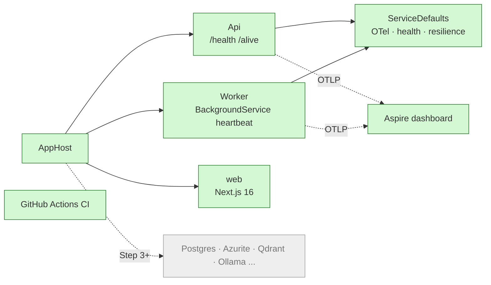

# Step 0: Scaffold and quality gates

| | |
| --- | --- |
| **Depends on** | nothing |
| **Branch** | `step-00-scaffold` |
| **PR size** | ~40 files, mostly generated or boilerplate |
| **Prompt lesson** | Scoping by naming artefacts; explicit non-goals (P3, P5) |

## Goal

A solution that builds, lints, tests and runs with one command, with no
features yet. `aspire run` starts api, worker and web; the dashboard shows all
three healthy. CI enforces the same gates. Every later step adds to this
skeleton instead of fighting it.

## Scope

**In**

- `global.json` (.NET 10 SDK, `rollForward: latestFeature`),
  `KnowledgeCopilot.slnx`, `Directory.Build.props`, `Directory.Packages.props`,
  `.editorconfig`, `Makefile`.
- Projects: `AppHost`, `ServiceDefaults`, `Api`, `Worker`, plus empty
  `Contracts`, `Domain`, `Application` class libraries so the dependency
  rule has something to point at.
- Test projects: `Api.Tests` (one health test), `AppHost.Tests` (one
  Aspire.Hosting.Testing smoke test).
- `web/`: Next.js 16 (App Router, TypeScript, pnpm) with one page and a
  `/api/health` route handler, started by the AppHost.
- `evals/`: uv project skeleton with one passing pytest.
- `/health` and `/alive` mapped in **all** environments (D-20).
- Options pattern with `ValidateOnStart` for `KnowledgeCopilot:Profile`.
- JSON console logs outside Development.
- GitHub Actions: CI (`make lint test` for .NET, web, evals), SHA-pinned
  actions, `permissions: contents: read`, concurrency group; Dependabot for
  NuGet, npm, uv/pip, GitHub Actions.
- `docs/adr/ADR-001-ports-and-adapters.md` (short; points at D-02).

**Out (non-goals)**

Containers for Qdrant/Ollama/Postgres etc., any domain code, auth,
Dockerfiles, Bicep, contracts codegen, real endpoints.

## What this step adds



## Planned files

```text
global.json
KnowledgeCopilot.slnx
Directory.Build.props
Directory.Packages.props
.editorconfig
Makefile
src/KnowledgeCopilot.AppHost/{AppHost.cs, *.csproj}
src/KnowledgeCopilot.ServiceDefaults/{Extensions.cs, *.csproj}
src/KnowledgeCopilot.Api/{Program.cs, Options/KnowledgeCopilotOptions.cs, *.csproj}
src/KnowledgeCopilot.Worker/{Program.cs, HeartbeatService.cs, *.csproj}
src/KnowledgeCopilot.{Contracts,Domain,Application}/*.csproj
tests/KnowledgeCopilot.Api.Tests/HealthEndpointTests.cs
tests/KnowledgeCopilot.AppHost.Tests/AppHostSmokeTests.cs
web/ (create-next-app output, pnpm, src/app/page.tsx, src/app/api/health/route.ts)
evals/{pyproject.toml, src/knowledge_evals/__init__.py, tests/test_smoke.py}
.github/workflows/ci.yml
.github/dependabot.yml
docs/adr/ADR-001-ports-and-adapters.md
```

## Design notes and pitfalls

- **Use the templates, then trim.** `dotnet new aspire-apphost`,
  `aspire-servicedefaults`, `webapi`, `worker`, `xunit3`. Remove weather
  samples. Agents sometimes write AppHost code from memory using APIs from
  older Aspire versions, so generating from templates avoids that.
- **Health in all environments.** The ServiceDefaults template wraps
  `MapDefaultEndpoints` in `if (app.Environment.IsDevelopment())`. Remove the
  condition (D-20). Keep `/health` details-free.
- **JavaScript hosting.** In Aspire 13 the Node/JS integration is
  `Aspire.Hosting.JavaScript`. The exact method for a pnpm-based Next.js app
  must be checked against the installed package, not guessed.
- **`.slnx`.** .NET 10 creates `.slnx` by default (`dotnet new sln`). Make sure
  every project is added.
- **Warnings as errors** from day one. Turning it on later costs a day.
- **SHA-pinned actions.** `actions/checkout@<40-char sha> # v5`. Dependabot
  keeps the SHAs current.
- **Makefile on Windows.** GNU make via `winget install ezwinports.make`.
  Avoid Bash-only syntax inside recipes; call `dotnet`, `pnpm`, `uv` directly.

## The build prompt

```text
# Role and context
You are a senior .NET engineer working in the repository knowledge-copilot-dotnet:
a permission-aware RAG copilot built with .NET 10 + Aspire 13, a Next.js 16 front end
and a Python RAGAS eval harness. It is a learning and interview-prep project held to
production standards, so the code must be clear first and rigorous second.
This is STEP 0 of 13: scaffold and quality gates. No features yet. The goal is a
skeleton that builds, lints, tests and runs with one command, which every later step
extends.

# Read first (these override your assumptions)
- .github/copilot-instructions.md (conventions; keep it in sync if you change one)
- docs/architecture.md section 4 (solution structure) and section 9.1 (dev startup)
- docs/decisions.md D-01, D-02, D-18, D-19, D-20
- docs/steps/step-00-scaffold.md (this step's plan and planned file list)

# Current state
The repo has README.md, LICENSE, .gitignore, .github/copilot-instructions.md and docs/.
No code.

# Task
1. Root files: global.json (SDK 10.0.x, rollForward latestFeature), KnowledgeCopilot.slnx,
   Directory.Build.props (net10.0, Nullable enable, ImplicitUsings enable,
   TreatWarningsAsErrors true, AnalysisLevel latest-recommended,
   EnforceCodeStyleInBuild true), Directory.Packages.props (central package
   management, ManagePackageVersionsCentrally true), .editorconfig.
2. Create from the official templates, then remove sample code:
   - src/KnowledgeCopilot.AppHost (aspire-apphost)
   - src/KnowledgeCopilot.ServiceDefaults (aspire-servicedefaults)
   - src/KnowledgeCopilot.Api (webapi, minimal APIs, no controllers)
   - src/KnowledgeCopilot.Worker (worker)
   - src/KnowledgeCopilot.Contracts, .Domain, .Application (classlib, empty
     except one placeholder type each so the projects compile)
3. AppHost: add api, worker and web. Worker WaitFor api. Pass
   KnowledgeCopilot__Profile=Free to api and worker. Give web the api URL through
   service discovery / environment references.
4. ServiceDefaults: keep OpenTelemetry, service discovery and the standard
   resilience handler. Map /health and /alive in ALL environments (D-20).
5. Api: bind KnowledgeCopilotOptions from section "KnowledgeCopilot" with a required
   Profile enum (Free, Azure), ValidateDataAnnotations().ValidateOnStart().
   Outside Development, use the JSON console formatter.
6. Worker: a HeartbeatService (BackgroundService) that logs once a minute using a
   [LoggerMessage] method and an injected TimeProvider. Same options binding as Api.
7. web/: Next.js 16 App Router + TypeScript + ESLint, pnpm, src/ directory. One page
   showing "Knowledge Copilot" and a GET /api/health route handler that returns
   {"status":"ok"}. Add Vitest + Testing Library with one passing test.
8. evals/: uv project, Python 3.12, package knowledge_evals, pytest + ruff, one test.
9. Tests:
   - tests/KnowledgeCopilot.Api.Tests: WebApplicationFactory test that /health and /alive
     return 200 in the Production environment.
   - tests/KnowledgeCopilot.AppHost.Tests: Aspire.Hosting.Testing test that starts the
     AppHost and asserts api becomes healthy.
   - Test that the Api fails to start when KnowledgeCopilot:Profile is missing.
10. Makefile targets: setup, build, lint, test, dev, clean. lint runs
    `dotnet format --verify-no-changes`, `pnpm -C web lint`, `uv run --project evals ruff check`.
    test runs dotnet test, pnpm -C web test, uv run --project evals pytest.
    dev runs `aspire run` (or `dotnet run --project src/KnowledgeCopilot.AppHost`).
11. .github/workflows/ci.yml: on pull_request and push to main; permissions contents: read;
    concurrency cancel-in-progress; jobs dotnet, web, evals calling the Makefile targets;
    every action pinned to a full commit SHA with a version comment; setup-dotnet reads
    global.json. .github/dependabot.yml for nuget, npm (web/), pip (evals/), github-actions,
    weekly, grouped minor+patch.
12. docs/adr/ADR-001-ports-and-adapters.md: one page, context / decision / consequences,
    referencing D-02.

# Constraints
- Latest patch of: .NET 10 SDK, Aspire 13.6, xUnit v3, Next.js 16, pnpm 10, Python 3.12.
- All NuGet versions only in Directory.Packages.props.
- Use Aspire.Hosting.JavaScript for the web app. Check the method names in the installed
  package version (look at the package's public API). If pnpm support differs from what you
  expect, stop and report the options rather than guessing.
- No Dockerfiles, no docker-compose, no Bicep, no secrets, no hard-coded ports unless the
  template requires them.
- Do not add MediatR, AutoMapper, Serilog, Swashbuckle or MassTransit.

# Non-goals (do NOT build these yet)
- Any infrastructure containers (Postgres, Azurite, Qdrant, Ollama, TEI, Keycloak): Step 3+.
- Any domain types, ports or adapters: Step 2.
- OpenAPI generation or contracts codegen: Step 1.
- Authentication: Step 8. Deployment: Steps 10 and 11.

# Acceptance criteria
- `make setup && make lint && make build && make test` pass on a clean clone (Windows + Linux).
- `make dev` opens the Aspire dashboard with api, worker and web Running/Healthy.
- `curl http://<api>/health` returns 200 with ASPNETCORE_ENVIRONMENT=Production.
- Api exits non-zero at startup if KnowledgeCopilot:Profile is missing (proven by a test).
- CI workflow passes on the PR; every `uses:` is a full SHA.
- `dotnet list package --outdated` shows nothing older than the latest patch of the pinned lines.

# Process
1. First output a plan: the file tree you will create, the template commands you will run,
   and any decision not covered by the docs. Wait for approval.
2. If the docs and this prompt conflict, or an API does not exist in the installed version,
   stop and ask.
3. Commit in logical steps (root files, .NET projects, web, evals, CI).
4. Open a PR titled "Step 0: Scaffold and quality gates".

# Report (in the PR description)
- Every file created or changed, with a one-line reason (generated files may be grouped).
- Decisions and trade-offs, written as D-0-xx entries appended to docs/decisions.md.
- Deviations from this prompt and why.
- Exact commands to verify.
- Open questions.
```

## Why this is a good prompt

| Prompt section | Principle | Why it helps |
| --- | --- | --- |
| "learning … held to production standards, clear first, rigorous second" | P1 | Sets the trade-off the agent should make when the docs are silent. |
| Read first, with section numbers and decision ids | P2 | Facts live in one place; the prompt stays short and can't drift from the docs. |
| Numbered task naming every project, file and target | P3 | Turns "scaffold a solution" into a checklist you can diff against. |
| "From the official templates, then remove sample code" | P4 | Templates encode current APIs; prevents the agent writing AppHost code from stale memory. |
| "Check method names in the installed package … stop and report" | P4, P8 | Names the most likely hallucination (JS hosting API) and gives a safe exit. |
| Explicit non-goals with the step that will do each | P5 | Stops helpful over-building and tells the agent the work isn't forgotten. |
| Test that the Api fails without a Profile | P6, P10 | A negative test proves `ValidateOnStart` actually runs. |
| Acceptance criteria as commands | P7 | "Done" is binary. |
| Plan first, wait for approval | P8 | Template choices and file layout are cheap to fix in a plan. |
| Report contract incl. D-0-xx entries | P9 | Decisions end up in the log, not lost in chat. |
| SHA-pinned actions, `contents: read`, no secrets | P10 | Supply-chain hygiene is a requirement, not an afterthought. |
| Commit in logical steps, one PR | P11 | Even a large scaffold is reviewable commit by commit. |

## Follow-up prompts

**Review** (fresh session):

```text
Review this branch against docs/steps/step-00-scaffold.md. Look only for:
1. Any NuGet version outside Directory.Packages.props.
2. /health or /alive still gated on Development.
3. Any GitHub Action not pinned to a full SHA, or workflow permissions broader than contents: read.
4. Template sample code left behind (WeatherForecast, Worker sample loops).
5. Makefile recipes that only work in bash.
6. APIs used in AppHost.cs that don't exist in the installed Aspire packages.
For each finding: file:line, why it is a problem, smallest fix. Say "none" for empty categories.
```

**Fix pattern:**

```text
Fix these findings, one commit each, and re-run make lint test:
1. src/KnowledgeCopilot.ServiceDefaults/Extensions.cs:NN maps health only in Development ->
   map in all environments; add a Production-environment test in Api.Tests.
Do not change anything else.
```

## Human review checklist

- [ ] `git clean -xfd && make setup lint build test` passes locally.
- [ ] Dashboard shows api, worker, web healthy; worker heartbeat log visible.
- [ ] No `Version=` attributes in any `.csproj`.
- [ ] `global.json` pins 10.0.x; `dotnet --version` agrees.
- [ ] CI is green; Dependabot config covers all four ecosystems.
- [ ] Nothing out of scope (no containers, no domain code).

## How to verify

```powershell
make setup; make lint; make build; make test
make dev        # open the dashboard URL printed in the console
$env:ASPNETCORE_ENVIRONMENT='Production'; dotnet run --project src/KnowledgeCopilot.Api  # should fail: no Profile
```

## Interview talking points

- Why central package management and warnings-as-errors from day one.
- What Aspire gives you (orchestration, service discovery, OTel defaults,
  dashboard, test host) and what it doesn't (it isn't a production runtime).
- Liveness vs readiness, and why the template's Development-only health mapping
  doesn't work for container probes.
- Supply-chain hygiene: SHA pinning, least-privilege `GITHUB_TOKEN`, Dependabot.

## Prompt lesson: scope by naming, fence with non-goals

A scaffold prompt is where agents over-build most: "set up the project" gets
you Docker, auth, sample CRUD and a README essay. Naming every artefact (P3)
gives the agent a closed list, and the non-goals list (P5), each with the step
that will do it, removes the temptation without losing the idea.
