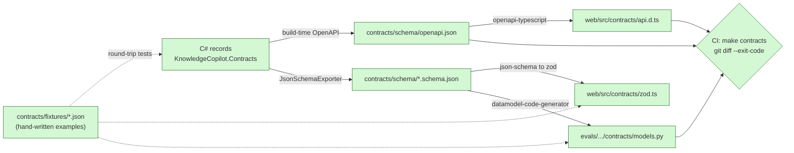

# Step 1: Contracts and codegen

| | |
| --- | --- |
| **Depends on** | Step 0 |
| **Branch** | `step-01-contracts` |
| **PR size** | ~25 hand-written files + generated output |
| **Prompt lesson** | Single source of truth; generated artefacts guarded by a drift check (P2, P7) |

## Goal

Define every payload that crosses a process or language boundary **once**, as
C# records, and generate everything else from them: OpenAPI 3.1, JSON Schema,
TypeScript types + zod validators for `web/`, and Pydantic models for
`evals/`. CI fails if anyone edits a generated file or forgets to regenerate.
Tool schemas sent to the LLM later (Step 5) come from the same records.

## Scope

**In**

- `KnowledgeCopilot.Contracts` records for: documents (upload metadata, DTO,
  status, ACL), search (request, hit, response), answers (request, response,
  context, citation), widgets (`FinancialChart`, `ComparisonTable`,
  `ActionProposal`) as a `[JsonPolymorphic]` hierarchy, job messages, a
  `ContractsVersion` constant.
- `JsonSerializerContext` (source-generated) with web defaults (camelCase).
- Api: built-in `Microsoft.AspNetCore.OpenApi` document exposed in
  Development, plus **build-time** generation to `contracts/schema/openapi.json`.
- A small tool (`tools/KnowledgeCopilot.SchemaExport`) that writes one JSON
  Schema file per root contract using `JsonSchemaExporter`.
- Codegen: `openapi-typescript` → `web/src/contracts/api.d.ts`; a generator
  from JSON Schema to zod → `web/src/contracts/zod.ts`;
  `datamodel-code-generator` → `evals/src/knowledge_evals/contracts/models.py`.
- `make contracts` runs all of it; CI runs it and fails on `git diff`.
- Round-trip tests in all three languages using shared JSON fixtures.

**Out (non-goals)**

Endpoint behaviour (stubs that return 501 are fine), database entities,
domain types, auth.

## What this step adds



## Planned files

```text
src/KnowledgeCopilot.Contracts/
  ContractsVersion.cs
  Documents/{DocumentUploadMetadata, DocumentDto, DocumentStatus, AclRequest}.cs
  Search/{SearchRequest, SearchHit, SearchResponse}.cs
  Answers/{AnswerRequest, AnswerResponse, RetrievedContext, Citation, UsageDto}.cs
  Widgets/{Widget, FinancialChartWidget, ComparisonTableWidget, ActionProposalWidget}.cs
  Jobs/{JobKind, JobMessage}.cs
  Serialization/ContractsJsonContext.cs
src/KnowledgeCopilot.Api/Endpoints/*.cs        (stubs returning 501 with typed results)
tools/KnowledgeCopilot.SchemaExport/Program.cs
tools/codegen/{gen-ts.mjs, gen-py.ps1 or Makefile recipe}
contracts/schema/                               (generated, committed)
contracts/fixtures/*.json                        (hand-written examples)
web/src/contracts/{api.d.ts, zod.ts}            (generated)
evals/src/knowledge_evals/contracts/models.py   (generated)
tests/KnowledgeCopilot.Contracts.Tests/RoundTripTests.cs
web/src/contracts/__tests__/fixtures.test.ts
evals/tests/test_contracts.py
```

## Design notes and pitfalls

- **Polymorphism.** Use `[JsonPolymorphic(TypeDiscriminatorPropertyName = "type")]`
  with `[JsonDerivedType(typeof(FinancialChartWidget), "financialChart")]`, etc.
  Check that the generated JSON Schema has a `oneOf` with discriminator
  `const` values, and that zod and Pydantic become discriminated unions. This
  is where codegen pipelines usually break.
- **Nullability.** With NRT on, `JsonSchemaExporter` marks non-nullable
  reference types correctly only when
  `JsonSerializerOptions.RespectNullableAnnotations = true`. Set it in the
  shared options and test it.
- **Required.** Use the C# `required` modifier; check it maps to `required` in
  the schema.
- **Determinism.** Generated files must be byte-stable across machines (sorted
  keys, `\n` line endings, no timestamps), otherwise the drift check flaps.
  Add `.gitattributes` entries for `contracts/schema/** text eol=lf`.
- **zod generation.** Choose a maintained JSON-Schema-to-zod generator and
  record the choice as `D-1-01`. If none handles discriminated unions well,
  generate zod from the OpenAPI document instead. Either way, test it with the
  fixtures.
- **Money and numbers.** Financial values: `decimal` in C#; in JSON, numbers.
  Document the precision expectation on `FinancialChartWidget`.
- **Versioning.** `ContractsVersion = "1.0.0"`. Breaking changes require a
  major bump and a decision entry.

## The build prompt

```text
# Role and context
You are a senior .NET + TypeScript + Python engineer on knowledge-copilot-dotnet, a
permission-aware RAG copilot (.NET 10 + Aspire 13, Next.js 16, Python RAGAS evals).
Learning project held to production standards.
This is STEP 1 of 13: contracts and codegen. Three languages consume the same payloads.
If they are typed separately they will drift, and the bugs will show up as silent UI or eval
failures. You will make the C# records the single source of truth and generate the rest.

# Read first (these override your assumptions)
- .github/copilot-instructions.md
- docs/architecture.md sections 4, 7, 9.6, 9.7, 10
- docs/decisions.md D-07, D-11, D-12, D-14
- docs/steps/step-01-contracts.md (planned files, pitfalls)

# Current state
Step 0 is merged: solution, AppHost, ServiceDefaults, Api, Worker, empty Contracts/Domain/
Application projects, web (Next.js 16, pnpm, Vitest), evals (uv, pytest), Makefile, CI.

# Task
1. In src/KnowledgeCopilot.Contracts create sealed records (file-scoped namespaces,
   `required` members, XML doc comments that become schema descriptions):
   - Documents: DocumentUploadMetadata(Title, SourceUri, ContentType, Acl: AclRequest),
     AclRequest(Users: string[], Groups: string[], WholeTenant: bool),
     DocumentDto(Id, Title, SourceUri, Status, Version, AclVersion, UpdatedAt, LastError?),
     DocumentStatus enum (Pending, Processing, Indexed, Failed, Deleting, Deleted).
   - Search: SearchRequest(Query, TopK = 8, Mode: SearchMode {Hybrid, Dense, Sparse}),
     SearchHit(ChunkId, DocumentId, Title, HeadingPath, Page?, Text, Score, Rank),
     SearchResponse(Hits, Timings: Dictionary<string, double>).
   - Answers: AnswerRequest(Question, ConversationId?), AnswerResponse(Answer, Contexts:
     RetrievedContext[], Citations: Citation[], Usage: UsageDto),
     Citation(ChunkId, DocumentId, Title, Snippet, Page?), UsageDto(InputTokens, OutputTokens,
     CostUsd, TtftMs, RetrievalMs).
   - Widgets: abstract record Widget with [JsonPolymorphic(TypeDiscriminatorPropertyName="type")]
     and derived FinancialChartWidget("financialChart": Title, Unit, Series[] of
     {Label, Points[] of {Period, Value: decimal}}, SourceChunkIds[]),
     ComparisonTableWidget("comparisonTable": Title, Columns[], Rows[] of {Label, Cells[]},
     SourceChunkIds[]), ActionProposalWidget("actionProposal": ActionType enum
     {CreateFollowUpTask, DraftEmail}, Summary, Arguments: object with typed variants).
   - Jobs: JobKind enum (Index, UpdateAcl, Delete), JobMessage(JobId, Kind, DocumentId,
     TenantId, TraceParent?). Only ids go on the queue: no content, no ACLs.
   - ContractsVersion const "1.0.0".
   - ContractsJsonContext: source-generated JsonSerializerContext, web defaults,
     RespectNullableAnnotations = true, enums as camelCase strings.
2. Api: register OpenAPI with Microsoft.AspNetCore.OpenApi, expose /openapi/v1.json in
   Development only, and generate contracts/schema/openapi.json at build time
   (Microsoft.Extensions.ApiDescription.Server). Add stub endpoints from architecture
   section 10 that return TypedResults with the right response types and 501 bodies,
   so the document is complete.
3. tools/KnowledgeCopilot.SchemaExport: console app that writes
   contracts/schema/<Name>.schema.json for each root type using JsonSchemaExporter with
   the ContractsJsonContext options. Output must be deterministic (stable property order,
   LF endings, trailing newline).
4. Codegen:
   - openapi-typescript -> web/src/contracts/api.d.ts
   - zod schemas -> web/src/contracts/zod.ts (choose a maintained generator; record the
     choice and the alternative as D-1-01)
   - datamodel-code-generator (Pydantic v2, discriminated unions) ->
     evals/src/knowledge_evals/contracts/models.py
   - Each generated file starts with a "GENERATED - DO NOT EDIT. Run make contracts" header.
5. `make contracts` runs export + all codegen. CI job "contracts" runs it and then
   `git diff --exit-code`.
6. Fixtures: contracts/fixtures/ with one valid JSON example per root type, including one
   example of EACH widget variant, plus invalid examples (missing required field, unknown
   discriminator). Tests:
   - C#: every valid fixture deserializes and re-serializes to semantically equal JSON;
     invalid ones fail.
   - TS: every valid fixture parses with the zod schema; invalid ones fail.
   - Python: every valid fixture validates with the Pydantic model; invalid ones fail.
7. Add .gitattributes so contracts/schema/**, web/src/contracts/** and the generated
   Python file use LF.

# Constraints
- No hand-written TS or Python types for these payloads, anywhere.
- No Swashbuckle or NSwag. Use the built-in OpenAPI support and JsonSchemaExporter.
- Pin codegen tool versions (package.json devDependencies, uv dev dependencies).
- If JsonSchemaExporter or the OpenAPI generator output a polymorphic type in a way the
  generators can't turn into a discriminated union, stop and show me the generated
  schema fragment and the options, before working around it.

# Non-goals
- No endpoint behaviour, persistence, domain logic or auth.
- No LLM tool registration yet (Step 5 builds tool schemas from these records).

# Acceptance criteria
- `make contracts` twice in a row produces no diff.
- Changing a record property name without regenerating makes CI fail (show this in the PR
  description with the failing output).
- All fixture tests pass in C#, TS and Python, including each widget variant and each
  invalid fixture.
- `make lint test` passes.

# Process
1. Plan first: list records with their properties, the generator choices, and how the
   discriminator appears in each language. Wait for approval.
2. Stop and ask on conflicts or missing APIs.
3. Open a PR "Step 1: Contracts and codegen".

# Report
Files with reasons (group generated files), D-1-xx decisions, deviations, verification
commands, open questions.
```

## Why this is a good prompt

| Prompt section | Principle | Why it helps |
| --- | --- | --- |
| "If they are typed separately they will drift…" | P1 | Explains the purpose, so the agent understands why hand-written types are forbidden. |
| Records with exact property lists | P3, P6 | The contract *is* the deliverable; naming every field leaves nothing to invent. |
| "Only ids go on the queue" | P10 | Carries a security and consistency rule into the type design. |
| "No hand-written TS or Python types, anywhere" | P4 | Rules out the shortcut that defeats the whole step. |
| Stop and show the schema fragment if polymorphism fails | P8 | The known-hard part gets a human decision instead of a silent hack. |
| Valid **and invalid** fixtures in all three languages | P6, P10 | Shared examples are the oracle; invalid fixtures prove validation isn't a no-op. |
| "Show the failing CI output in the PR" | P7 | Proves the drift gate fails when it should, not just that it passes. |
| Determinism requirement | P7 | A flapping drift check gets disabled; stating it up front prevents that. |

## Follow-up prompts

**Review:**

```text
Review this branch against docs/steps/step-01-contracts.md. Look only for:
1. Any hand-written TS/Python type duplicating a contract.
2. Discriminated unions that became plain unions or `any` in TS/zod/Pydantic.
3. Nullable/required mismatches between C# and the generated schema (check 3 records by hand).
4. Non-deterministic generator output (timestamps, unordered keys, CRLF).
5. Missing invalid-fixture tests in any language.
file:line, why, smallest fix. "none" for empty categories.
```

**Explain (learning):**

```text
Explain how a FinancialChartWidget travels from the C# record to the zod schema in our repo,
file by file. Then give three interview questions on contract-first design across languages,
with answers that reference D-07.
```

## Human review checklist

- [ ] Open `zod.ts`: widgets are `z.discriminatedUnion("type", …)` (or equivalent).
- [ ] Open `models.py`: widgets use `Field(discriminator="type")`.
- [ ] A required property in C# is required in all three outputs.
- [ ] `make contracts` on Windows produces no diff (line endings).
- [ ] CI has a separate `contracts` job.

## How to verify

```powershell
make contracts; git status --porcelain   # expect nothing
make test
```

## Interview talking points

- Contract-first vs code-first; why code-first C# records still give one source of truth.
- Discriminated unions across C#, TypeScript and Python.
- Why the drift check matters more than the generator choice.
- Why job messages carry ids only (consistency and data exposure).

## Prompt lesson: single source of truth

When the same fact would appear in several places (types in three languages,
or facts repeated in prompt and docs), name **one** owner and make everything
else derived and checked. In this prompt that applies to the code (records →
codegen → drift check) and to the prompt itself (it points to the docs instead
of copying them).
