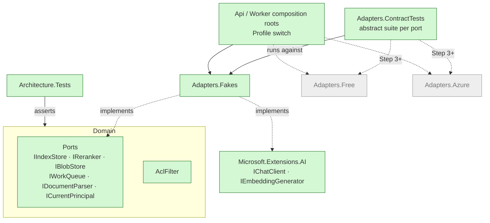

# Step 2: Ports, fakes and the composition root

| | |
| --- | --- |
| **Depends on** | Step 1 |
| **Branch** | `step-02-ports-and-fakes` |
| **PR size** | ~35 files, little logic |
| **Prompt lesson** | Interface-first prompting: give signatures and semantics, not implementations (P3, P6) |

## Goal

Make the hexagonal architecture real before any vendor code exists:

- The ports, plus in-memory fakes for each.
- An abstract **contract test suite** per port.
- Profile wiring in the composition roots.
- An **architecture test** that fails the build if the core imports a vendor
  SDK.
- A Development-only principal.

After this step the whole system can run end to end on fakes in unit tests.

## Scope

**In**

- Ports in `Domain/Ports`: `IIndexStore` (+ `IndexCapabilities`,
  `IndexedChunk`, `ScoredChunk`, `AclFilter`), `IReranker`, `IBlobStore`,
  `IWorkQueue` (+ `ReceivedJob`, `JobReceipt`), `IDocumentParser`
  (+ `ParsedSection`), `ICurrentPrincipal` (+ `Principal`).
  `IChatClient` and `IEmbeddingGenerator` come from
  `Microsoft.Extensions.AI.Abstractions` (D-03).
- `Domain.Security.AclFilter`: builds the principal set (`u:`, `g:`, `t:`).
- `Adapters.Fakes`: `InMemoryIndexStore`, `PassThroughReranker`,
  `InMemoryBlobStore`, `InMemoryWorkQueue` (with visibility timeout semantics
  via `TimeProvider`), `MarkdownOnlyParser` stub, `ScriptedChatClient`,
  `HashEmbeddingGenerator` (deterministic vectors), `DevCurrentPrincipal`.
- `Adapters.ContractTests`: abstract suites, e.g. `IndexStoreContract`,
  `WorkQueueContract`, `BlobStoreContract`, `RerankerContract`, subclassed for
  the fakes now and for real adapters later.
- Composition roots: `AddKnowledgeCopilotCore()`, `AddFakeAdapters()`,
  `AddFreeAdapters()` / `AddAzureAdapters()` as empty extension methods that
  throw `NotImplementedException("Step 3")` per port. `Program.cs` selects by
  `Profile`.
- `Architecture.Tests` using NetArchTest (or ArchUnitNET) for the dependency
  rule in architecture.md §4.
- `DevCurrentPrincipal` registered only when `IsDevelopment()`. Startup throws
  if it would be registered in any other environment (decision D-2-01).

**Out (non-goals)**

Real adapters (Qdrant, AI Search, Storage, Ollama, Azure OpenAI), database,
endpoints with behaviour, RRF.

## What this step adds



## Port semantics (the part the prompt must pin down)

| Port | Semantics the contract suite must prove |
| --- | --- |
| `IIndexStore.UpsertAsync` | Idempotent by `ChunkId`; re-upsert replaces payload and vectors. |
| `IIndexStore.Search*` | **Never** returns a chunk whose `tenant_id` differs or whose `acl_principals` don't intersect the filter. Results sorted by score descending; ties broken by `ChunkId` ordinal. |
| `IIndexStore.UpdateAclAsync` | Changes principals and `acl_version` for every chunk of the document without touching vectors. |
| `IIndexStore.DeleteByDocumentAsync` | Removes every chunk of that document in that tenant only. |
| `IWorkQueue.ReceiveAsync` | A received message is invisible for the visibility timeout; if not completed it reappears; `DequeueCount` increments. |
| `IWorkQueue.CompleteAsync` | Idempotent; completing an expired receipt fails with a typed exception. |
| `IBlobStore` | `PutAsync` then `OpenReadAsync` returns identical bytes; missing key throws `BlobNotFoundException`. |
| `IReranker` | Returns a subset of the input, at most `topN`, each candidate at most once. |
| `ICurrentPrincipal` | `ToAclPrincipals()` always contains `u:{userId}` and `t:{tenantId}`, plus `g:{id}` for each group. |

## Planned files

```text
src/KnowledgeCopilot.Domain/Ports/*.cs
src/KnowledgeCopilot.Domain/Security/{Principal, AclFilter}.cs
src/KnowledgeCopilot.Domain/Indexing/{IndexedChunk, ScoredChunk, IndexCapabilities}.cs
src/KnowledgeCopilot.Adapters.Fakes/*.cs
src/KnowledgeCopilot.Adapters.Free/ServiceCollectionExtensions.cs   (stubs)
src/KnowledgeCopilot.Adapters.Azure/ServiceCollectionExtensions.cs  (stubs)
src/KnowledgeCopilot.Application/ServiceCollectionExtensions.cs
src/KnowledgeCopilot.Api/Program.cs, src/KnowledgeCopilot.Worker/Program.cs (profile switch)
tests/KnowledgeCopilot.Adapters.ContractTests/{IndexStoreContract, WorkQueueContract,
  BlobStoreContract, RerankerContract}.cs + Fakes/*ContractTests.cs
tests/KnowledgeCopilot.Architecture.Tests/DependencyRuleTests.cs
tests/KnowledgeCopilot.Domain.Tests/AclFilterTests.cs
tests/KnowledgeCopilot.Api.Tests/CompositionRootTests.cs
```

## Design notes and pitfalls

- **Contract suites as abstract classes.** `public abstract class
  IndexStoreContract { protected abstract Task<IIndexStore> CreateAsync(); … }`
  with `[Fact]` methods in the base. xUnit v3 discovers them in each concrete
  subclass. Real adapters (Step 3/4) subclass with an Aspire- or
  container-backed fixture.
- **Time.** The fake queue uses `TimeProvider`; tests use `FakeTimeProvider`
  (`Microsoft.Extensions.TimeProvider.Testing`) to advance past the
  visibility timeout without sleeping.
- **Deterministic fake embeddings.** `HashEmbeddingGenerator` should map
  similar strings to nearby vectors well enough for tests (e.g. hashed
  character trigrams into N buckets, then L2-normalised). Pure random vectors
  make retrieval tests meaningless.
- **Validating the composition root.** Build the service provider with
  `ValidateOnBuild = true` and `ValidateScopes = true` in a test, for each
  profile and environment combination that is supposed to work.
- **Architecture test scope.** Forbid `Azure.*`, `Qdrant.*`, `OllamaSharp*`,
  `Npgsql*`, `Microsoft.EntityFrameworkCore*`, `Microsoft.Data.SqlClient*`
  from `Domain` and `Application`. Allow `Microsoft.Extensions.AI.Abstractions`.

## The build prompt

```text
# Role and context
You are a senior .NET engineer on knowledge-copilot-dotnet (permission-aware RAG copilot,
.NET 10 + Aspire 13). Learning project held to production standards.
This is STEP 2 of 13: ports, fakes and the composition root. We define the hexagon before
any vendor code exists, so that every later adapter is written against an interface, and
proven by a contract test suite that already passes for the fake.

# Read first (these override your assumptions)
- .github/copilot-instructions.md
- docs/architecture.md sections 4 (dependency rule), 6 (ports and adapters), 8 (ACL filter)
- docs/decisions.md D-02, D-03, D-04, D-14, D-19
- docs/steps/step-02-ports-and-fakes.md, especially the "Port semantics" table, which is the
  specification for the contract suites

# Current state
Steps 0-1 merged: scaffold, CI, contracts with codegen. Domain and Application are empty.

# Task
1. Domain ports (signatures exactly as in architecture section 6; every method async with
   CancellationToken; use IReadOnlyList / IAsyncEnumerable where natural):
   IIndexStore, IReranker, IBlobStore, IWorkQueue, IDocumentParser, ICurrentPrincipal.
   Supporting records: IndexCapabilities(NativeHybrid, SparseVectors), IndexedChunk,
   ScoredChunk, AclFilter, ParsedSection(HeadingPath, Text, Page?, IsTable), ReceivedJob,
   JobReceipt, Principal(TenantId, UserId, Groups, Roles).
2. Domain.Security.AclFilter.For(Principal) returning the tenant id and the principal set
   ["u:{userId}", "g:{g1}", ..., "t:{tenantId}"], distinct and ordinally sorted.
   Throws if tenant or user is empty.
3. Adapters.Fakes implementing every port, plus ScriptedChatClient (IChatClient that
   replays a scripted list of ChatResponseUpdate, including function calls) and
   HashEmbeddingGenerator (deterministic, L2-normalised character-trigram hashing,
   configurable dimensions). InMemoryWorkQueue honours visibility timeout and dequeue count
   using an injected TimeProvider.
4. Contract suites in tests/KnowledgeCopilot.Adapters.ContractTests as abstract classes, one
   per port (IndexStore, WorkQueue, BlobStore, Reranker), each with one [Fact] per row of
   the "Port semantics" table, plus concrete subclasses for the fakes. IndexStore suite
   MUST include:
   - Search_OtherTenant_ReturnsNothing
   - Search_NoPrincipalOverlap_ReturnsNothing
   - UpdateAcl_RevokedGroup_NoLongerReturned
   - DeleteByDocument_OnlyAffectsThatTenant
5. Composition roots: AddKnowledgeCopilotCore(); AddFakeAdapters(); AddFreeAdapters() and
   AddAzureAdapters() as stubs that register nothing and throw a clear
   InvalidOperationException("Profile <X> adapters arrive in Step 3") at startup.
   Program.cs in Api and Worker read KnowledgeCopilotOptions.Profile once and call the
   matching method. A configuration flag KnowledgeCopilot:UseFakes=true (Development and
   tests only) selects AddFakeAdapters.
6. DevCurrentPrincipal (fixed tenant "dev", user "dev-user", groups from config) registered
   only when IHostEnvironment.IsDevelopment(). If UseFakes or DevCurrentPrincipal is
   requested outside Development, startup must throw. Record this as D-2-01.
7. Architecture.Tests: Domain and Application must not depend on Azure.*, Qdrant.*,
   OllamaSharp*, Npgsql*, Microsoft.EntityFrameworkCore*, Microsoft.Data.SqlClient*,
   or on any Adapters.* / Persistence* / Api / Worker project. Domain must not depend on
   Application.
8. CompositionRootTests: build the provider with ValidateOnBuild and ValidateScopes for
   (Development, UseFakes=true). Also assert startup fails for (Production, UseFakes=true)
   and for (Production, Free) until Step 3.

# Constraints
- Ports use only BCL, Contracts and Microsoft.Extensions.AI.Abstractions types.
- No vendor packages anywhere in this step.
- Tests use FakeTimeProvider, never Task.Delay for time-dependent behaviour.
- Use NetArchTest.eNhancedEdition or ArchUnitNET for the architecture test. Pick one and
  record it as D-2-02.

# Non-goals
- No real adapters, no database, no RRF or retriever, no endpoints with behaviour.
- No JWT; ICurrentPrincipal's real implementation is Step 8.

# Acceptance criteria
- `make lint test` passes; every contract suite runs against its fake.
- Adding `using Azure.Storage.Blobs;` to any Domain file makes Architecture.Tests fail
  (show the failing output in the PR, then revert).
- Production + UseFakes fails startup with a clear message (test).
- AclFilterTests cover: groups deduplicated, sorted output, empty tenant throws.

# Process
1. Plan first: list every port signature and every contract test name. Wait for approval.
2. Stop and ask if architecture section 6 is ambiguous for a signature.
3. Open a PR "Step 2: Ports, fakes and the composition root".

# Report
Files with reasons, D-2-xx decisions, deviations, verification commands, open questions.
```

## Why this is a good prompt

| Prompt section | Principle | Why it helps |
| --- | --- | --- |
| "Define the hexagon before any vendor code exists" | P1 | Explains *why* fakes come first: every adapter later gets a ready-made test oracle. |
| The "Port semantics" table as the spec | P2, P6 | Behaviour is defined once, in the step page, and every contract test maps to a row. |
| Named, mandatory security tests | P10 | Cross-tenant and revoked-ACL cases aren't left to the agent's imagination. |
| Signatures, not implementations | P3 | Interface-first: the agent designs the seams, not the internals. |
| "Show the failing output, then revert" | P7 | Proves the architecture test has teeth. |
| UseFakes / DevCurrentPrincipal must fail outside Development | P10 | A classic way a dev shortcut leaks into production, handled up front. |
| FakeTimeProvider, no Task.Delay | P4 | Prevents slow, flaky time-based tests. |
| Pick an architecture-test library and record it | P8, P9 | Lets the agent choose but forces the choice to be visible. |

## Follow-up prompts

**Review:**

```text
Review this branch against the "Port semantics" table in docs/steps/step-02-ports-and-fakes.md.
For each row, point to the contract test that proves it, or report it as missing.
Also check: any port method without CancellationToken; any fake that ignores the AclFilter;
any way UseFakes or DevCurrentPrincipal can be active outside Development.
file:line, why, smallest fix.
```

**Explain:**

```text
Using our IndexStoreContract and InMemoryIndexStore, explain the contract-test pattern
and how Step 3 will reuse it for Qdrant and Azure AI Search. Give three interview questions
about ports and adapters with answers that reference D-02 and D-04.
```

## Human review checklist

- [ ] Every port method has a `CancellationToken`.
- [ ] Each "Port semantics" row maps to a named contract test.
- [ ] `InMemoryIndexStore` applies the ACL filter inside search, not after.
- [ ] No vendor package references in Domain/Application `.csproj` files.
- [ ] `DevCurrentPrincipal` can't be reached in Production (test exists).

## How to verify

```powershell
make test
dotnet test tests/KnowledgeCopilot.Architecture.Tests
```

## Interview talking points

- Ports and adapters vs layered architecture; where the composition root lives.
- Contract test suites: one specification, many implementations.
- Why ACL filtering is a port-level guarantee, not a retriever detail.
- How MEAI interfaces serve as ports without adopting an agent framework.

## Prompt lesson: interface-first prompting

When you hand an agent a seam, give it the **signature and the semantics**
(the table), not the implementation. The agent can't silently weaken a
contract when every behaviour has a named test, and later prompts for real
adapters become one line: "make the existing contract suite pass for X".
