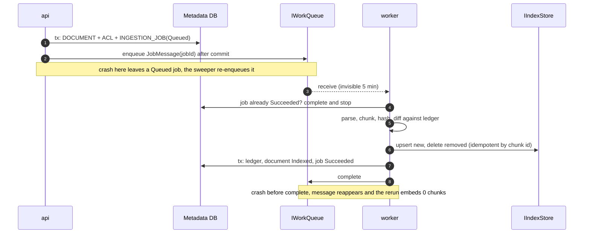

# Step 3: Persistence and ingestion

| | |
| --- | --- |
| **Depends on** | Step 2 |
| **Branches** | `step-03a-persistence-upload`, `step-03b-worker-indexing` |
| **PR size** | Two PRs (this step is deliberately split, P11) |
| **Prompt lesson** | Invariants and failure scenarios as requirements (P10) |

## Goal

Documents go in, chunks come out, and the system stays correct when things
fail. An admin uploads a file with an ACL. The api stores it and enqueues a
job. The worker parses, chunks, hashes, embeds only what changed and writes to
the index. ACL changes and deletions are separate job kinds, so content
hashing can never hide them (D-14). Everything is safe under at-least-once
delivery.

## Scope

**3a: persistence and upload**

- `KnowledgeCopilot.Persistence`: `KnowledgeCopilotDbContext`, entities from
  architecture §7 (DOCUMENT, DOCUMENT_ACL, CHUNK_LEDGER, INGESTION_JOB; the
  others arrive with Step 5), configurations, optimistic concurrency.
- Migration projects for PostgreSQL and SQL Server (D-06); CI applies both.
- AppHost: `postgres` + database `kcdb`, `azurite` (blobs + queues).
  Containers for Azure-only services are not added.
- `Adapters.Common`: `AzureBlobStore`, `StorageQueueWorkQueue` (Azure SDK;
  Azurite locally); both pass the Step 2 contract suites against Azurite.
- Application `IngestionService` + Api endpoints: `POST /api/v1/documents`,
  `GET` list and by id, `PUT …/acl`, `DELETE …/{id}`.
- Outbox-lite: `INGESTION_JOB` row is committed first; enqueue after commit; a
  `QueuedJobSweeper` re-enqueues jobs `Queued` for more than N minutes.

**3b: worker indexing**

- Worker `QueueConsumer` (visibility timeout, max attempts, poison →
  dead-letter queue, trace context restore) and handlers `Index`,
  `UpdateAcl`, `Delete`.
- `MarkdownParser` (Markdig, heading-aware sections, tables kept whole) in
  `Adapters.Common`; `DoclingParser` (free) and
  `DocumentIntelligenceParser` (azure) behind `IDocumentParser`.
- Domain `StructureAwareChunker`, `ContentHasher`, `ChunkId`.
- Embedding: `IEmbeddingGenerator` via OllamaSharp (free) and
  Azure OpenAI (azure, 512 dims, D-08), batched.
- Index **write side**: `QdrantIndexStore` and `AzureSearchIndexStore`
  `EnsureIndexAsync`, `UpsertAsync`, `UpdateAclAsync`, `DeleteByDocumentAsync`,
  `DeleteChunksAsync`. Their search methods arrive in Step 4.
- AppHost: `qdrant`, `ollama` (CommunityToolkit) with models pulled,
  `docling-serve` container.

**Out (non-goals)**

Search and retrieval, chat, real auth (use `DevCurrentPrincipal`; admin role
from config), UI upload page, evals.

## Upload and indexing (from architecture §9.2-9.4)



## Invariants (the specification for 3b's tests)

| # | Invariant | Proven by |
| - | --------- | --------- |
| I1 | Processing the same job twice gives the same index and ledger state, and the second run embeds 0 chunks. | `IndexJob_Redelivered_EmbedsNothing` |
| I2 | Changing one section of a document re-embeds only chunks of that section. | `IndexJob_OneSectionChanged_EmbedsOnlyChanged` |
| I3 | An ACL-only change never re-embeds but always updates every chunk's principals and `acl_version`. | `UpdateAcl_ChangesPrincipals_NoEmbedding` |
| I4 | After `Delete`, no chunk, blob or ledger row for the document remains. | `Delete_RemovesEverything` |
| I5 | A crash between index write and DB commit leaves a state the retry fixes. | `IndexJob_CrashBeforeCommit_RetryConverges` |
| I6 | A job failing `MaxAttempts` times goes to the dead-letter queue, and the document becomes `Failed` with `last_error`. | `IndexJob_PoisonMessage_DeadLettered` |
| I7 | Chunk id = SHA-256(`tenant` ∥ `documentId` ∥ `contentSha256` ∥ `occurrence`), so identical paragraphs in one document get different ids. | `ChunkId_DuplicateParagraphs_Distinct` |
| I8 | Jobs are processed in `version` order per document; an older `Index` job arriving after a newer one is a no-op. | `IndexJob_StaleVersion_Skipped` |
| I9 | Upload with the same content and the same ACL creates no job. | `Upload_Unchanged_NoJob` |

## Planned files

```text
# 3a
src/KnowledgeCopilot.Persistence/{KnowledgeCopilotDbContext, Entities/*, Configurations/*}.cs
src/KnowledgeCopilot.Persistence.Migrations.Postgres/
src/KnowledgeCopilot.Persistence.Migrations.SqlServer/
src/KnowledgeCopilot.Adapters.Common/Storage/{AzureBlobStore, StorageQueueWorkQueue}.cs
src/KnowledgeCopilot.Application/Ingestion/{IngestionService, QueuedJobSweeper}.cs
src/KnowledgeCopilot.Api/Endpoints/DocumentEndpoints.cs
tests/.../ContractTests/Storage/{AzuriteBlobStoreContractTests, AzuriteWorkQueueContractTests}.cs
tests/KnowledgeCopilot.Api.Tests/Documents/*Tests.cs
# 3b
src/KnowledgeCopilot.Domain/Ingestion/{StructureAwareChunker, ContentHasher, ChunkId}.cs
src/KnowledgeCopilot.Adapters.Common/Parsing/MarkdownParser.cs
src/KnowledgeCopilot.Adapters.Free/{Parsing/DoclingParser, Index/QdrantIndexStore, Ai/OllamaRegistration}.cs
src/KnowledgeCopilot.Adapters.Azure/{Parsing/DocumentIntelligenceParser, Index/AzureSearchIndexStore, Ai/AzureOpenAiRegistration}.cs
src/KnowledgeCopilot.Worker/{QueueConsumer, Handlers/*}.cs
tests/KnowledgeCopilot.Application.Tests/Ingestion/InvariantTests.cs
tests/KnowledgeCopilot.Domain.Tests/Ingestion/*Tests.cs
```

## Design notes and pitfalls

- **Enqueue after commit, plus a sweeper.** It's simpler than a full outbox
  and correct enough: the DB is the source of truth, and the queue only
  carries an id. The worker checks the job status, so duplicates are harmless.
- **Visibility timeout vs long jobs.** Large PDFs can exceed 5 minutes. Either
  extend visibility periodically (`UpdateMessageAsync`) while working, or keep
  jobs small. Pick one and record it.
- **Poison handling.** Storage Queues has no built-in DLQ; use a second queue
  `ingest-poison` and move the message when `DequeueCount > MaxAttempts`.
- **Chunker.** Target ~400 tokens with ~50 overlap inside a section; never
  split a table; prefix each chunk with its heading path for context. Use a
  tokenizer (`Microsoft.ML.Tokenizers`) for counts, not characters.
- **Qdrant.** Create the collection with named vectors `dense` (size from the
  embedder, cosine) and sparse `sparse` with `modifier: idf`. Add payload
  indexes for `tenant_id` (`is_tenant: true`), `document_id`,
  `acl_principals`. Sparse vector values = term frequencies from a simple
  analyzer (lowercase, Unicode word split, stop words); hash terms to `uint`
  indices. Record the analyzer as a decision, because query time must use the
  same one.
- **AI Search.** Index with `dense` vector field (512 dims), `text` searchable,
  `tenant_id`, `document_id`, `acl_principals` (Collection(Edm.String),
  filterable). `UpdateAclAsync` uses `MergeDocuments` on each chunk id from the
  ledger.
- **Two databases, one model.** Avoid provider-specific column types in
  entities. Put JSON columns (Step 5) behind value converters. Run both
  migrations in CI (Postgres container + SQL Server container or Azure SQL
  Edge).
- **Upload limits.** Enforce `MaxUploadMb` with Kestrel and
  `FormOptions.MultipartBodyLengthLimit`; allow-list content types
  (`text/markdown`, `application/pdf`).

## Build prompt 3a: persistence and upload

```text
# Role and context
You are a senior .NET engineer on knowledge-copilot-dotnet (permission-aware RAG copilot,
.NET 10 + Aspire 13). Learning project held to production standards.
This is STEP 3a of 13: persistence and upload. The metadata database becomes the system of
record. The search index will be a derived projection we can rebuild from DB + blobs.

# Read first (these override your assumptions)
- .github/copilot-instructions.md
- docs/architecture.md sections 7 (data model), 9.2 and 9.4 (upload, ACL change, delete),
  10 (API surface), 11 (security), 13 (configuration)
- docs/decisions.md D-05, D-06, D-14
- docs/steps/step-03-ingestion.md (invariants I9 applies to 3a, pitfalls)

# Current state
Steps 0-2 merged. Ports, fakes and contract suites exist. AddFreeAdapters/AddAzureAdapters
are stubs. DevCurrentPrincipal exists for Development.

# Task
1. Persistence: KnowledgeCopilotDbContext with Document, DocumentAcl, ChunkLedger,
   IngestionJob exactly as architecture section 7. Unique index on
   (tenant_id, source_uri) for Document and on idempotency_key for IngestionJob.
   Optimistic concurrency token on Document. No provider-specific types in entities.
2. Two migration projects (Postgres via Npgsql, SQL Server) with an initial migration each.
   Api applies migrations automatically in Development only. CI applies both against
   containers.
3. AppHost (Free): AddPostgres + database "kcdb" with a data volume; AddAzureStorage
   RunAsEmulator (Azurite) with blobs "blobs" and queues "queues". Api and worker reference
   and WaitFor them.
4. Adapters.Common: AzureBlobStore and StorageQueueWorkQueue on the Azure SDK, registered
   via the Aspire client integrations. They must pass the existing BlobStoreContract and
   WorkQueueContract against Azurite (Aspire.Hosting.Testing or Testcontainers fixture).
   Also create the poison queue "ingest-poison".
5. Application.IngestionService:
   - Upload(metadata, stream): validate (content type allow-list text/markdown and
     application/pdf, size <= MaxUploadMb, ACL principals non-empty, at most 200 principals),
     stream to blob while computing SHA-256, then in ONE transaction upsert Document
     (version+1 when content changed), replace DocumentAcl (acl_version+1 when ACL changed),
     insert IngestionJob(kind Index, idempotency key "{docId}:v{version}"). Commit, then enqueue.
     Same content and same ACL: no job, return Unchanged (invariant I9).
     ACL-only change on upload: enqueue UpdateAcl, not Index.
   - ReplaceAcl(id, acl): acl_version+1, job UpdateAcl key "{docId}:acl:{aclVersion}".
   - Delete(id): status Deleting, job Delete key "{docId}:delete".
   - QueuedJobSweeper (BackgroundService in the worker): every minute re-enqueue jobs Queued
     for > 5 min. Use TimeProvider.
6. Api endpoints per architecture section 10 (documents only), TypedResults, ProblemDetails,
   202 + Location for accepted jobs. Admin endpoints require role kc.admin (from
   ICurrentPrincipal.Roles; DevCurrentPrincipal reads roles from config). GET endpoints
   return only documents whose ACL intersects the caller's principal set, in the caller's tenant.
7. Wire the real adapters in AddFreeAdapters (blob, queue) and AddAzureAdapters (same
   adapters, Azure endpoints with DefaultAzureCredential). Ports not yet implemented keep the
   stub behaviour.

# Constraints
- Never put content or ACLs on the queue; JobMessage carries ids only.
- Never trust tenant or user from the request; use ICurrentPrincipal.
- Use the Aspire client integrations (Aspire.Azure.Storage.Blobs, Aspire.Azure.Storage.Queues,
  Aspire.Npgsql.EntityFrameworkCore.PostgreSQL, Aspire.Microsoft.EntityFrameworkCore.SqlServer).
  Check package names and versions against Aspire 13.6. If one doesn't exist, stop and ask.
- No connection strings in appsettings files; they come from Aspire.

# Non-goals
- No worker handlers, parsing, chunking, embeddings or index writes (that is 3b).
- No real authentication (Step 8). No UI.

# Acceptance criteria
- `make lint test` passes; both migrations apply cleanly in CI.
- Blob and queue contract suites pass against Azurite.
- Tests: Upload_Unchanged_NoJob (I9); Upload_AclOnlyChange_EnqueuesUpdateAcl;
  Upload_TooLarge_Returns413; Upload_DisallowedType_Returns415;
  Upload_NonAdmin_Returns403; GetDocuments_OtherTenant_NotVisible;
  EnqueueFails_AfterCommit_SweeperReenqueues (simulate with a throwing fake queue).
- `make dev`: upload a Markdown file with curl, see the blob in Azurite, a Queued job in the DB,
  and a message on the queue.

# Process
Plan first (entities, endpoints, transaction boundaries). Wait for approval. Stop and ask on
conflicts. PR "Step 3a: Persistence and upload".

# Report
Files with reasons, D-3-xx decisions, deviations, verification commands, open questions.
```

## Build prompt 3b: worker indexing

```text
# Role and context
Same project and standards as Step 3a (merged). This is STEP 3b: the worker turns jobs into
index state. The work is at-least-once, so correctness comes from invariants, not luck.

# Read first (these override your assumptions)
- .github/copilot-instructions.md
- docs/architecture.md sections 8 (index schema) and 9.3-9.4
- docs/decisions.md D-04, D-08, D-10, D-14
- docs/steps/step-03-ingestion.md: the Invariants table I1-I8 is the specification. Every row
  must have the named test.

# Current state
3a merged: DB, migrations, blob + queue adapters, upload/ACL/delete endpoints, sweeper.

# Task
1. Domain:
   - ContentHasher: SHA-256 hex of UTF-8 text normalised to LF and trimmed of trailing whitespace.
   - ChunkId.Create(tenant, documentId, contentSha256, occurrence) per invariant I7.
   - StructureAwareChunker: input ParsedSection list; output chunks of ~ChunkTargetTokens
     with ChunkOverlapTokens overlap inside a section, never crossing sections, never
     splitting a table; each chunk text prefixed with "{heading path}\n\n". Token counts via
     Microsoft.ML.Tokenizers (cl100k_base or the embedder's tokenizer; record which).
2. Parsers: MarkdownParser (Markdig; headings build the heading path; tables kept whole) in
   Adapters.Common. DoclingParser (HTTP client to docling-serve, Free) and
   DocumentIntelligenceParser (prebuilt-layout, Azure). Each returns ParsedSection list.
3. Embeddings: register IEmbeddingGenerator with OllamaSharp (Free; model from config,
   default nomic-embed-text) and Azure OpenAI (Azure; text-embedding-3-small, Dimensions 512).
   Batch requests (max 64 inputs). Add UseOpenTelemetry().
4. Index write side, passing the IndexStoreContract upsert/ACL/delete tests:
   - QdrantIndexStore: EnsureIndexAsync creates the collection with named dense vector
     (cosine, size from embedder) and sparse vector "sparse" with IDF modifier; payload indexes
     tenant_id (is_tenant), document_id, acl_principals. Sparse vectors: term frequencies from
     a SparseEncoder (lowercase, Unicode word split, English stop words, terms hashed to uint
     with a stable hash). Put SparseEncoder in Domain so query time (Step 4) reuses it.
   - AzureSearchIndexStore: EnsureIndexAsync creates fields per architecture section 8, vector
     profile HNSW cosine 512 dims. UpdateAclAsync merges acl_principals and acl_version for all
     chunk ids from the ledger.
   Search methods throw NotSupportedException("Step 4") for now.
5. Worker QueueConsumer (BackgroundService): receive batch, restore Activity from
   traceparent, dispatch to IJobHandler by kind; on success complete; on failure leave the
   message to reappear; when DequeueCount > MaxAttempts move to ingest-poison, job
   DeadLettered, document Failed with last_error. Extend visibility while a job runs longer
   than half the timeout.
6. Handlers:
   - Index: skip if job Succeeded or document.version > job's version (I8). Parse, chunk, hash,
     diff against CHUNK_LEDGER (new / unchanged / removed). Embed only new; upsert new with
     tenant, principals, acl_version; delete removed; then one DB transaction: ledger, document
     Indexed, job Succeeded.
   - UpdateAcl: UpdateAclAsync with principals and acl_version from DB. No embedding.
   - Delete: DeleteByDocumentAsync, delete blobs, delete ledger rows, document Deleted.
7. AppHost (Free): AddQdrant with data volume; Ollama via CommunityToolkit.Aspire.Hosting.Ollama
   with the chat and embedding models; docling-serve container with health check. Worker
   WaitFor these.

# Constraints
- Domain stays vendor-free (the architecture test must still pass).
- No content in logs. Log ids, counts and durations.
- Tests for I1-I8 run on fakes in Application.Tests using FakeTimeProvider and fault-injecting
  fakes (a queue that "crashes" before complete, an index that throws once).
- Qdrant and AI Search adapters must pass the write-side contract tests. Run Qdrant in a
  container in CI. Run AI Search contract tests only when AZURE_SEARCH_ENDPOINT is set
  (skip with a reason otherwise).
- Verify Qdrant.Client and Azure.Search.Documents APIs against the installed versions,
  especially the sparse-vector and IDF-modifier APIs. Stop and ask if anything differs.

# Non-goals
- No search/query methods, RRF, reranker or retrieval endpoint (Step 4).
- No chat, auth or UI.

# Acceptance criteria
- `make lint test` passes; tests named in the Invariants table exist and pass.
- `make dev`: upload a 30-page Markdown doc, worker indexes it, Qdrant dashboard shows points
  with tenant_id and acl_principals; re-upload unchanged -> no job; edit one section ->
  only that section's chunks are embedded (log shows counts).
- ACL change via PUT updates Qdrant payloads without new embeddings (log shows 0 embedded).

# Process
Plan first: chunking algorithm with an example, handler state machine, failure handling per
invariant. Wait for approval. PR "Step 3b: Worker indexing".

# Report
Files with reasons, D-3-xx decisions (sparse analyzer, tokenizer, visibility extension),
deviations, verification commands, open questions.
```

## Why these are good prompts

| Prompt section | Principle | Why it helps |
| --- | --- | --- |
| Split into 3a and 3b | P11 | Each PR has one theme (state vs pipeline) and can be reviewed in about an hour. |
| Invariants table as the spec with named tests | P6, P10 | Turns "make it idempotent" into nine checkable properties. |
| Exact transaction boundary and "commit, then enqueue" | P3, P10 | The classic dual-write bug is designed out, and the sweeper covers the gap. |
| "ACL-only change → UpdateAcl, not Index" | P10 | Fixes the original plan's gap where hashing hid ACL changes. |
| Fault-injecting fakes required | P6, P10 | Failure paths are tested deliberately instead of hoped for. |
| SparseEncoder in Domain for reuse at query time | P3 | Prevents the index-time/query-time analyzer mismatch Step 4 would otherwise hit. |
| "Verify sparse/IDF APIs against installed versions" | P4, P8 | Names the riskiest API surface and the safe exit. |
| Skipped-with-reason Azure tests | P7 | CI stays green without cloud credentials and still shows what wasn't run. |

## Follow-up prompts

**Review (3b):**

```text
Review this branch against the Invariants table in docs/steps/step-03-ingestion.md.
For I1-I8 point to the test and check it really exercises the failure (e.g. does the
"crash" test actually stop between index write and DB commit?).
Also look for: the message completed before the DB transaction commits; content or prompts
in logs; the index-time sparse analyzer not reusable at query time; chunk ids that ignore
occurrence. file:line, why, smallest fix.
```

**Fix pattern:**

```text
1. Worker/Handlers/IndexHandler.cs:NN completes the queue message before SaveChangesAsync ->
   move CompleteAsync after the commit; extend IndexJob_CrashBeforeCommit_RetryConverges so it
   fails on the old order.
Only this change. Re-run make test.
```

## Human review checklist

- [ ] Message completion happens only after the DB commit.
- [ ] The queue carries `JobMessage` ids only.
- [ ] Each invariant test fails if you break the behaviour (try one by hand).
- [ ] Both migrations are generated and applied in CI.
- [ ] Qdrant collection has payload indexes and the sparse IDF modifier.
- [ ] Upload size and type limits are enforced at the server.

## How to verify

```powershell
make dev
curl -F "file=@samples/handbook-sample.md" -F "metadata=<samples/meta.json" http://localhost:<api>/api/v1/documents
# Aspire dashboard: worker trace shows ingest.parse/chunk/embed/index spans
```

## Interview talking points

- At-least-once delivery and idempotent consumers; why exactly-once isn't needed.
- Dual-write problem, outbox vs "commit then enqueue plus sweeper".
- Why content hashing must not drive ACL updates.
- Chunking strategy trade-offs and why chunk ids include occurrence.
- Qdrant sparse vectors with the IDF modifier vs AI Search's built-in BM25.

## Prompt lesson: invariants and failure scenarios

For stateful, distributed work, "make it robust" means nothing. A table of
invariants, each with a named test and a failure to inject, gives the agent a
precise target. It also gives you a review checklist: break the behaviour by
hand and watch the test fail.
