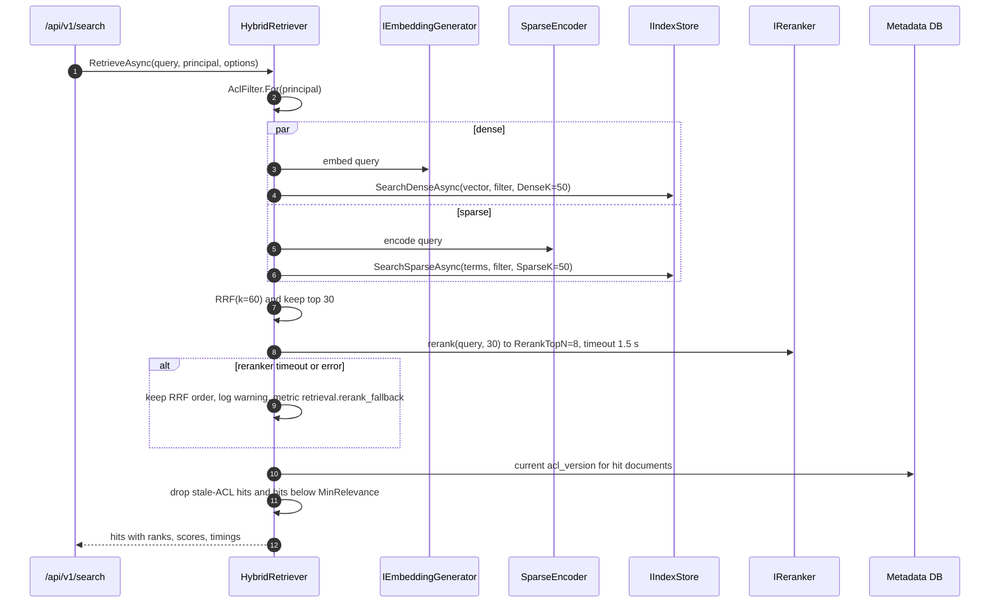

# Step 4: Hybrid retrieval

| | |
| --- | --- |
| **Depends on** | Step 3 |
| **Branch** | `step-04-retrieval` |
| **PR size** | ~25 files |
| **Prompt lesson** | Test oracles: hand-computed expected outputs (P6) |

## Goal

Given a question and a principal, return the best chunks the principal is
allowed to see, fast. Dense and sparse search run in parallel inside the index
with the ACL pre-filter. Results are fused with **hand-written Reciprocal Rank
Fusion**, reranked by a cross-encoder, filtered by a relevance floor and by
`acl_version` freshness. Retrieval quality is measured from this step on:
recall@k, MRR and ACL leaks (D-13).

## Scope

**In**

- Domain `ReciprocalRankFusion` (k = 60, 1-based ranks, deterministic ties).
- Domain `SparseEncoder` reused at query time (from Step 3b).
- Search side of `QdrantIndexStore` and `AzureSearchIndexStore`:
  `SearchDenseAsync`, `SearchSparseAsync`, `SearchHybridAsync` (AI Search
  native RRF; Qdrant Query API prefetch + fusion), all with the ACL filter
  pushed down.
- `TeiReranker` (HTTP to text-embeddings-inference `/rerank`) with timeout and
  fallback to fused order; AppHost TEI container with a `bge-reranker` model.
- Application `HybridRetriever` with spans `retrieval.dense`,
  `retrieval.sparse`, `retrieval.fuse`, `retrieval.rerank`.
- `acl_version` freshness check against the DB (defence in depth, D-14).
- `POST /api/v1/search` (contracts from Step 1) returning hits and timings.
- `evals/`: `kc-eval retrieval` computing recall@k, MRR, ACL-leak count from a
  small golden set; a Development-only persona header for eval calls until
  Step 8.

**Out (non-goals)**

LLM generation, chat, RAGAS, caching, auth beyond the dev persona header.

## Retrieval pipeline



## The test oracle (copy exactly into `ReciprocalRankFusionTests`)

RRF score for a document *d* = Σ over lists of `1 / (k + rank(d))`, with
k = 60 and **1-based** ranks. Documents missing from a list contribute 0 for it.

| Chunk | Dense rank | Sparse rank | Score (6 dp) | Fused rank |
| ----- | ---------- | ----------- | ------------ | ---------- |
| A     | 1          | 2           | 0.032522     | 1          |
| C     | 3          | 1           | 0.032266     | 2          |
| B     | 2          | 4           | 0.031754     | 3          |
| E     | –          | 3           | 0.015873     | 4          |
| D     | 4          | –           | 0.015625     | 5          |

Tie rule: equal scores are ordered by `ChunkId` using ordinal string
comparison. Example: X at dense rank 2 only and Y at sparse rank 2 only both
score 1/62 ≈ 0.016129, so X comes before Y.

## Metric definitions (used by `kc-eval retrieval`)

- **recall@k** for a query = |relevant ∩ top-k| / |relevant|; averaged over
  queries. Queries with no relevant chunks *for that persona* are scored
  separately as "should be empty".
- **MRR@k** = mean over queries of 1 / (rank of the first relevant hit), or 0
  if none in top k.
- **ACL leaks** = number of returned hits whose document the persona isn't
  allowed to read according to the golden set's ground-truth ACLs. Must be
  **0**; any leak fails the run regardless of other scores.
- Relevance is judged at **document + heading path** level, because chunk ids
  change when chunking changes.

## Planned files

```text
src/KnowledgeCopilot.Domain/Retrieval/{ReciprocalRankFusion, RetrievalOptions}.cs
src/KnowledgeCopilot.Application/Retrieval/{HybridRetriever, AclFreshnessFilter}.cs
src/KnowledgeCopilot.Adapters.Free/Index/QdrantIndexStore.Search.cs
src/KnowledgeCopilot.Adapters.Azure/Index/AzureSearchIndexStore.Search.cs
src/KnowledgeCopilot.Adapters.Common/Rerank/TeiReranker.cs
src/KnowledgeCopilot.Api/Endpoints/SearchEndpoints.cs
src/KnowledgeCopilot.Api/Dev/DevPersonaMiddleware.cs        (Development only)
tests/KnowledgeCopilot.Domain.Tests/Retrieval/ReciprocalRankFusionTests.cs
tests/KnowledgeCopilot.Application.Tests/Retrieval/HybridRetrieverTests.cs
tests/KnowledgeCopilot.Adapters.ContractTests/Index/{Qdrant,AzureSearch}IndexStoreContractTests.cs
evals/src/knowledge_evals/retrieval.py, evals/datasets/retrieval-smoke.jsonl, evals/personas.json
tools/datasets/download-handbook.ps1 (+ .sh)
```

## Design notes and pitfalls

- **Pre-filter, always.** Filtering after top-k both leaks (via timing and
  counts) and starves results: if 45 of 50 dense hits are forbidden you're
  left with 5. The contract tests from Step 2 already prove the adapters
  filter in the engine; this step adds them for the real adapters.
- **Qdrant sparse query** must use the same `SparseEncoder` as indexing,
  otherwise term hashes won't match and sparse recall silently drops to 0. Add
  a test that indexes "quarterly revenue" and finds it by sparse search.
- **Score scales differ** (cosine vs BM25). That's why RRF uses ranks. Don't
  normalise and add scores.
- **AI Search native hybrid** already applies RRF. When `NativeHybrid` is
  used, don't fuse again; record which path ran in the response timings.
- **Reranker cold start** on ACA (Step 11) can exceed the timeout; the fallback
  keeps answers flowing.
- **Dev persona header** (`X-KC-Dev-Persona: alice`) maps to personas defined in
  config. It is registered only in Development (a test asserts Production
  ignores it) and is deleted in Step 8. Record as D-4-01.
- **Corpus licence.** GitLab Handbook is CC BY-SA 4.0. The download script
  fetches it and the repo stores only the script and the golden question set.

## The build prompt

```text
# Role and context
You are a senior .NET engineer on knowledge-copilot-dotnet (permission-aware RAG copilot,
.NET 10 + Aspire 13). Learning project held to production standards.
This is STEP 4 of 13: hybrid retrieval. Retrieval quality and permission safety are where
RAG systems actually fail, so this step is defined by exact oracles and metrics, not adjectives.

# Read first (these override your assumptions)
- .github/copilot-instructions.md
- docs/architecture.md sections 6, 8, 9.6 (retrieval part), 12, 15
- docs/decisions.md D-04, D-08, D-09, D-13, D-14
- docs/steps/step-04-retrieval.md: the RRF oracle table, the tie rule and the metric
  definitions are normative. Implement them exactly.

# Current state
Steps 0-3 merged. Index write side, SparseEncoder (Domain), ledger and worker exist. Search
methods throw NotSupportedException.

# Task
1. Domain.Retrieval.ReciprocalRankFusion.Fuse(IReadOnlyList<IReadOnlyList<string>> rankedLists,
   int k = 60) returning (ChunkId, Score, FusedRank) ordered by score desc then ChunkId ordinal.
   Tests: reproduce the oracle table exactly (scores to 6 dp) and the tie example; empty lists;
   one list only; duplicate id within a list (first occurrence wins, document this).
2. Search side of QdrantIndexStore (dense; sparse with the shared SparseEncoder; hybrid via the
   Query API prefetch + RRF fusion) and AzureSearchIndexStore (dense vector query; text query;
   hybrid = both in one request). ACL filter always pushed down (tenant + any-of principals).
   Return ScoredChunk with acl_version and document_id.
   Extend the IndexStore contract suite with: Dense_FindsSemanticNeighbour,
   Sparse_FindsExactTerm, Hybrid_FilterAppliedToBothLegs, and run it for Qdrant (container in
   CI) and AI Search (only when AZURE_SEARCH_ENDPOINT is set, otherwise skipped with a reason).
3. TeiReranker: POST {texts, query} to TEI /rerank, map indices back, top N; typed HttpClient
   with a 1.5 s timeout via the standard resilience handler (no retries for rerank). On
   failure return the input order truncated and increment kc.retrieval.rerank_fallback.
   AppHost: TEI CPU container with BAAI/bge-reranker-base (verify the current CPU image tag;
   pin it), model cache volume, health check.
4. Application.HybridRetriever.RetrieveAsync(query, principal, options, ct):
   - Parallel dense and sparse with DenseK/SparseK from RetrievalOptions, unless
     options.Mode = Hybrid and IndexCapabilities.NativeHybrid and UseNativeHybrid=true.
   - RRF -> top 30 -> rerank -> RerankTopN.
   - AclFreshnessFilter: one DB query for the documents in the hits; drop hits whose
     acl_version < document.acl_version or whose document is not Indexed.
   - Drop hits below MinRelevance (rerank score) but always say how many were dropped in timings.
   - Activities retrieval.dense/sparse/fuse/rerank with counts as tags.
5. POST /api/v1/search -> SearchResponse with Timings (embed, dense, sparse, fuse, rerank,
   freshness, total in ms) and the Mode actually used.
6. DevPersonaMiddleware: in Development only, header X-KC-Dev-Persona selects a persona from
   configuration KnowledgeCopilot:Dev:Personas (tenant, user, groups, roles) and sets the
   principal. Not registered in other environments. Test both.
7. evals: `uv run kc-eval retrieval --profile free --dataset datasets/retrieval-smoke.jsonl`:
   - dataset row: {id, question, persona, relevant: [{document, headingPath}], forbidden:
     [document]}
   - personas.json: at least 3 personas (all-staff, finance group, contractor with narrow access)
   - computes recall@5, recall@10, MRR@10 and ACL leaks exactly as defined on the step page;
     writes results JSON + a Markdown table; exits 1 if ACL leaks > 0 or thresholds in
     evals/thresholds.toml [free.retrieval] are not met.
   - Uses the generated Pydantic models for SearchRequest/SearchResponse.
   - pytest tests for each metric with a hand-computed example.
8. tools/datasets/download-handbook.(ps1|sh): fetch a pinned commit of the GitLab Handbook
   Markdown into ./data (gitignored) and print the licence notice. tools/seed: a console app
   that uploads the corpus with ACLs from a mapping file.

# Constraints
- No score normalisation; RRF uses ranks only.
- ACL filtering is never done after retrieval (only the freshness check is post-retrieval).
- RetrievalOptions bound from KnowledgeCopilot:Retrieval with validation (k > 0, TopN <= 30).
- Verify Qdrant Query API (prefetch, fusion) and Azure.Search.Documents hybrid APIs in the
  installed versions; stop and ask if they differ from your expectations.
- The persona header must be impossible to enable outside Development.

# Non-goals
- No LLM calls except embeddings. No chat, no RAGAS, no caching, no real auth.

# Acceptance criteria
- `make lint test` passes; RRF oracle test reproduces the table to 6 dp.
- Contract suite passes for InMemory and Qdrant (and AI Search when configured), including
  the cross-tenant and revoked-ACL tests from Step 2.
- HybridRetrieverTests: reranker timeout falls back; stale acl_version hit dropped; the
  NativeHybrid path is not fused twice.
- `make dev` + seed: `kc-eval retrieval` prints the metrics table, ACL leaks = 0; record the
  first baseline numbers in the PR and in evals/thresholds.toml (thresholds = baseline - 0.05).
- Production environment ignores X-KC-Dev-Persona (test).

# Process
Plan first: query flow, adapter query syntax for each engine (show the Qdrant filter JSON and
the AI Search $filter string), dataset format. Wait for approval. PR "Step 4: Hybrid retrieval".

# Report
Files with reasons, D-4-xx decisions, baseline metrics table, deviations, verification commands,
open questions.
```

## Why this is a good prompt

| Prompt section | Principle | Why it helps |
| --- | --- | --- |
| RRF oracle table + tie rule, "to 6 dp" | P6 | "Implement RRF correctly" becomes a test that either passes or doesn't. 0- vs 1-based and k value are no longer guesses. |
| Metric definitions on the step page, normative | P2, P6 | The Python metrics and the interview explanation use the same definitions. |
| "Show the Qdrant filter JSON and AI Search $filter in the plan" | P8 | The riskiest translation is reviewed before code exists. |
| "No score normalisation" / "never filter after retrieval" | P4, P10 | Blocks the two most common hybrid-search mistakes. |
| Reranker timeout + fallback + metric | P10 | Failure mode is a requirement with observable evidence. |
| Baseline numbers and thresholds = baseline − 0.05 | P7 | The quality gate starts from measured reality, not invented targets. |
| Persona header Development-only with a test | P10 | A testing convenience can't become an auth bypass. |
| Skipped-with-reason AI Search tests | P7 | Honest about what ran without blocking CI. |

## Follow-up prompts

**Review:**

```text
Review this branch against docs/steps/step-04-retrieval.md. Look only for:
1. Any path where ACL filtering happens after the engine returns results.
2. RRF deviations from the oracle (rank base, k, tie order, double fusion on NativeHybrid).
3. Query-time sparse encoding that differs from index-time encoding.
4. The dev persona header being reachable outside Development.
5. Metric code that differs from the definitions (e.g. recall over hits instead of relevant).
file:line, why, smallest fix.
```

**Explain:**

```text
Walk me through one /api/v1/search request in our code, with timings from a real trace.
Then explain why RRF uses ranks rather than scores, using our oracle table. Give three
interview questions on hybrid retrieval with model answers.
```

## Human review checklist

- [ ] RRF tests contain the exact oracle numbers.
- [ ] Adapter filter syntax checked by hand for both engines.
- [ ] Contract suite ran against Qdrant in CI (not skipped).
- [ ] Baseline metrics recorded; ACL leaks 0 for all personas.
- [ ] Reranker fallback visible in a trace when TEI is stopped.

## How to verify

```powershell
make dev
dotnet run --project tools/KnowledgeCopilot.Seed -- --corpus ./data/handbook --acl tools/seed/acl-map.json
curl -H "X-KC-Dev-Persona: contractor" -d '{"query":"travel policy per diem","topK":8}' -H "Content-Type: application/json" http://localhost:<api>/api/v1/search
uv run --project evals kc-eval retrieval --profile free --dataset datasets/retrieval-smoke.jsonl
```

## Interview talking points

- Dense vs sparse retrieval; why hybrid wins on enterprise text (acronyms, codes, names).
- RRF: formula, why k = 60, why ranks instead of scores.
- Pre-filtering vs post-filtering for permissions; `acl_version` as defence in depth.
- Cross-encoder reranking: cost, latency, and graceful degradation.
- recall@k and MRR, and why ACL leaks are a hard gate rather than a metric.

## Prompt lesson: test oracles

When correctness has a precise answer, compute it yourself and put it in the
prompt. An oracle table settles the ambiguities (rank base, constant, ties)
that adjectives leave open, and it becomes the first test the agent writes.
