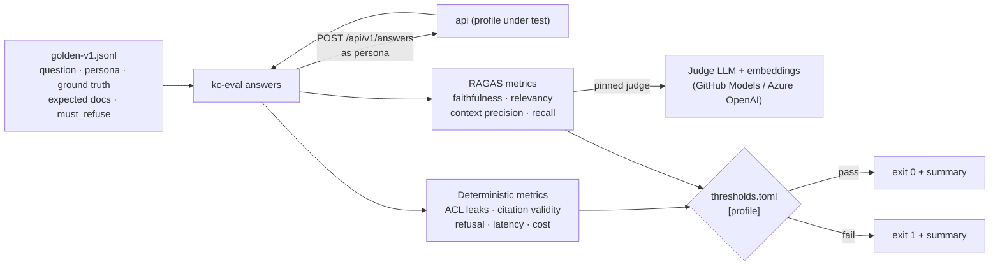

# Step 6: RAGAS evaluation harness

| | |
| --- | --- |
| **Depends on** | Step 5 |
| **Branch** | `step-06-evals` |
| **PR size** | ~20 files (mostly Python) + datasets |
| **Prompt lesson** | Defining metrics, datasets and thresholds precisely; cross-language prompts (P7) |

## Goal

Make answer quality and permission safety measurable and gated. A Python
harness (uv + RAGAS 0.4) calls the running system **only over HTTP**, scores
answers with a **pinned judge**, compares against **per-profile thresholds**
and fails CI on regressions or any ACL leak (D-12). The same golden set and
the same judge run against both profiles, which is how "swapping clouds is a
config change" gets proven rather than claimed.

## Scope

**In**

- Golden set v1 (`evals/datasets/golden-v1.jsonl`):
  - ~40 Handbook questions with persona and ground truth.
  - ~20 FinanceBench-style 10-K questions.
  - ~10 "must refuse / not in your documents" questions per persona.
- `kc-eval answers`: calls `/api/v1/answers` per persona and computes RAGAS
  faithfulness, response relevancy, context precision, context recall, plus
  custom metrics: citation validity, refusal correctness, ACL leaks, p95
  latency, cost per answer.
- Judge configuration pinned in `evals/judge.toml` (provider, model, version,
  temperature 0, embeddings model).
- Per-profile thresholds in `evals/thresholds.toml`.
- Reports: JSON + Markdown summary (GitHub job summary) + per-question CSV.
- CI: PR job (retrieval suite + 10-question answer smoke); nightly job (full
  set); `permissions: models: read` for GitHub Models as judge.
- `make eval` target.

**Out (non-goals)**

Online/production evaluation, human annotation UI, fine-tuning, Phoenix
integration (Step 9).

## Evaluation flow



## Metric definitions (normative)

| Metric | Definition | Gate |
| ------ | ---------- | ---- |
| **ACL leaks** | Count of answers whose `contexts` or `citations` include a document in the row's `forbidden` list, or whose answer contains a row-specific `leak_canary` string. | **= 0**, both profiles, always |
| **Refusal correctness** | For `must_refuse` rows: the answer is the fixed no-access message (exact match after trim). For other rows: it isn't. Accuracy over rows. | ≥ threshold |
| **Citation validity** | Fraction of citations whose chunk id appears in the returned `contexts`. | = 1.0 |
| **Faithfulness** (RAGAS) | Fraction of answer claims supported by the retrieved contexts, judged by the pinned LLM. | ≥ threshold |
| **Response relevancy** (RAGAS) | Similarity between the question and questions generated from the answer. | ≥ threshold |
| **Context precision / recall** (RAGAS) | Ranking quality and coverage of the retrieved contexts against the reference answer. | ≥ threshold |
| **Latency p95** | p95 of the HTTP round trip per profile. | report only (gated in Step 12) |
| **Cost per answer** | Mean of `usage.costUsd`. | report only |

Scores from RAGAS are averaged over the rows that have a reference answer and
aren't `must_refuse`. A run is **invalid** (exit code 2, not 1) when more than
5 % of rows error, so judge outages don't look like quality regressions.

## Dataset row format

```json
{"id":"hb-017","suite":"smoke","persona":"contractor","question":"What is the per diem for Berlin?",
 "reference":"€42 per day ...","expected_documents":["handbook/travel.md"],
 "forbidden":["finance/fy2024-board-pack.md"],"must_refuse":false,"leak_canary":null,"tags":["travel"]}
```

`leak_canary` is a unique string planted in a restricted seed document (for
example `KC-CANARY-7731`). If it appears in any answer for a persona without
access, that's a leak, even when citations look clean.

## Planned files

```text
evals/pyproject.toml                         (ragas 0.4.x, openai, httpx, typer, pydantic, pytest)
evals/src/knowledge_evals/{cli, client, metrics_custom, ragas_runner, report, config}.py
evals/judge.toml, evals/thresholds.toml
evals/datasets/golden-v1.jsonl, evals/datasets/README.md (sources + licences)
evals/tests/test_metrics_custom.py, test_gate.py, test_report.py
tools/seed/canaries.json (restricted docs containing canary strings)
.github/workflows/evals.yml
Makefile: eval, eval-smoke
```

## Design notes and pitfalls

- **RAGAS 0.4 API.** RAGAS has had breaking API changes between minor
  versions (metric classes, LLM wrappers, `evaluate` signature). The prompt
  makes the agent read the installed version's docs and code first.
- **Judge determinism.** Temperature 0 doesn't make LLM judges fully
  deterministic. Run each nightly job once, keep a rolling history, and set
  thresholds a margin below the baseline. Record the judge model id and
  version in every report.
- **GitHub Models as judge in CI.** Use the OpenAI-compatible endpoint with
  `GITHUB_TOKEN` and `permissions: models: read`. Rate limits are low, so
  keep the PR smoke small, cache judge results by (row id, answer hash, judge
  model), and use concurrency 2–4.
- **Licences.** The Handbook is CC BY-SA 4.0. Check FinanceBench's licence
  before committing any of its rows, and record it in `datasets/README.md`.
  If committing them isn't allowed, commit a script that builds the rows
  locally.
- **Starting the stack in CI.** The free profile on a GitHub runner needs
  small Ollama models (CPU). Record the chosen models and measured runtime;
  move the full set to nightly if PRs get slow.
- **No in-process shortcuts.** The harness must not import .NET code or touch
  the DB. HTTP only, so it evaluates what users get.

## The build prompt

```text
# Role and context
You are a senior Python engineer with RAG evaluation experience, working in the evals/ folder of
knowledge-copilot-dotnet (permission-aware RAG copilot; .NET 10 api; Python 3.12 + uv harness).
Learning project held to production standards.
This is STEP 6 of 13: the RAGAS evaluation harness and CI gate. Its job is to turn "the answers
seem good" into numbers with thresholds, and to make any permission leak fail the build.

# Read first (these override your assumptions)
- .github/copilot-instructions.md
- docs/architecture.md sections 9.8, 10, 15
- docs/decisions.md D-07, D-12, D-13
- docs/steps/step-06-evals.md: the metric definitions table and dataset row format are
  normative. Implement them exactly.
- The installed RAGAS 0.4.x documentation and source for metric classes, LLM/embedding
  wrappers and the evaluate API. Do not rely on memory of older RAGAS versions.

# Current state
Steps 0-5 merged. /api/v1/answers returns answer, contexts, citations, usage. evals/ has the
retrieval suite from Step 4, generated Pydantic contracts, personas.json and the dev persona header.

# Task
1. Dataset: evals/datasets/golden-v1.jsonl in the row format on the step page. Write ~40 Handbook
   questions (mix of factual, multi-hop, table lookups), ~20 10-K questions, and >= 10 must_refuse
   rows per persona (questions answerable only from documents the persona can't see). Mark 10 rows
   suite "smoke". Add tools/seed/canaries.json: restricted documents with unique canary strings,
   seeded by the existing seed tool. Document sources and licences in datasets/README.md; if a
   source's licence doesn't allow redistribution, commit a builder script instead of the rows.
2. Client: httpx async client calling /api/v1/answers with the persona header, concurrency limit,
   timeout, retries on 5xx only; parse with the generated Pydantic models.
3. Custom metrics (pure functions, unit tested with hand-computed examples): acl_leaks,
   refusal_correctness, citation_validity, latency_p95, mean_cost.
4. RAGAS runner: faithfulness, response relevancy, context precision, context recall using the
   judge from evals/judge.toml (provider: github_models | azure_openai, model, embeddings model,
   temperature 0, max concurrency). Cache judge results on disk keyed by
   (row id, sha256(answer + contexts), judge model). Rows erroring > 5 % -> exit code 2 (invalid run).
5. Gate: evals/thresholds.toml with [free.answers], [azure.answers] (and the existing retrieval
   sections). acl_leaks must be 0 and citation_validity must be 1.0 regardless of thresholds.
   Exit 0 pass, 1 regression, 2 invalid.
6. Report: results.json (all metrics, judge id, dataset version, git sha, profile), summary.md
   (table with metric, value, threshold, pass/fail, delta vs previous if provided), per-row CSV.
   When running in GitHub Actions, append summary.md to $GITHUB_STEP_SUMMARY.
7. CLI (typer): kc-eval answers --profile free|azure --suite smoke|full --base-url ... --out ...
8. CI .github/workflows/evals.yml:
   - pull_request (paths src/**, evals/**, web/src/contracts/**): start the free stack, seed,
     run retrieval + answers smoke.
   - schedule nightly + workflow_dispatch: full suite.
   - permissions: contents read, models read. Actions pinned by SHA. Upload reports as artifacts.
   Measure runtime and record the Ollama models used as D-6-xx.
9. make eval-smoke and make eval.
10. Run the full suite locally once, record the baseline in the PR, set thresholds to
    baseline minus a margin you justify (and record as D-6-xx).

# Constraints
- HTTP only: never import .NET code, never read the DB or the index.
- Use the generated Pydantic contracts; no hand-written duplicates.
- No API keys in code or config; read from environment variables. In CI use GITHUB_TOKEN with
  models: read for GitHub Models.
- Judge model pinned by exact id; changing it requires a decision entry and a new baseline.
- If RAGAS 0.4 doesn't support a metric as described, stop and propose the closest supported
  metric with a short explanation.

# Non-goals
- No online/production evaluation, annotation UI, Phoenix, or prompt tuning in this step.

# Acceptance criteria
- `make lint test` passes (ruff, pytest for custom metrics and the gate).
- `make eval-smoke` runs end to end locally against the free profile and writes the three reports.
- Planting a leak (temporarily granting the contractor persona a canary document without updating
  the dataset) makes the run exit 1 with ACL leaks > 0. Show this in the PR, then revert.
- Stopping the judge endpoint makes the run exit 2, not 1.

# Process
Plan first: dataset composition table, judge choice with rate-limit math for CI, RAGAS API calls
you will use (with links to the installed docs or source). Wait for approval.
PR "Step 6: RAGAS evaluation harness".

# Report
Files with reasons, D-6-xx decisions, baseline table, CI runtime, deviations, verification
commands, open questions.
```

## Why this is a good prompt

| Prompt section | Principle | Why it helps |
| --- | --- | --- |
| Role switch to "senior Python engineer with RAG evaluation experience" | P1 | Cross-language step: the persona primes the right ecosystem habits. |
| Normative metric table, including the canary definition of a leak | P6, P7 | "Evaluate quality" becomes exact formulas; leaks can't hide behind clean citations. |
| "Read the installed RAGAS docs; don't rely on memory" | P2, P4 | RAGAS API churn is the predictable hallucination; the prompt points at the real source. |
| Exit codes 0/1/2 | P7, P10 | Separates "quality dropped" from "the judge is down", so the gate stays trusted. |
| Planting a leak to prove the gate fails | P7 | Tests the test. |
| Licence check with a fallback | P4 | Avoids committing data you may not redistribute. |
| Rate-limit math in the plan | P8 | A free judge with low limits is a known CI risk; it gets planned, not discovered. |
| Baseline then threshold = baseline − justified margin | P7, P9 | Thresholds come from evidence and are recorded as decisions. |

## Follow-up prompts

**Review:**

```text
Review evals/ against the metric definitions in docs/steps/step-06-evals.md. For each metric,
compute it by hand for 3 rows of the per-row CSV and compare with the report. Also check: any
import of non-HTTP access to the system; judge model not pinned; leaks not forcing failure; an
error rate above 5 % returning 1 instead of 2. file:line, why, smallest fix.
```

**Explain:**

```text
Explain how faithfulness is computed in the RAGAS version we installed, step by step, using one
row from our last report. What can make it unreliable, and how does our setup mitigate it? Three
interview questions on RAG evaluation with model answers.
```

## Human review checklist

- [ ] Dataset licences documented; restricted data not committed.
- [ ] Judge model id pinned and recorded in reports.
- [ ] Leak-planting demo in the PR shows exit 1.
- [ ] Judge outage gives exit 2.
- [ ] PR eval job runtime is acceptable (record it).

## How to verify

```powershell
make dev   # in another terminal
make eval-smoke
Get-Content evals/out/summary.md
```

## Interview talking points

- Offline RAG evaluation: retrieval metrics vs generation metrics.
- LLM-as-judge: bias, variance, pinning, and why thresholds need margins.
- Permission leaks as a hard gate; canary strings.
- Proving profile portability by evaluating both profiles with the same judge and dataset.

## Prompt lesson: define metrics precisely

When you ask an agent to "evaluate" something, every metric needs a
definition, a pass condition and a failure mode. Exact definitions make the
code checkable by hand, and separate exit codes keep a flaky dependency from
looking like a regression.
