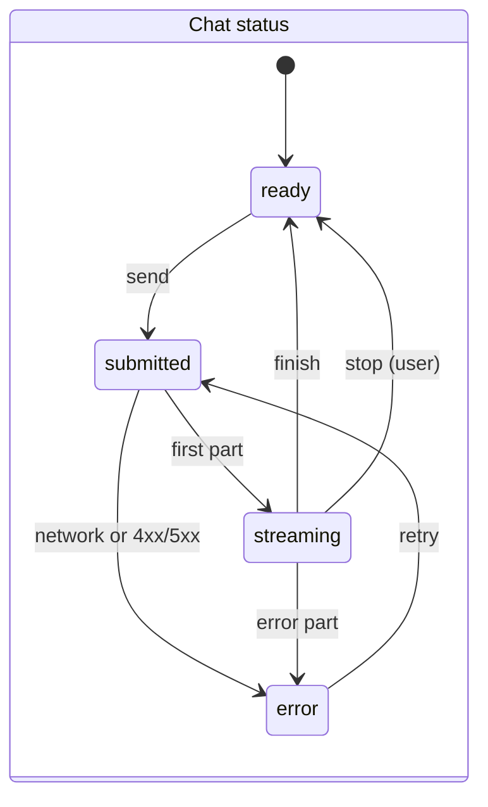

# Step 7: Generative UI

| | |
| --- | --- |
| **Depends on** | Step 5 |
| **Branch** | `step-07-generative-ui` |
| **PR size** | ~30 files in `web/` |
| **Prompt lesson** | Enumerating UI states; exhaustiveness checks (P3, P7) |

## Goal

A Next.js 16 chat UI where answers stream in. Tool calls render as real
components (`FinancialChart`, `ComparisonTable`, `ActionCard`) and citations
appear as clickable chips. `useChat` consumes the .NET stream unchanged
through a Next.js route handler that proxies to the api (it becomes the full
BFF in Step 8). Every state a message or tool part can be in has a defined
rendering, and the type checker enforces that.

## Scope

**In**

- `/chat` page with `useChat` (`@ai-sdk/react` 4.x) and `DefaultChatTransport`
  pointing at `/api/chat`.
- `app/api/chat/route.ts`: streaming proxy to `POST /api/v1/chat` (no
  buffering; forwards status, the protocol header and abort). In Development
  it adds the dev persona header from a persona switcher; in other
  environments it refuses until Step 8.
- Components: `MessageList`, `MessageParts` (exhaustive switch over part
  types), `CitationChip` + `SourcesPanel`, `FinancialChart`,
  `ComparisonTable`, `ActionCard` (approve/deny via the AI SDK approval API),
  `Composer` (stop, retry), `ErrorBanner`.
- Every widget validates its input with the generated zod schema before
  rendering; invalid input renders a safe fallback.
- `/documents` admin page: list, upload with ACL, status polling.
- Tests: Vitest + Testing Library, replaying the **golden SSE files from Step 5**
  through a mock transport. One Playwright smoke test against `make dev`.
- Accessibility basics: keyboard reachable, `aria-live` for streaming text,
  chart has a table alternative.

**Out (non-goals)**

Login (Step 8), theming polish, conversation history sidebar, mobile layout
beyond responsive basics.

## UI state model



| Tool part state (installed `ai` types are authoritative) | `FinancialChart` / `ComparisonTable` | `ActionCard` |
| --- | --- | --- |
| `input-streaming` | Skeleton with the title if present | Skeleton |
| `input-available` | Skeleton ("preparing chart") | Summary, no buttons yet |
| `approval-requested` | n/a | Summary + Approve / Deny, focus on card |
| `approval-responded` | n/a | Buttons disabled, "Submitting…" |
| `output-available` | Render the widget from validated input | "Done" + result summary |
| `output-denied` | n/a | "Cancelled" |
| `output-error` | Inline error + "Show data as table" | Error text, no retry button |
| invalid input (zod fails) | Neutral fallback "Couldn't display this chart" + log | Same, never show buttons |

## Planned files

```text
web/src/app/chat/page.tsx
web/src/app/api/chat/route.ts
web/src/app/documents/page.tsx, web/src/app/api/documents/route.ts (+ [id])
web/src/components/chat/{MessageList, MessageParts, Composer, ErrorBanner, PersonaSwitcher}.tsx
web/src/components/citations/{CitationChip, SourcesPanel, renderCitations}.tsx
web/src/components/widgets/{FinancialChart, ComparisonTable, ActionCard, WidgetFallback}.tsx
web/src/lib/{assertNever.ts, apiBase.ts}
web/src/test/{mockTransport.ts, golden.ts}
web/src/**/__tests__/*.test.tsx
web/e2e/chat.spec.ts, web/playwright.config.ts
```

## Design notes and pitfalls

- **Streaming proxy.** Return `new Response(upstream.body, { status, headers })`.
  Don't `await upstream.text()`. Pass `req.signal` to `fetch` so a user's Stop
  cancels the api call. Set `export const dynamic = "force-dynamic"`.
- **Service discovery.** The AppHost injects the api URL as an environment
  variable; read it on the server only. Never expose it via
  `NEXT_PUBLIC_*`.
- **Citations.** Text contains `[1]`. Replace these with `CitationChip` only
  when a matching `source-document` with `sourceId` "1" exists; otherwise leave
  plain text. Never render model text as HTML.
- **Charts.** Pick a chart library that supports React 19 / Next.js 16 and
  record it (D-7-01). Always provide a table view for accessibility.
- **Exhaustiveness.** `switch (part.type)` with `default: assertNever(part)` so
  an AI SDK upgrade that adds part types breaks the build instead of rendering
  nothing.
- **Approvals in the UI are requests, not authority.** The server decides
  (Step 5b). The UI just sends the response and shows what the stream says.
- **Reuse golden files.** Copy-reference the `.sse` golden files from the .NET
  tests (a shared folder or a test helper that reads them) so the UI tests
  use exactly what the api emits.

## The build prompt

```text
# Role and context
You are a senior front-end engineer (React 19, Next.js 16 App Router, TypeScript, AI SDK) working
in web/ of knowledge-copilot-dotnet, a permission-aware RAG copilot whose .NET api streams the
AI SDK UI message stream protocol. Learning project held to production standards.
This is STEP 7 of 13: generative UI. The model's tool calls become components, citations
become chips, and every state a message or tool part can be in has a defined rendering.

# Read first (these override your assumptions)
- .github/copilot-instructions.md
- docs/architecture.md sections 9.6, 9.7, 11
- docs/decisions.md D-07, D-11, D-15, D-16
- docs/steps/step-07-generative-ui.md: the chat state diagram and the tool-part state table
  are the specification. Each cell needs a rendering and a test.
- docs/steps/step-05-chat-api.md (wire-format examples) and the golden .sse files in
  tests/KnowledgeCopilot.Api.Tests/Streaming/Golden/
- The installed `ai` and `@ai-sdk/react` type definitions: tool-part states, the approval
  response API on useChat, DefaultChatTransport options

# Current state
Steps 0-5 merged. web/ has the Step 0 skeleton and generated contracts (TS types + zod). The api
serves /api/v1/chat (SSE), /api/v1/documents, with the dev persona header in Development.

# Task
1. app/api/chat/route.ts: POST proxy to `${API_BASE}/api/v1/chat` that streams the body through
   unchanged (status, content-type, x-vercel-ai-ui-message-stream header), forwards
   request.signal, force-dynamic. In development add X-KC-Dev-Persona from a cookie set by
   PersonaSwitcher; in any other NODE_ENV respond 501 "auth arrives in Step 8".
   API_BASE comes from the server-side env var injected by the AppHost; never NEXT_PUBLIC.
2. /chat page: useChat with DefaultChatTransport({ api: "/api/chat" }). Composer with send,
   stop (while streaming) and retry (on error). ErrorBanner for the error state.
3. MessageParts: exhaustive switch on part.type with assertNever. Render text (with citations),
   source-document (collected into SourcesPanel), tool-showFinancialChart,
   tool-showComparisonTable, tool-proposeAction, and ignore step-start parts.
4. Widgets render per the tool-part state table; each validates input with the generated zod
   schema and falls back to WidgetFallback on failure (no throw, console.warn without the data).
   FinancialChart has a "Show as table" toggle. Choose a chart library compatible with React 19
   and record it as D-7-01.
5. ActionCard: in approval-requested state show summary + Approve/Deny; call the AI SDK approval
   response API (verify its exact name and signature in the installed version); disable buttons
   immediately after click; reflect output-available / output-denied / output-error from the
   stream only.
6. Citations: renderCitations(text, sources) replaces [n] with CitationChip only when a
   source-document with sourceId n exists; chips open SourcesPanel at that source. No
   dangerouslySetInnerHTML anywhere.
7. /documents page: list (status badges), upload form (file + users + groups + whole-tenant
   toggle), polling every 3 s while any doc is Pending/Processing. Proxied through
   app/api/documents route handlers like chat.
8. Tests (Vitest + Testing Library):
   - mockTransport that replays a golden .sse file; tests for golden examples 1-5 asserting the
     rendered output.
   - One test per cell in the tool-part state table (generate states from fixtures).
   - renderCitations unit tests: valid, missing source, adjacent [1][2], text that looks like
     HTML stays text.
   - ActionCard: double click sends one response.
   Playwright: one smoke test that asks a seeded question in `make dev` and sees a citation chip.

# Constraints
- No hand-written types for API payloads; use generated contracts.
- No client-side access to the api origin or any token.
- Strict TypeScript; ESLint with the Next.js config; no `any` in components.
- If the installed AI SDK names differ from this prompt (part types, states, approval API), the
  installed types win; list the differences in the plan.

# Non-goals
- No authentication or session handling (Step 8). No conversation history UI. No theming work
  beyond a clean default.

# Acceptance criteria
- `pnpm -C web lint && pnpm -C web test` pass; `pnpm -C web build` passes with no type errors.
- Removing one case from the MessageParts switch fails the type check (show it in the PR, revert).
- `make dev`: ask about revenue as the finance persona and see a chart with citation chips; trigger
  proposeAction and approve it; the card shows Done; reloading and re-approving is impossible.
- Lighthouse accessibility score >= 90 on /chat (record it).

# Process
Plan first: component tree, state table to component mapping, AI SDK API names verified from the
installed types. Wait for approval. PR "Step 7: Generative UI".

# Report
Files with reasons, D-7-xx decisions, screenshots or a short GIF of chart, table and approval
flows, deviations, verification commands, open questions.
```

## Why this is a good prompt

| Prompt section | Principle | Why it helps |
| --- | --- | --- |
| State diagram + state table, "each cell needs a rendering and a test" | P3, P7 | UI bugs live in unlisted states (loading, invalid, denied). Enumerating them makes coverage checkable. |
| `assertNever` + "show the type check failing" | P7 | The compiler enforces the state list over time. |
| Reuse Step 5 golden SSE files | P2, P6 | Front end and back end are tested against the same bytes. |
| "Installed AI SDK types win; list differences" | P4, P8 | The AI SDK changes quickly; the agent verifies instead of assuming. |
| No `NEXT_PUBLIC` api URL, no tokens client-side | P10 | Prepares the BFF security model before auth exists. |
| No `dangerouslySetInnerHTML`; HTML-looking text test | P10 | Model output is untrusted input for the UI too. |
| Screenshots/GIF in the report | P9 | Visual work needs visual evidence. |

## Follow-up prompts

**Review:**

```text
Review web/ against the state table in docs/steps/step-07-generative-ui.md. For each cell, point to
the component branch and the test. Also check: any buffering in the proxy route; any NEXT_PUBLIC
api URL; any HTML injection path; ActionCard sending duplicate approval responses; widgets that
render without zod validation. file:line, why, smallest fix.
```

**Explain:**

```text
Trace one tool call from the SSE line in our golden file to the rendered FinancialChart: which
AI SDK state transitions happen and which of our components render each one. Three interview
questions on generative UI and streaming React, with model answers.
```

## Human review checklist

- [ ] Stop button cancels the server request (see the api trace end early).
- [ ] Every tool-part state renders something sensible (try them in Storybook or tests).
- [ ] Invalid widget input shows the fallback, not a crash.
- [ ] Citation chips only for real sources.
- [ ] No api URL or token visible in the browser's network tab or JS bundle.

## How to verify

```powershell
pnpm -C web lint; pnpm -C web test; pnpm -C web build
make dev   # open the web URL from the dashboard, go to /chat
pnpm -C web exec playwright test
```

## Interview talking points

- Generative UI: tools as a UI protocol; validating model output before rendering.
- Streaming through a BFF without buffering; cancellation end to end.
- Exhaustive state modelling in TypeScript.
- Why approval buttons are UX, not security.

## Prompt lesson: enumerate the states

UI prompts fail when they describe the happy path ("show a chart"). List every
state the data can be in, require a rendering and a test per state, and add a
compile-time exhaustiveness check so the list stays complete as libraries
change.
