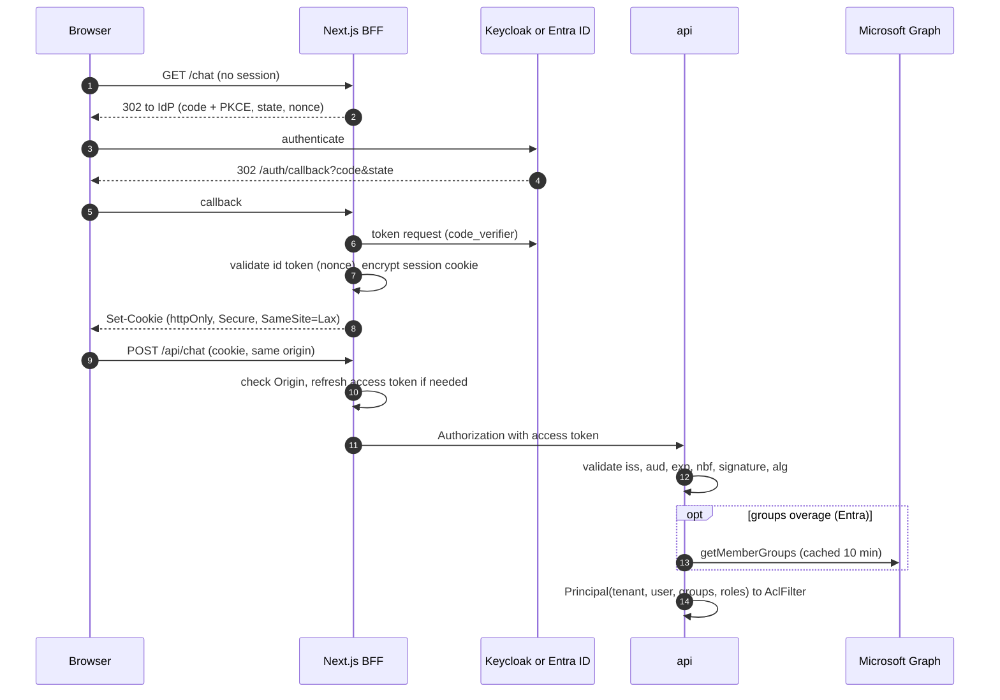

# Step 8: Authentication and multi-tenancy

| | |
| --- | --- |
| **Depends on** | Step 7 |
| **Branches** | `step-08a-api-auth`, `step-08b-bff` |
| **PR size** | Two PRs |
| **Prompt lesson** | Threat-model prompting: every threat gets a mitigation and a negative test (P10) |

## Goal

Replace the dev persona shortcut with real identity, without changing a line
of retrieval code. In `free`, Keycloak is the IdP; in `azure`, Entra ID. The
api validates JWTs and maps claims to a `Principal` (tenant, user, groups,
roles). The web app becomes a **Backend-for-Frontend**: it owns the OIDC
session, and the browser holds only an encrypted httpOnly cookie (D-16).
Tenant isolation is proven by negative tests at every layer.

## Scope

**8a: api authentication and authorization**

- JwtBearer for both IdPs (authority, audience, issuer, signing keys via
  discovery). Clock skew 30 s.
- `JwtCurrentPrincipal`: maps configurable claims (`TenantClaim`,
  `GroupsClaim`, roles) to `Principal`; rejects tokens without a tenant.
- Entra **group overage**: when the token carries `_claim_names.groups`
  instead of `groups`, resolve memberships via Microsoft Graph
  `getMemberGroups` (managed identity / client credentials), cached for 10 min.
- Authorization policies: `kc.user`, `kc.admin`. Applied to every endpoint
  except `/health`, `/alive`.
- AppHost: Keycloak (`Aspire.Hosting.Keycloak`) with an imported dev realm
  `knowledge-copilot`: clients `kc-web` (confidential, PKCE), `kc-api`
  (audience), `kc-evals` (dev realm only); groups; users matching the
  eval personas; mappers for `tenant_id`, group **ids**, and realm roles.
- Delete `DevPersonaMiddleware` and `X-KC-Dev-Persona` everywhere; evals get
  real tokens per persona.

**8b: Next.js BFF**

- OIDC authorization code + PKCE in route handlers; encrypted httpOnly,
  `Secure`, `SameSite=Lax` session cookie; refresh before expiry; logout
  with RP-initiated end-session.
- Library chosen after checking maintenance status and Next.js 16 support
  (Auth.js, Better Auth, or `openid-client` directly). Recorded as D-8-01.
- Proxy routes attach `Authorization` server-side; CSRF protection on all
  state-changing BFF routes (origin check + SameSite).
- Middleware redirects unauthenticated users to login; the persona switcher is
  removed.

**Out (non-goals)**

User management UI, SCIM, multiple IdPs at once, ABAC beyond groups, rate
limiting (Step 12).

## Token flow (architecture §9.5)



## Threat model (the specification for the negative tests)

| # | Threat | Mitigation | Negative test |
| - | ------ | ---------- | ------------- |
| T1 | Token for another audience (e.g. a Graph token) | Validate `aud` = api audience | `Api_WrongAudience_401` |
| T2 | Token from another issuer or realm | Validate `iss` against configured authority | `Api_WrongIssuer_401` |
| T3 | Expired or not-yet-valid token | `exp` / `nbf` with 30 s skew | `Api_ExpiredToken_401` |
| T4 | `alg: none` or HMAC-with-public-key confusion | Only asymmetric algorithms from discovery keys | `Api_AlgNone_401`, `Api_Hs256_401` |
| T5 | Token without tenant claim | Reject at principal mapping | `Api_NoTenantClaim_403` |
| T6 | Cross-tenant data access by id (IDOR) | Every query scoped by tenant; 404 (not 403) for other tenants' ids | `Documents_OtherTenantId_404`, `Conversation_OtherTenant_404` |
| T7 | Group overage silently drops groups | Detect overage, call Graph, fail closed if Graph fails | `Principal_Overage_ResolvesGroups`, `Principal_OverageGraphDown_503` |
| T8 | Dev shortcut still active | Dev persona code deleted; `DevCurrentPrincipal` only in Development | `Production_DevPersonaHeader_Ignored` (header is meaningless) |
| T9 | Token theft from the browser | Tokens only in encrypted server-side cookie | BFF test: no token in any response body or non-httpOnly cookie |
| T10 | CSRF on BFF POST routes | SameSite=Lax + Origin/Host check | `Bff_CrossOriginPost_403` |
| T11 | Open redirect via callback `returnTo` | Allow only relative paths | `Bff_AbsoluteReturnTo_Rejected` |
| T12 | Session fixation / stale session after logout | Rotate session on login; end-session + cookie clear on logout | `Bff_Logout_ClearsCookie` |
| T13 | Admin endpoint used by a normal user | `kc.admin` policy | `Documents_Upload_NonAdmin_403` |
| T14 | Group names spoofed by IdP admins renaming groups | ACLs store group **ids**, never names | Realm mapper emits ids; `Principal_UsesGroupIds` |

## Planned files

```text
# 8a
src/KnowledgeCopilot.Api/Auth/{AuthSetup, JwtCurrentPrincipal, ClaimsMapping, Policies}.cs
src/KnowledgeCopilot.Adapters.Azure/Identity/GraphGroupResolver.cs
src/KnowledgeCopilot.Domain/Ports/IGroupResolver.cs
deploy/keycloak/realm-knowledge-copilot.json
src/KnowledgeCopilot.AppHost/AppHost.cs (Keycloak)
tests/KnowledgeCopilot.Api.Tests/Auth/*Tests.cs (local signing key + test issuer)
evals/src/knowledge_evals/auth.py (token per persona)
# 8b
web/src/auth/*, web/src/middleware.ts, web/src/app/auth/{login,callback,logout}/route.ts
web/src/app/api/**/route.ts (attach token, CSRF check)
web/src/**/__tests__/auth*.test.ts
```

## Design notes and pitfalls

- **Testing JWT validation** without an IdP: create an RSA key in the test,
  serve a fake OIDC discovery document and JWKS through a test handler, and
  mint tokens with chosen claims. This makes T1–T5 fast and deterministic.
- **Keycloak group ids.** The default group mapper emits names or paths.
  Configure it to emit ids (or use a script/attribute mapper) and record the
  approach. ACLs store `g:{id}`.
- **Entra tenant.** For a single-tenant demo the tenant claim can be `tid`. For
  app-level tenants, use an app role or a directory extension attribute.
  Decide and record.
- **Overage.** Over 200 groups in JWT (or 6 in implicit flows), Entra omits
  `groups` and sets `_claim_names`. Graph `getMemberGroups` with
  `securityEnabledOnly=true`. The api's identity needs `GroupMember.Read.All`
  (application permission, admin consent).
- **Evals.** Free: `kc-evals` client with direct access grants is enabled
  **only** in the dev realm file; production realms must not have it. Azure:
  the agent proposes a persona token approach (for example service
  principals that are members of test groups, using client credentials) and
  verifies the `groups` claim appears. If it doesn't, the agent stops and asks.
- **BFF library choice.** Check release dates, open issues and Next.js 16
  support before choosing. A small, well-understood `openid-client`
  implementation is a valid answer.
- **Aspire Keycloak** is a preview package. Pin it and note it in decisions.

## Build prompt 8a: api authentication and authorization

```text
# Role and context
You are a senior .NET security-minded engineer on knowledge-copilot-dotnet (permission-aware RAG
copilot, .NET 10 + Aspire 13). Learning project held to production standards.
This is STEP 8a of 13: real identity in the api. Retrieval already enforces ACLs given a
Principal; this step makes the Principal trustworthy. Treat this as security work: every threat
in the step page's threat model needs a mitigation and a named negative test.

# Read first (these override your assumptions)
- .github/copilot-instructions.md
- docs/architecture.md sections 9.5, 11
- docs/decisions.md D-14, D-16 and D-2-01, D-4-01
- docs/steps/step-08-auth.md: the threat model table (T1-T8, T13, T14 apply to 8a) is normative

# Current state
Steps 0-7 merged. ICurrentPrincipal is implemented by DevCurrentPrincipal (Development) plus the
DevPersonaMiddleware header. The web proxy adds the persona header in development.

# Task
1. AuthSetup: AddAuthentication().AddJwtBearer with Authority, Audience from
   KnowledgeCopilot:Auth (validated options), ValidateIssuer/Audience/Lifetime/IssuerSigningKey
   all true, ClockSkew 30 s, ValidAlgorithms restricted to RS256/PS256/ES256. MapInboundClaims
   false.
2. JwtCurrentPrincipal: map sub/oid -> UserId, TenantClaim -> TenantId (missing -> 403 via a
   typed exception and ProblemDetails), GroupsClaim -> Groups (ids), roles -> Roles. If the
   token has an overage indicator, call IGroupResolver (new Domain port); Azure implementation
   GraphGroupResolver (Microsoft.Graph SDK or raw HTTP with DefaultAzureCredential),
   HybridCache/IMemoryCache 10 min per user; if Graph fails, fail closed with 503.
3. Policies kc.user (authenticated + tenant) and kc.admin (role kc.admin). RequireAuthorization on
   every endpoint group; /health and /alive AllowAnonymous.
4. Make every tenant-scoped repository query filter by TenantId (EF global query filter bound to
   ICurrentPrincipal, or explicit filters; choose and record). Other tenants' ids return 404.
5. Delete DevPersonaMiddleware and the X-KC-Dev-Persona header from api, web proxy, evals and
   docs. DevCurrentPrincipal stays for Development without Keycloak only if KnowledgeCopilot:
   Auth:Mode=Dev; record as D-8-xx.
6. AppHost (Free): AddKeycloak (Aspire.Hosting.Keycloak, pinned preview) with data volume and
   realm import from deploy/keycloak/realm-knowledge-copilot.json containing: clients kc-web
   (confidential, standard flow, PKCE S256, redirect URIs for local web), kc-api (bearer-only
   audience via audience mapper), kc-evals (direct access grants, dev realm only); groups
   matching personas.json; users per persona with a dev password from an Aspire parameter;
   mappers: tenant_id (user attribute), groups as ids, realm roles.
7. Tests (Api.Tests): a TestAuthority helper serving discovery + JWKS from an in-memory RSA key,
   minting tokens. Implement every negative test named for T1-T8, T13, T14, plus the happy path.
   Retrieval contract still passes for two tenants with tokens instead of personas.
8. evals: auth.py obtains a token per persona (free: kc-evals password grant against the dev
   realm; azure: propose an approach in the plan, verify groups appear in the token, stop and ask
   if not). The answers and retrieval suites send Authorization headers.

# Constraints
- No custom JWT parsing or signature code; use the framework handlers.
- Never accept tenant, user or groups from headers or bodies.
- Fail closed: any uncertainty about identity -> 401/403/503, never "anonymous with defaults".
- Keycloak realm file contains no real secrets; client secrets come from Aspire parameters.
- Verify Aspire.Hosting.Keycloak APIs (realm import, data volume) in the installed preview version.

# Non-goals
- No BFF/session work (8b). No user management, SCIM or multiple simultaneous IdPs.

# Acceptance criteria
- `make lint test` passes; each listed negative test exists and fails if its mitigation is
  removed (demonstrate one in the PR, then revert).
- `make dev`: Keycloak starts with the realm; evals run with real tokens; ACL leaks = 0.
- grep for X-KC-Dev-Persona returns nothing.

# Process
Plan first: claims mapping table for Keycloak and Entra, test authority design, tenant filtering
approach. Wait for approval. PR "Step 8a: API authentication and tenancy".

# Report
Files with reasons, D-8-xx decisions, threat-to-test mapping table, deviations, verification
commands, open questions.
```

## Build prompt 8b: Next.js BFF

```text
# Role and context
Same project and standards; 8a merged. This is STEP 8b: make web/ a Backend-for-Frontend. The
browser must never see an access or refresh token; it only holds an encrypted httpOnly session
cookie. Threats T9-T12 in the step page are normative.

# Read first (these override your assumptions)
- .github/copilot-instructions.md
- docs/architecture.md sections 9.5, 11
- docs/decisions.md D-16
- docs/steps/step-08-auth.md (threat model T9-T12, pitfalls on library choice)

# Task
1. Choose the OIDC library: compare Auth.js, Better Auth and openid-client (latest release date,
   maintenance status, Next.js 16 App Router support, refresh-token handling, encrypted cookie
   sessions). Present the comparison in the plan and wait for my choice. Record as D-8-01.
2. Routes: /auth/login (PKCE, state, nonce, returnTo relative only), /auth/callback, /auth/logout
   (RP-initiated end-session, clear cookie). Session cookie: encrypted (key from env/Aspire
   parameter), httpOnly, Secure (except localhost http), SameSite=Lax, path /, rotated on login.
3. Token refresh in the server-side session when the access token expires within 60 s;
   concurrent requests share one refresh.
4. All app/api/* proxy routes: require a session (401 JSON otherwise), check Origin/Host on
   non-GET (403 on mismatch), attach Authorization server-side, stream responses through unchanged.
5. middleware.ts: redirect unauthenticated page requests to /auth/login?returnTo=...
6. Remove PersonaSwitcher and the development persona cookie. Show the signed-in user and a logout
   button.
7. AppHost: pass the Keycloak authority, client id and secret (parameter) to web.
8. Tests: T9-T12 negative tests (Vitest on route handlers), plus a Playwright login -> ask ->
   logout flow against make dev.

# Constraints
- No tokens in client components, props, localStorage, sessionStorage, or non-httpOnly cookies.
- No NEXT_PUBLIC variables containing secrets or the api origin.
- Use the library's supported APIs only; verify against the installed version.

# Non-goals
- No social login, no account linking, no user profile pages.

# Acceptance criteria
- `pnpm -C web lint test build` pass; T9-T12 tests pass.
- Manual: devtools shows only the session cookie (httpOnly); the JS bundle contains no token or api URL.
- Playwright flow passes in make dev.

# Process
Plan with the library comparison first; wait for my choice. PR "Step 8b: Next.js BFF".

# Report
Files with reasons, D-8-xx decisions, deviations, verification commands, open questions.
```

## Why these are good prompts

| Prompt section | Principle | Why it helps |
| --- | --- | --- |
| Threat table with one negative test per threat | P10 | Security requirements become a checklist of tests rather than "make it secure". |
| "Fails if its mitigation is removed (demonstrate one)" | P7 | Proves the tests detect the vulnerability, not just pass. |
| "Fail closed" and "never accept identity from headers or bodies" | P4, P10 | Rules out the most common auth shortcuts. |
| Test authority with in-memory keys | P6 | Makes JWT edge cases (alg none, wrong aud) cheap to test deterministically. |
| "Present the library comparison and wait for my choice" | P8 | A decision with long-term cost stays with the human. |
| Azure persona approach: "verify groups appear, stop if not" | P8 | Turns an uncertain area into an explicit checkpoint. |
| Deleting the dev persona header, with a grep check | P5, P7 | Temporary scaffolding gets removed verifiably. |

## Follow-up prompts

**Review (security):**

```text
Act as a penetration tester. Using only the threat model in docs/steps/step-08-auth.md and this
branch, try to (1) read another tenant's document, (2) call an admin endpoint as a user, (3) get a
token into browser JavaScript, (4) make the api accept a token it should reject. For each attempt
show the request you would send, the code that stops it, and the test that proves it. Report any
gap as file:line + fix.
```

**Explain:**

```text
Explain the BFF pattern as implemented in web/src/auth, and compare it with storing tokens in the
SPA. Then explain Entra group overage and our handling. Three interview questions on OAuth/OIDC
for SPAs and multi-tenant authorization, with model answers.
```

## Human review checklist

- [ ] Every threat T1–T14 maps to code and a test.
- [ ] `ValidAlgorithms` restricted; `MapInboundClaims` false; skew 30 s.
- [ ] No identity from headers or bodies anywhere.
- [ ] Realm JSON has no real secrets; `kc-evals` exists only in the dev realm.
- [ ] Browser devtools: only an httpOnly session cookie.

## How to verify

```powershell
make test
make dev        # log in as a persona, ask a question, log out
make eval-smoke # real tokens, ACL leaks = 0
```

## Interview talking points

- JWT validation: what to check and the classic attacks (alg none, key confusion, audience).
- Multi-tenancy: tenant in the token, scoping every query, 404 vs 403.
- Entra group overage and failing closed.
- BFF vs tokens in the browser; CSRF with cookie sessions.

## Prompt lesson: threat-model prompting

Security work gets weak results from "make it secure". It gets strong results
from a table of threats, each with a mitigation and a named negative test, plus
a request to show a test failing when its mitigation is removed. That gives the
agent a target and gives you evidence.
