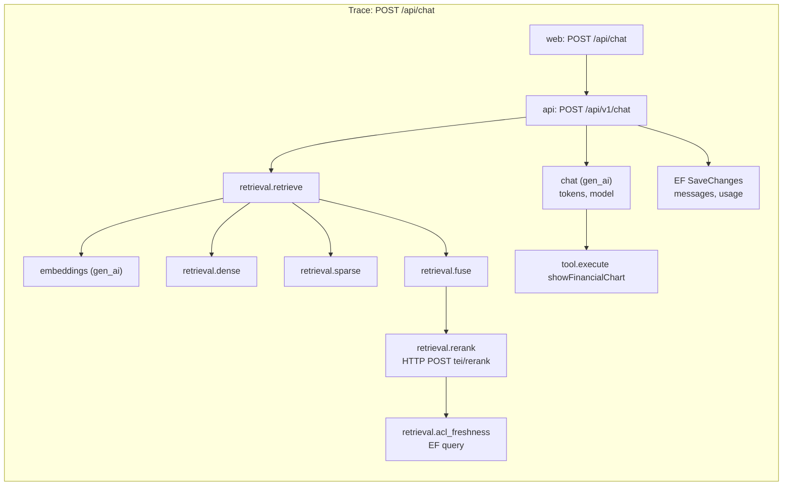

# Step 9: Observability

| | |
| --- | --- |
| **Depends on** | Steps 6 and 8 |
| **Branch** | `step-09-observability` |
| **PR size** | ~20 files |
| **Prompt lesson** | Naming conventions as constraints (P4) |

## Goal

One trace per user question, from the browser's request through the BFF, api,
retrieval legs, reranker and LLM, with token usage and cost on the spans.
One trace per document, from upload through the queue into the worker.
Metrics for the product numbers that matter: TTFT, retrieval latency, cost,
ingestion throughput and queue age. Same instrumentation in both profiles;
only the exporter changes.

## Scope

**In**

- `KnowledgeCopilot.Telemetry` static class (in ServiceDefaults or Application):
  one `ActivitySource` and one `Meter` per area with **documented names**.
- GenAI semantic conventions through `Microsoft.Extensions.AI`
  `UseOpenTelemetry()` for chat and embeddings; sensitive content off by default.
- Custom spans from architecture §12, with attributes from the naming table below.
- Queue trace propagation: `traceparent` in `JobMessage`; worker `process` span
  linked to the producer, following messaging semantic conventions.
- Metrics: `kc.chat.ttft`, `kc.retrieval.duration`, `kc.llm.cost`,
  `kc.ingest.chunks`, `kc.queue.age`, `kc.retrieval.rerank_fallback`,
  `kc.chat.citation_dropped`.
- Resource attributes: `service.name`, `service.version`, `deployment.environment.name`, `app.profile`.
- Web: Next.js `instrumentation.ts` exporting OTLP; BFF propagates context to the api.
- Exporters: OTLP (Aspire dashboard; Phoenix optional via AppHost flag);
  Azure Monitor OpenTelemetry distro when `Profile=Azure`.
- Telemetry tests with an in-memory exporter.
- `docs/observability.md`: naming table, how to find a slow answer, sample queries.

**Out (non-goals)**

Alerts and SLO burn rates (Step 11/12), log sampling strategy beyond defaults,
front-end RUM.

## One question, one trace



## Naming table (normative)

| Kind | Name | Attributes (required in **bold**) | Notes |
| ---- | ---- | --------------------------------- | ----- |
| Span | `retrieval.retrieve` | **`kc.retrieval.mode`**, `kc.retrieval.hits` | parent of the legs |
| Span | `retrieval.dense` / `retrieval.sparse` | **`kc.retrieval.k`**, `kc.retrieval.hits`, `db.system.name` | `db.system.name` = `qdrant` or `azure.ai.search` |
| Span | `retrieval.fuse` | `kc.retrieval.input_count`, `kc.retrieval.output_count` | |
| Span | `retrieval.rerank` | `kc.rerank.top_n`, `kc.rerank.fallback` | |
| Span | `ingest.parse` / `.chunk` / `.embed` / `.index` | **`kc.document.id`**, counts | never document text |
| Span | `{queue} process` | **`messaging.system`**, **`messaging.operation.type`**=`process`, `messaging.destination.name`, `messaging.message.id` | linked to the producer span |
| Span | `tool.execute {name}` | **`gen_ai.tool.name`**, `gen_ai.tool.call.id`, `kc.tool.outcome` | |
| Span | (MEAI) `chat {model}` / `embeddings {model}` | `gen_ai.*` per GenAI semconv | produced by `UseOpenTelemetry()` |
| Histogram | `kc.chat.ttft` (ms) | `app.profile`, `gen_ai.request.model` | |
| Histogram | `kc.retrieval.duration` (ms) | `kc.retrieval.mode`, `kc.retrieval.leg` | |
| Counter | `kc.llm.cost` (USD) | `gen_ai.request.model`, `kc.tenant.id` | tenant ok while tenants ≤ ~100 (cardinality) |
| Counter | `kc.ingest.chunks` | `kc.ingest.outcome` = `embedded` / `skipped` / `deleted` | |
| Histogram | `kc.queue.age` (s) | `messaging.destination.name` | enqueue → receive |
| Counter | `kc.retrieval.rerank_fallback` | `kc.rerank.reason` | |
| Counter | `kc.chat.citation_dropped` | — | |

Rules:

- `kc.*` for project-specific names; standard semconv names whenever one
  exists.
- No user ids, emails, prompts or document text as attributes. `kc.tenant.id`
  and `kc.document.id` are allowed (opaque ids).
- Units: ms for latency histograms, s for queue age, USD for cost.

## Planned files

```text
src/KnowledgeCopilot.ServiceDefaults/Telemetry/{KcTelemetry, ResourceSetup, ExporterSetup}.cs
src/KnowledgeCopilot.Application/** (spans/metrics added where the table says)
src/KnowledgeCopilot.Adapters.Common/Storage/StorageQueueWorkQueue.cs (propagation)
src/KnowledgeCopilot.Worker/QueueConsumer.cs (process span with link)
web/instrumentation.ts, web/src/lib/otel.ts
src/KnowledgeCopilot.AppHost/AppHost.cs (optional Phoenix container)
tests/KnowledgeCopilot.Application.Tests/Telemetry/*Tests.cs
docs/observability.md
```

## Design notes and pitfalls

- **Semconv versions move.** GenAI and messaging conventions are still
  evolving (`gen_ai.system` → `gen_ai.provider.name`,
  `deployment.environment` → `deployment.environment.name`). Use whatever the
  installed `Microsoft.Extensions.AI` emits for GenAI, and the current stable
  messaging conventions for our spans. Record the semconv version.
- **Sensitive data.** `UseOpenTelemetry(configure: c => c.EnableSensitiveData =
  …)` must be bound to `KnowledgeCopilot:Telemetry:CaptureContent` and that
  setting must be rejected outside Development.
- **Links vs parent for queues.** Messaging conventions recommend the consumer
  `process` span **link** to the producer context (batching makes a single
  parent wrong). The Aspire dashboard shows links, so you can still navigate.
- **TTFT measurement** belongs where the first `text-delta` is written, not
  where the LLM call starts.
- **Cost attribution.** The `kc.llm.cost` counter and `USAGE_RECORD` must agree.
  Test that one chat turn produces equal values.
- **Azure Monitor distro** (`Azure.Monitor.OpenTelemetry.AspNetCore`) replaces
  the OTLP exporter in `azure`; don't double-export.

## The build prompt

```text
# Role and context
You are a senior .NET engineer with OpenTelemetry experience, working on knowledge-copilot-dotnet
(permission-aware RAG copilot; .NET 10 + Aspire 13; Next.js 16 BFF; Python evals).
Learning project held to production standards.
This is STEP 9 of 13: observability. The goal is one trace per question and per document, and
metrics for TTFT, retrieval latency, cost, ingestion and queue age. Names matter: telemetry with
inconsistent names can't be queried, so the naming table on the step page is a hard constraint.

# Read first (these override your assumptions)
- .github/copilot-instructions.md
- docs/architecture.md section 12
- docs/decisions.md D-01, D-03
- docs/steps/step-09-observability.md: the naming table and its rules are normative. Do not
  invent names that are not in it; if you need one, propose it in the plan.
- The OpenTelemetry semantic conventions for GenAI and messaging (current versions), and what the
  installed Microsoft.Extensions.AI version actually emits.

# Current state
Steps 0-8 merged. ServiceDefaults has default OTel (ASP.NET Core, HttpClient, runtime). Some spans
exist ad hoc from Steps 3-5. JobMessage has a TraceParent field.

# Task
1. KcTelemetry: static ActivitySource and Meter instances ("KnowledgeCopilot.Retrieval",
   ".Ingestion", ".Chat", ".Tools"), each instrument created once, names and units exactly as the
   naming table. Register sources and meters in ServiceDefaults. Add EF Core and Azure SDK
   instrumentation.
2. Resource: service.name, service.version (assembly informational version), 
   deployment.environment.name, app.profile on all signals (api, worker, web).
3. Replace ad-hoc spans with the table's spans and attributes across retrieval, ingestion, chat
   and tools. Remove any attribute carrying user ids, emails, prompts or text.
4. GenAI: ensure IChatClient and IEmbeddingGenerator pipelines use UseOpenTelemetry with
   EnableSensitiveData bound to KnowledgeCopilot:Telemetry:CaptureContent; startup fails if it is
   true outside Development.
5. Queue propagation: producer injects W3C traceparent (and tracestate) into JobMessage; the
   worker extracts it and starts "{queue} process" (Consumer kind) with a link to the producer
   context and messaging attributes. Record kc.queue.age from the enqueue timestamp.
6. Metrics: kc.chat.ttft at first text-delta; kc.retrieval.duration per leg; kc.llm.cost from the
   same calculation as UsageRecord; kc.ingest.chunks with outcome; kc.retrieval.rerank_fallback;
   kc.chat.citation_dropped.
7. Exporters: OTLP when OTEL_EXPORTER_OTLP_ENDPOINT is set (Aspire sets it). When Profile=Azure
   and APPLICATIONINSIGHTS_CONNECTION_STRING is set, use the Azure Monitor distro instead (no
   double export). AppHost flag KnowledgeCopilot:Telemetry:Phoenix=true adds an Arize Phoenix
   container and points a second OTLP exporter at it (verify Phoenix's OTLP endpoint and image tag).
8. Web: instrumentation.ts with the OTel Node SDK (or @vercel/otel, verify Next.js 16 support),
   OTLP exporter, fetch instrumentation so BFF -> api requests carry traceparent.
9. Tests with an in-memory exporter:
   - Chat_OneTurn_ProducesExpectedSpanTree (names and parent/child as in the diagram)
   - Ingest_QueueHop_LinksProducer
   - Spans_ContainNoForbiddenAttributes (scan all attributes for prompt/user/email keys and for
     seeded secret strings)
   - Cost_MetricEqualsUsageRecord
   - CaptureContent_OutsideDevelopment_FailsStartup
10. docs/observability.md: naming table (link to the step page), how to find the slowest leg of a
    slow answer in the Aspire dashboard, and example KQL for Application Insights.

# Constraints
- Names, units and attribute keys exactly as the naming table. New names need plan approval.
- No high-cardinality attributes (user ids, chunk ids on metrics, raw queries).
- No content capture unless Development + explicit flag.
- Verify the GenAI attribute names emitted by the installed MEAI version and use those; record
  the semconv version in D-9-01.

# Non-goals
- No alerts, SLO burn-rate rules or dashboards-as-code for Azure (Step 11/12).

# Acceptance criteria
- `make lint test` passes including the telemetry tests.
- make dev: one chat question shows a single trace from web through api to the LLM in the Aspire
  dashboard, with gen_ai token usage on the chat span; an upload shows the worker span linked to
  the api span.
- Metrics visible in the dashboard: kc.chat.ttft, kc.retrieval.duration, kc.llm.cost.

# Process
Plan first: the span tree for chat and ingestion with names from the table, and any names you
need to add. Wait for approval. PR "Step 9: Observability".

# Report
Files with reasons, D-9-xx decisions, screenshots of the two traces, deviations, verification
commands, open questions.
```

## Why this is a good prompt

| Prompt section | Principle | Why it helps |
| --- | --- | --- |
| Normative naming table with required attributes | P4, P6 | Consistent names are what make telemetry queryable; the table is the contract. |
| "New names need plan approval" | P8 | Lets the agent extend the vocabulary without letting it drift. |
| "Verify what the installed MEAI emits" | P2, P4 | GenAI semconv is changing; the installed library is the source of truth. |
| Forbidden-attributes test scanning for secrets | P10 | Telemetry is a common data-leak path; tested, not trusted. |
| Cost metric equals UsageRecord | P7 | Two sources of the same number must agree. |
| Expected span tree diagram + test | P6, P7 | A picture of the target trace turns into an assertion. |
| Screenshots of the traces in the report | P9 | Observability is verified by looking at it. |

## Follow-up prompts

**Review:**

```text
Review telemetry on this branch against the naming table in docs/steps/step-09-observability.md.
List every ActivitySource/Meter instrument and attribute key in the code and mark each as
matching, missing or not in the table. Also check for PII/content in attributes or logs, double
export in Azure mode, and TTFT measured at the wrong point. file:line, why, smallest fix.
```

**Explain:**

```text
Using a real trace from make dev, explain where the time went for one answer and which span
attributes tell us the model, token counts and cost. Then explain span links vs parent for queue
consumers. Three interview questions on observability for LLM systems, with model answers.
```

## Human review checklist

- [ ] Every name and unit matches the table.
- [ ] No prompt, document text, email or user id in any attribute.
- [ ] One trace per chat turn across web → api → LLM.
- [ ] Worker span linked to the producer.
- [ ] Cost metric equals `USAGE_RECORD` for a test turn.

## How to verify

```powershell
make test
make dev   # ask one question and upload one document, then open Traces and Metrics in the dashboard
```

## Interview talking points

- OpenTelemetry signals, resources and semantic conventions; why names matter.
- GenAI telemetry: tokens, models, cost, and content capture risks.
- Trace propagation across queues: links vs parent.
- TTFT vs total latency, and which one users feel.

## Prompt lesson: naming conventions as constraints

Agents invent plausible names freely, and telemetry with plausible but
inconsistent names is nearly useless. Give a normative naming table, require
plan approval for new names, and test the names. The same technique works for
API routes, config keys and log events.
