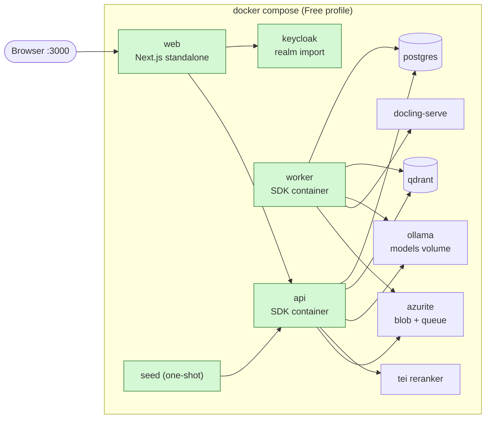

# Step 10: Free-profile packaging

| | |
| --- | --- |
| **Depends on** | Steps 8 and 9 |
| **Branch** | `step-10-free-packaging` |
| **PR size** | ~15 files plus generated `deploy/` |
| **Prompt lesson** | Environment parity: verify, don't assume (P4, P8) |

## Goal

Anyone can run the whole Free profile with `docker compose up` on a laptop,
without the .NET SDK or Aspire installed: api, worker, web, Postgres, Qdrant,
Ollama, TEI reranker, docling-serve, Keycloak (with a seeded realm), Azurite and the seed
corpus. The **same eval suite** that passes under `make dev` passes against
Compose. Parity is checked by a test, not assumed.

## Scope

**In**

- Container images:
  - `api` and `worker` via .NET SDK container publish (no Dockerfile),
    chiseled or non-root base images;
  - `web` via a Next.js `output: "standalone"` multi-stage Dockerfile, non-root.
- Aspire Docker Compose publishing (`Aspire.Hosting.Docker`): generate
  `deploy/compose/docker-compose.yaml` + `.env.example`, **commit the output**,
  then hand-edit only through documented overlays.
- Keycloak realm export (`deploy/keycloak/realm-knowledge-copilot.json`) with
  persona users, groups and clients (secrets via env, not in the file).
- Seed job: one-shot container that uploads `data/seed/` through the api.
- Health checks and `depends_on: condition: service_healthy` ordering.
- Model bootstrap: Ollama pulls the chat and embedding models on first start
  (with progress visible), and the volume persists them.
- `make compose-up`, `make compose-down`, `make compose-evals`.
- CI job: build images, `compose up`, run evals with the Free thresholds,
  `compose down -v`.
- `docs/run-with-docker.md`: requirements (RAM/disk), first-run time, troubleshooting.

**Out (non-goals)**

Kubernetes/Helm, image signing, registry publishing (Step 11 uses ACR),
GPU images.

## Topology



## Parity matrix (what must be identical to `make dev`)

| Aspect | `make dev` (Aspire) | Compose | How parity is checked |
| ------ | ------------------- | ------- | --------------------- |
| Config keys | AppHost env | `.env` + compose env | config snapshot test: api `/admin/config` (redacted) equal sets of keys |
| Model names + embedding dims | AppHost parameters | `.env` | eval report header records model + dims |
| Index schema | created at startup | created at startup | same code path; `/health/ready` checks the collection |
| Persona tokens | Keycloak container | Keycloak container, same realm file | eval persona login |
| Seed corpus | `make seed` | seed job | document count + content hashes in eval report |
| Eval thresholds | `evals/thresholds.free.yaml` | same file | `make compose-evals` |
| Telemetry | Aspire dashboard | standalone Aspire dashboard container (optional) | trace visible |

## Planned files

```text
deploy/compose/docker-compose.yaml        (generated, committed)
deploy/compose/docker-compose.override.example.yaml
deploy/compose/.env.example
deploy/keycloak/realm-knowledge-copilot.json
deploy/seed/Dockerfile, deploy/seed/seed.sh
web/Dockerfile, web/.dockerignore
src/KnowledgeCopilot.Api/KnowledgeCopilot.Api.csproj (container properties)
src/KnowledgeCopilot.Worker/KnowledgeCopilot.Worker.csproj (container properties)
src/KnowledgeCopilot.AppHost/AppHost.cs (AddDockerComposeEnvironment)
Makefile (compose targets), .github/workflows/compose-evals.yml
docs/run-with-docker.md
```

## Design notes and pitfalls

- **Generated, then owned.** Regenerate with `aspire publish` when the AppHost
  changes; diff the result in the PR. Hand edits go in an override file so
  regeneration doesn't wipe them.
- **Secrets.** `.env.example` has placeholders only; `.env` is gitignored.
  Keycloak client secrets and the Postgres password come from `.env`.
- **Keycloak hostname.** The browser reaches Keycloak at `localhost:8080`, but
  the web container reaches it at `keycloak:8080`. Token issuer must match
  for validation. Use `KC_HOSTNAME` + a backchannel setting, and test with a
  real login. This is the most common Compose auth bug.
- **Ollama first run** downloads several GB. Healthy ≠ model ready: the api's
  readiness check must verify the models exist, not only that Ollama answers.
- **Image size and user.** SDK containers default to non-root `app` user;
  keep it. Next.js standalone image should be < 250 MB.
- **ARM vs x86.** TEI CPU image availability for arm64 varies; document the
  fallback (`Reranker:Enabled=false`) and record what was verified.
- **Health ordering.** `depends_on: service_healthy` only works if each image
  has a working healthcheck (chiseled images have no curl; use the app's own
  health probe or a tiny healthcheck binary).

## The build prompt

```text
# Role and context
You are a senior .NET and container engineer working on knowledge-copilot-dotnet
(permission-aware RAG copilot; .NET 10 + Aspire 13; Next.js 16; Python evals).
Learning project held to production standards.
This is STEP 10 of 13: package the Free profile so it runs with docker compose and passes the
same evals as `make dev`. Parity is the point: if it is not proven by a test, assume it differs.

# Read first (these override your assumptions)
- .github/copilot-instructions.md
- docs/architecture.md sections 13 and 14
- docs/decisions.md D-02, D-17, D-18
- docs/steps/step-10-free-packaging.md: the parity matrix is the acceptance contract.
- Current Aspire docs for the Docker Compose publisher (Aspire.Hosting.Docker) and for
  `aspire publish`; current .NET SDK container publish docs; Next.js standalone output docs.

# Current state
Steps 0-9 merged. Everything runs under `make dev` (Aspire AppHost) with Keycloak, Ollama, TEI,
docling-serve, Qdrant, Postgres and Azurite containers. There are no Dockerfiles and no deploy/ folder yet.

# Task
1. api and worker images via SDK container publish: ContainerRepository, ContainerFamily
   (chiseled or noble non-root — verify which tags exist for .NET 10), port, user. No Dockerfile.
2. web image: multi-stage Dockerfile with Next.js output "standalone", pnpm, non-root user,
   NEXT_TELEMETRY_DISABLED, final image < 250 MB.
3. AppHost: add the Docker Compose environment and publish to deploy/compose. Commit the output and
   an override example. Document regeneration in docs/run-with-docker.md.
4. Keycloak: export the realm (users, groups, clients, mappers) to deploy/keycloak with secrets
   replaced by env placeholders; import on start. Solve browser vs container hostname so that tokens
   issued via localhost validate in the api (verify against current Keycloak hostname options).
5. Health: every service has a working healthcheck; depends_on uses service_healthy. The api
   readiness check verifies the Ollama models and the index collection exist.
6. Seed: one-shot container that waits for api readiness and uploads data/seed via the api, as a
   seeded admin persona; idempotent on rerun.
7. Make targets: compose-up, compose-down (keeps volumes), compose-reset (-v), compose-evals.
8. Parity test: a script that compares the set of configuration keys (not values) and the eval
   report header (models, dims, doc count, corpus hashes) between make dev and compose.
9. CI workflow compose-evals.yml: build images, compose up with small models, wait for healthy,
   run evals with thresholds.free.yaml, upload the report, compose down -v. Cache the Ollama
   models volume if feasible; if not, record the run time.
10. docs/run-with-docker.md: requirements (CPU, RAM, disk), first-run time you measured,
    troubleshooting for the issues in "Design notes and pitfalls".

# Constraints
- No secrets in any committed file; .env is gitignored; .env.example has placeholders.
- All application containers run as non-root.
- Generated compose file is committed unmodified; hand edits go only in the override.
- Do not change application behaviour to make packaging easier (no auth bypass flags, no
  disabled ACL filters). If something only works by weakening security, stop and ask.
- Verify every image tag you use exists (docker manifest inspect) and record them in the report.

# Non-goals
- No Kubernetes, Helm, registry push, image signing or GPU images.

# Acceptance criteria
- On a clean machine with only Docker: `cp .env.example .env && make compose-up` reaches all
  healthy, the seed job completes, and persona login + a cited answer works in the browser.
- `make compose-evals` passes with the Free thresholds; the parity script reports no differences.
- `docker image ls` shows api/worker/web images and their sizes in the report.

# Process
Plan first: list of images and base tags, Keycloak hostname approach, healthcheck approach for
chiseled images. Wait for approval. Then implement. PR "Step 10: Free-profile packaging".

# Report
Files with reasons, verified image tags and sizes, measured first-run time, D-10-xx decisions,
deviations, verification commands, open questions.
```

## Why this is a good prompt

| Prompt section | Principle | Why it helps |
| --- | --- | --- |
| Parity matrix as the contract | P4, P6 | "Works in Compose" is vague; a list of things that must match is testable. |
| "If it is not proven by a test, assume it differs" | P7 | Sets the default stance against silent drift. |
| "Verify every image tag exists" | P2, P4 | Agents invent plausible tags; `docker manifest inspect` is cheap proof. |
| "Do not weaken security to make packaging easier; stop and ask" | P8, P10 | Blocks the tempting shortcut (disable auth in compose). |
| Generated file unmodified + override | P4 | Keeps regeneration safe and reviewable. |
| Measured first-run time and sizes in the report | P9 | Evidence instead of claims, and useful docs. |
| Known pitfalls listed on the page | P10 | The Keycloak hostname problem is predictable; naming it saves a debugging session. |

## Follow-up prompts

**Review:**

```text
Review the packaging on this branch. Check: secrets in committed files, root users, unpinned or
non-existent tags, missing healthchecks, depends_on without service_healthy, Keycloak issuer
mismatch, and any config key present in AppHost but missing from compose. file:line, why, fix.
```

**Fix pattern (parity failure):**

```text
compose-evals fails but make dev passes. Do not change thresholds. Compare the eval report headers
and the config key sets, list each difference, and tell me which one explains the failure before
changing anything.
```

## Human review checklist

- [ ] No secrets committed; `.env` ignored.
- [ ] All app containers non-root; image sizes reasonable.
- [ ] Clean-machine run tested by you, not only CI.
- [ ] Login works through the browser (issuer matches).
- [ ] Parity script passes and evals pass in Compose.

## How to verify

```powershell
Copy-Item deploy\compose\.env.example deploy\compose\.env
make compose-up
docker compose -f deploy\compose\docker-compose.yaml ps
make compose-evals
make compose-down
```

## Interview talking points

- Dev/prod parity and how to prove it.
- SDK container publish vs Dockerfiles; chiseled images.
- Generated infrastructure: when to own it.
- OIDC issuer problems inside container networks.

## Prompt lesson: verify, don't assume

Packaging is full of plausible guesses: image tags, hostnames, health
endpoints. A good prompt turns each guess into a verification step and makes
"proven by a test" the bar. It also blocks the shortcut most likely to be
taken (weakening security) by asking the agent to stop instead.
