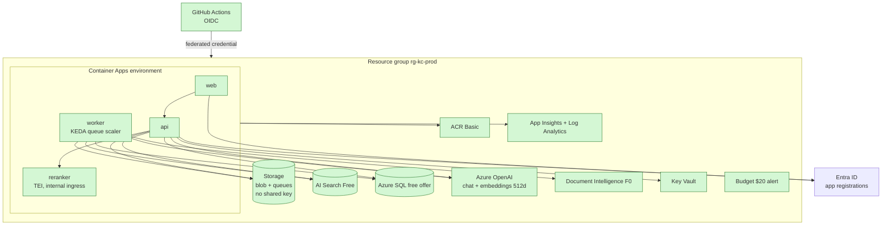
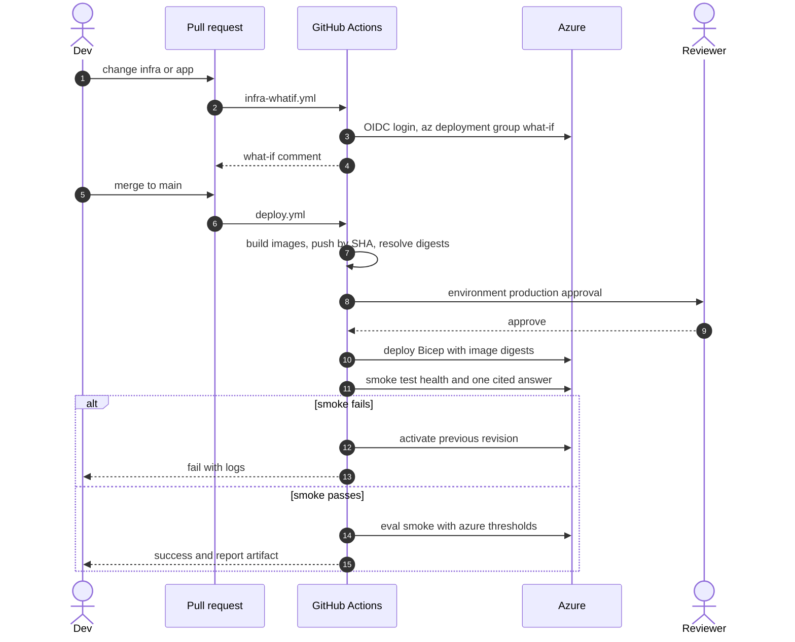

# Step 11: Azure deployment

| | |
| --- | --- |
| **Depends on** | Step 10 |
| **Branch** | `step-11-azure-deploy` |
| **PR size** | ~25 files (Bicep + workflows) |
| **Prompt lesson** | Guardrails and human gates for costly or destructive actions (P8, P10) |

## Goal

Deploy the Azure profile with Bicep and GitHub Actions. No secrets stored
anywhere: managed identity to every Azure service, GitHub OIDC to Azure. Cost
stays near zero when idle: Container Apps scale to zero, free tiers where they
exist, and a budget alert. Every deploy is gated by `what-if` on the PR, a
human approval, a smoke test and an eval smoke run.

## Scope

**In**

- `infra/` Bicep, generated first (`azd infra gen` or `aspire publish` for
  Azure), then committed and **owned** (D-17):
  - Container Apps environment + api, worker, web and reranker (TEI) apps
    (scale to zero; worker scaled by KEDA Azure Queue scaler; reranker internal
    ingress only);
  - user-assigned managed identities per app with least-privilege role
    assignments;
  - Azure Container Registry (Basic), images pulled with managed identity;
  - Storage account (blob + queues), shared keys disabled;
  - Azure AI Search Free, Azure SQL Database (free offer), Azure OpenAI
    (chat + `text-embedding-3-small` at 512 dims), Document Intelligence F0;
  - Key Vault (only for things that have no MI path, e.g. Entra client secret
    for the BFF if not using certificates);
  - Log Analytics + Application Insights;
  - Budget with alert at $20/month.
- Entra ID app registrations (api, web) documented; created by script or
  manually. The agent writes the script, does not run it.
- GitHub Actions:
  - `infra-whatif.yml` on PRs touching `infra/`: `az deployment group what-if`,
    output posted as a PR comment;
  - `deploy.yml` on main: build + push images (tagged by commit SHA, deployed
    **by digest**), deploy Bicep, `environment: production` with required
    reviewers, smoke test, eval smoke, and an automatic rollback to the previous
    revision if the smoke test fails.
- GitHub OIDC federated credential (no client secret in GitHub).
- `docs/deploy-azure.md`: one-time setup, cost table, teardown.

**Out (non-goals)**

Multiple environments beyond `prod`, private networking/VNet integration
(documented as the upgrade path), custom domains, multi-region.

## Azure topology



## Deploy pipeline



## Role assignments (least privilege)

| Identity | Resource | Role |
| -------- | -------- | ---- |
| api | Storage | Storage Blob Data Contributor, Storage Queue Data Message Sender |
| worker | Storage | Storage Blob Data Reader, Storage Queue Data Message Processor |
| api | AI Search | Search Index Data Reader |
| worker | AI Search | Search Index Data Contributor |
| api, worker | Azure OpenAI | Cognitive Services OpenAI User |
| worker | Document Intelligence | Cognitive Services User |
| api, worker | Azure SQL | contained Entra DB user with db_datareader + db_datawriter (migrations run by the pipeline identity) |
| all apps | ACR | AcrPull |
| api / web | Key Vault | Key Vault Secrets User (only if a secret exists) |
| GitHub OIDC SP | resource group | Contributor + User Access Administrator **scoped to the RG** (or a custom role) |

Verify each role name against current Azure built-in roles; record deviations.
Index creation needs Search Service Contributor at startup. Decide whether the
api creates the index (needs that role) or the pipeline does (preferred).

## Cost table (idle, estimates to verify)

| Resource | Tier | Idle cost (approx.) |
| -------- | ---- | ------------------- |
| Container Apps | consumption, min replicas 0 | ~$0 (free grant) |
| AI Search | Free | $0 (50 MB, 3 indexes) |
| Azure SQL | free offer (serverless, auto-pause) | $0 within monthly limits |
| Azure OpenAI | pay per token | $0 idle |
| Document Intelligence | F0 | $0 (500 pages/month) |
| ACR | Basic | ~$5/month |
| Storage, Log Analytics, Key Vault | pay per use | ~$0–2/month |

Prices change: the agent must cite the pricing page and date for each row.

## Planned files

```text
infra/main.bicep, infra/main.parameters.json
infra/modules/{aca, acr, storage, search, sql, openai, docintel, keyvault, monitoring, budget, roles}.bicep
infra/scripts/entra-setup.ps1 (written, run by a human)
infra/scripts/create-index.ps1 (or a .NET tool)
.github/workflows/infra-whatif.yml, deploy.yml
evals/thresholds.azure.yaml (smoke subset)
docs/deploy-azure.md
```

## Design notes and pitfalls

- **AI Search Free: 50 MB.** At 512 dims (float32 ≈ 2 KB per vector plus text
  and fields) a few thousand chunks fit. Keep the Azure corpus small and
  record the measured index size (D-08).
- **Azure SQL with Entra auth** requires an Entra admin on the server and
  `CREATE USER [identity] FROM EXTERNAL PROVIDER` per identity. That is a
  post-deploy SQL step; script it and make it idempotent.
- **Scale to zero + KEDA with managed identity**: the queue scaler must
  authenticate with the worker identity (`identity` in the scale rule), not a
  connection string. Verify the current ACA syntax.
- **Cold starts.** Minimum replicas 0 means a first request may take 10+ s.
  Record measured cold start and decide whether api uses min replicas 1
  (costs money) in D-11-xx.
- **Azure OpenAI quota and model availability** vary by region; the
  parameters file holds region and deployment names, and the plan must check them.
- **Deploy by digest.** Tags are mutable; the Bicep receives `image@sha256:…`.
- **Agent guardrails.** The agent may run `bicep build`, `az bicep lint` and
  local what-if *only if* the user gives explicit permission for that session.
  It must never run `az deployment … create`, `azd up`, `az group delete` or
  role-assignment commands.

## The build prompt

```text
# Role and context
You are a senior Azure and .NET engineer working on knowledge-copilot-dotnet
(permission-aware RAG copilot; .NET 10 + Aspire 13; Next.js 16; Python evals).
Learning project held to production standards, deployed to the user's own subscription.
This is STEP 11 of 13: Azure deployment with Bicep and GitHub Actions. It involves real money and
real security boundaries, so the guardrails below are absolute.

# Guardrails (absolute; read before anything else)
- You must NOT run any command that creates, changes or deletes Azure or Entra resources: no
  `az deployment ... create`, `azd up/provision/deploy/down`, `az group delete`,
  `az role assignment create`, `az ad app create`, or portal automation. Write scripts and
  workflows; a human runs them.
- You may run `az bicep build`, `az bicep lint` and Bicep formatting locally. Ask before running
  any `what-if`, even though it is read-only, because it needs credentials.
- No secrets in files, workflow YAML, parameters or outputs. Bicep outputs must not contain keys.
- If a requirement can only be met with a key or connection string, stop and ask.

# Read first (these override your assumptions)
- .github/copilot-instructions.md
- docs/architecture.md sections 11, 13 and 14
- docs/decisions.md D-02, D-05, D-08, D-17
- docs/steps/step-11-azure-deploy.md: topology, role table, cost table and pipeline diagram.
- Current docs for: Azure Container Apps Bicep (including KEDA azure-queue scaler with managed
  identity), Azure SQL Entra-only auth, Azure AI Search Free limits, Azure OpenAI model and region
  availability, GitHub OIDC with azure/login, and `azd infra gen` / Aspire Azure publishing.

# Current state
Steps 0-10 merged. The Azure profile works locally against real Azure services the user created by
hand, with DefaultAzureCredential. Images build via SDK container publish and the web Dockerfile.
No infra/ folder.

# Task
1. Generate a starting point with `azd infra gen` (or Aspire publish for Azure; verify which is
   current for Aspire 13) into infra/, then refactor into the modules listed on the page. Record
   the generated-then-owned decision in D-11-01.
2. Resources and settings as the topology diagram: scale-to-zero ACA apps (the TEI reranker app has
   internal ingress only and a CPU image tag you verified), worker KEDA queue scale
   rule using the worker managed identity, storage with allowSharedKeyAccess false, SQL with
   Entra-only auth, AI Search Free, Azure OpenAI deployments (chat + text-embedding-3-small with
   dimensions 512 in app config), Document Intelligence F0, Key Vault (RBAC mode), App Insights,
   budget alert at 20 USD to a parameter email.
3. Identity: one user-assigned identity per app; role assignments exactly as the role table (verify
   built-in role names and IDs; use IDs in Bicep). No keys anywhere; apps use
   DefaultAzureCredential with AZURE_CLIENT_ID set to their identity.
4. Post-deploy scripts (written, not run): Entra app registrations, SQL contained users for each
   identity (idempotent), index creation with the pipeline identity.
5. Workflows:
   - infra-whatif.yml on PRs touching infra/: OIDC login, what-if, comment the summary on the PR.
   - deploy.yml on push to main: build/push images tagged with the commit SHA, resolve digests,
     environment "production" (required reviewers), deploy Bicep with digests, smoke test
     (/health/ready and one cited answer as a test persona), eval smoke with
     thresholds.azure.yaml, roll back to the previous revision if smoke fails.
   - permissions: id-token write, contents read; pin actions by SHA.
6. docs/deploy-azure.md: one-time setup in order (subscription, resource providers, Entra apps,
   federated credential, GitHub environment and reviewers, first deploy, SQL users), the cost table
   with pricing page links and the date checked, teardown steps, and known limits (50 MB index,
   cold starts).

# Constraints
- The guardrails above.
- Bicep passes `az bicep lint` with no warnings, or each suppressed warning is justified inline.
- Parameters file has no secrets; names derived from a single `environmentName` + uniqueString.
- Every resource is tagged (app, environment, owner, cost-center parameter).
- Least privilege: if a role broader than the table seems necessary, stop and explain.

# Non-goals
- No VNet/private endpoints (document as the upgrade path), no custom domain, no multi-region.

# Acceptance criteria
- `az bicep build --file infra/main.bicep` and lint pass locally.
- Workflows pass actionlint and pin actions by SHA.
- A human following docs/deploy-azure.md can deploy and get a cited answer; teardown removes
  everything.
- Secret scan (gitleaks or similar) on the branch is clean.

# Process
Plan first: module list, the role assignments you will create, region and model availability you
verified, and what the human must do by hand. Wait for approval. PR "Step 11: Azure deployment".

# Report
Files with reasons, role assignments created, things the human must run (in order), cost table
with sources, D-11-xx decisions, deviations, verification commands, open questions.
```

## Why this is a good prompt

| Prompt section | Principle | Why it helps |
| --- | --- | --- |
| Guardrails first, listing forbidden commands | P8, P10 | Costly and destructive actions are named explicitly, so there is no ambiguity. |
| "Ask before what-if, even though read-only" | P8 | Credential use is a human decision. |
| "If it needs a key, stop and ask" | P10 | Turns the most likely shortcut into a stop point. |
| Role table with "stop if broader is needed" | P4, P10 | Least privilege is specified, not hoped for. |
| "Verify role names, regions, KEDA syntax" | P2 | These change often and are commonly invented. |
| Human runbook as a deliverable | P9 | Splits work into what the agent writes and what a person runs. |
| Cost table with sources and date | P9 | Cost claims are only useful with evidence. |

## Follow-up prompts

**Review:**

```text
Review infra/ and the workflows. Check: any key, connection string or secret; roles broader than
the role table; storage shared keys; SQL auth not Entra-only; public network settings; unpinned
actions; missing environment approval; images deployed by tag instead of digest; outputs exposing
secrets. file:line, why, smallest fix.
```

**Explain:**

```text
Explain to me how a deploy authenticates from GitHub to Azure without any secret, step by step,
and how the api reaches Azure OpenAI and Azure SQL without keys. Then three interview questions on
managed identity and OIDC with model answers.
```

## Human review checklist

- [ ] The agent did not run any create/delete command (check its tool log).
- [ ] No secrets anywhere; secret scan clean.
- [ ] Role assignments match the table; nothing at subscription scope.
- [ ] `production` environment requires a reviewer.
- [ ] Budget alert set and email correct.
- [ ] You ran the first deploy yourself and tore it down once.

## How to verify

```powershell
az bicep build --file infra\main.bicep
az bicep lint --file infra\main.bicep
# then, by a human with permission:
az deployment group what-if -g rg-kc-prod -f infra\main.bicep -p infra\main.parameters.json
```

## Interview talking points

- Managed identity and workload identity federation: keyless deployments.
- Least-privilege role design for a RAG system (reader vs contributor on the index).
- Scale to zero, KEDA and cold-start trade-offs.
- Safe deployment: what-if, approvals, digests, smoke tests, rollback.

## Prompt lesson: guardrails and human gates

When the agent could spend money or break things, put the rules at the very
top, list the forbidden commands by name, and say what to do instead (write a
script, ask, stop). Split the deliverable into what the agent produces and
what the human runs. Then check the agent's tool log during review.
