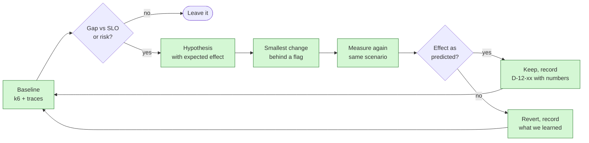

# Step 12: Hardening, performance and cost

| | |
| --- | --- |
| **Depends on** | Steps 9 and 11 (Step 10 for local load tests) |
| **Branch** | `step-12-hardening` (may be split into 12a/12b/12c PRs) |
| **PR size** | 3 small PRs, ~10 files each |
| **Prompt lesson** | Measure first: hypothesis → experiment → evidence (P7, P12) |

## Goal

Make the system hold up under load and abuse, and keep cost predictable, using
**measurements** rather than guesses. Establish a baseline with load tests,
compare it to the SLOs in [architecture §15](../architecture.md#15-initial-slos-and-budgets),
and then make only changes that a measurement justifies: rate limits, an
ACL-aware semantic cache, token and upload limits, and cost per request.

## Scope

**In**

- **12a, Baseline:** k6 load tests in `loadtests/` (chat streaming, retrieval only,
  upload), persona tokens from the test IdP, results exported as JSON +
  summary; baseline report vs SLOs in `docs/perf/baseline.md`.
- **12b, Limits:** ASP.NET Core rate limiter with partitioned policies per user
  and per tenant (token bucket for chat, fixed window for uploads, concurrency
  limit for streaming connections); `429` with `Retry-After` and problem
  details; LLM `max_tokens` and context budget limits; upload size and page
  count limits; request timeouts; circuit breaker on the reranker and LLM
  (Microsoft.Extensions.Http.Resilience).
- **12c, Cache:** ACL-aware semantic answer cache with `HybridCache`
  (L1 memory, optional L2 Redis/Garnet), only if the baseline shows a benefit
  for repeated questions. Invalidation on document and ACL change.
- Cost per request recorded and reported (p50/p95), budget guard: tenant
  daily token cap with clear error.
- Final report `docs/perf/results.md`: before/after for each change.

**Out (non-goals)**

Autoscaling tuning beyond ACA defaults, multi-region, model fine-tuning,
GPU serving.

## Measure-first loop



## Cache key and safety (the dangerous part)

A semantic cache in a permission-aware system can leak: a cached answer built
from chunks user A can read must never be served to user B who cannot.

| Key component | Why |
| ------------- | --- |
| `tenantId` | Tenant isolation |
| SHA-256 of the **sorted, de-duplicated principal set** (user + groups) | Same answer only for the same effective permissions |
| `chatModel`, `promptVersion`, `retrievalConfigHash` | Different config → different answer |
| Normalised question (exact) or embedding neighbourhood (semantic) | Matching strategy |
| `corpusVersion` per tenant (incremented on any document or ACL change) | Invalidation without scanning |

Rules:

- Before serving a cached answer, **re-run the ACL freshness check** (Step 4)
  on its cited chunk ids. If any is no longer readable, treat it as a miss.
- Only cache answers with all citations valid and no tool calls requiring approval.
- Cache hits are marked in the trace (`kc.cache.hit`) and the stream is
  replayed with the same parts, so the UI behaves the same way.
- Eval suite runs with the cache **on**, and the ACL canary tests must still
  pass with zero leaks.

## Limits table (initial values; tune from measurements)

| Limit | Initial value | Response |
| ----- | ------------- | -------- |
| Chat requests per user | 20 / min (token bucket, burst 5) | 429 + Retry-After |
| Chat requests per tenant | 200 / min | 429 |
| Concurrent streams per user | 2 | 429 |
| Uploads per user | 10 / hour | 429 |
| Upload size / pages | 20 MB / 300 pages | 413 / 422 problem details |
| Max output tokens | 1,024 | truncated with finish reason |
| Context budget | 6,000 tokens of chunks | lowest-ranked chunks dropped, counted |
| Tenant daily tokens (Azure) | parameter, e.g. 200k | 429 with `budget_exceeded` type |

## Planned files

```text
loadtests/{chat-stream.js, retrieve.js, upload.js, lib/auth.js, README.md}
src/KnowledgeCopilot.Api/RateLimiting/*.cs
src/KnowledgeCopilot.Application/Chat/Limits/*.cs
src/KnowledgeCopilot.Application/Caching/{AnswerCache, CacheKey, CorpusVersion}.cs
src/KnowledgeCopilot.Infrastructure/Resilience/*.cs
tests/**/{RateLimitTests, CacheKeyTests, CacheAclTests, LimitsTests}.cs
docs/perf/{baseline.md, results.md}
```

## Design notes and pitfalls

- **k6 and SSE.** k6 has no built-in SSE client. Measure TTFT with a
  streaming HTTP response and timing the first `text-delta`, or use the
  `xk6-sse` extension. Verify which works with the current k6 and record
  it.
- **Load-test the right thing.** Locally the LLM dominates; isolate
  retrieval with the retrieve-only scenario (use the debug endpoint or a
  flag), and use a fake LLM to test the api's own overhead.
- **Partitioned limiter keys** come from validated claims, never from headers
  the client can set.
- **Cache hit rates** for enterprise Q&A are often low; the cache must earn
  its place in the measurements or be left off (feature flag default off).
- **Azure costs during load tests.** Load tests against Azure cost money;
  require an explicit parameter and keep VUs small.
- **Resilience pipelines vs streaming.** Retries can't happen after the first
  byte has been streamed; retry only before the stream starts.

## The build prompt (12a: baseline)

Hardening is three PRs. The first prompt only measures; later prompts depend
on its numbers.

```text
# Role and context
You are a senior .NET performance engineer working on knowledge-copilot-dotnet
(permission-aware RAG copilot; .NET 10 + Aspire 13; Next.js 16; Python evals).
Learning project held to production standards.
This is STEP 12a: establish a performance baseline. You are measuring, not optimising. Do not
change application code in this PR except what is needed to measure (and say why).

# Read first (these override your assumptions)
- .github/copilot-instructions.md
- docs/architecture.md sections 12 and 15 (SLOs)
- docs/steps/step-12-hardening.md: measure-first loop, limits table, cache safety section.
- docs/observability.md (span and metric names from Step 9).
- Current k6 docs, including options for streaming responses / SSE.

# Current state
Steps 0-11 merged. Telemetry has kc.chat.ttft and kc.retrieval.duration. Compose and Azure
deployments work. No load tests exist.

# Task
1. loadtests/ with k6 scripts:
   - chat-stream.js: persona login (token from the test IdP), POST /api/v1/chat with questions from
     evals/datasets (fixed seed), measure TTFT (time to first text-delta) and total time, check the
     stream ends with [DONE] and has at least one source-document.
   - retrieve.js: retrieval only (debug endpoint, Development/test only), measure latency.
   - upload.js: upload small Markdown documents and poll until indexed; measure end-to-end time.
   Scenarios: smoke (1 VU), baseline (5 VUs, 5 min), stress (ramp to failure), all parameterised.
2. Verify how to measure SSE TTFT with current k6 (built-in streaming or xk6-sse). If neither
   works reliably, measure TTFT from the server metric kc.chat.ttft instead and say so.
3. Run smoke and baseline against compose (Free). Do NOT run against Azure; write the command and
   the cost warning for a human to run.
4. docs/perf/baseline.md: machine spec, models, corpus size, scenario, results table (p50/p95/p99
   TTFT, retrieval, total, error rate, throughput) next to the SLOs, plus the three slowest traces
   with their slowest span. End with a ranked list of gaps vs SLOs and hypotheses for each, with
   the expected effect and how to measure it.

# Constraints
- No optimisation in this PR. Any code change must be needed for measurement.
- Fixed seeds and recorded versions so runs are comparable.
- Personas and tokens from the test IdP only; no auth bypass.
- Do not run load against Azure.

# Non-goals
- Rate limits, cache, resilience changes (12b, 12c).

# Acceptance criteria
- `make loadtest-smoke` passes locally against compose.
- baseline.md contains real numbers from your runs and a ranked gap list with hypotheses.

# Process
Plan first: scenarios, how TTFT will be measured, what you will run. Wait for approval.
PR "Step 12a: Performance baseline".

# Report
Results table, the hypotheses, how you measured TTFT and why, deviations, open questions.
```

## The build prompt (12b/12c: one change per hypothesis)

```text
# Role and context
Same project and role as 12a. This is STEP 12{b|c}. Work only on hypothesis H{n} from
docs/perf/baseline.md: "{hypothesis text}", expected effect: "{expected effect}".

# Read first
- docs/perf/baseline.md, docs/steps/step-12-hardening.md (limits table and cache safety rules),
  docs/architecture.md section 11 (security).

# Task
1. Implement the smallest change that tests H{n}, behind a feature flag (default off until the
   measurement justifies it).
2. Tests for correctness. For the cache: CacheAclTests prove that a user with a different
   principal set never receives another user's cached answer, that an ACL change invalidates, and
   that the freshness check runs on cache hits. For limits: partition keys come from validated
   claims; 429 includes Retry-After and problem details.
3. Re-run the same k6 scenario with the flag off and on, same seed and machine.
4. Append to docs/perf/results.md: hypothesis, change, before/after numbers, verdict.
5. If the effect is not what H{n} predicted, revert the code, keep the measurement, and record
   what we learned.

# Constraints
- One hypothesis per PR. No unrelated optimisations.
- The eval suite (including ACL canaries, with the cache on) must still pass with zero leaks.
- Retries only before the first streamed byte.

# Acceptance criteria
- Tests pass; results.md has before/after numbers; D-12-xx records the decision with numbers.

# Process
Plan first, including the exact measurement you will compare. Wait for approval.
```

## Why this is a good prompt

| Prompt section | Principle | Why it helps |
| --- | --- | --- |
| "You are measuring, not optimising" | P5, P12 | Stops the agent from making speculative changes, which is its natural tendency. |
| Hypotheses with expected effect | P7 | Turns "make it faster" into something that can be proven wrong. |
| One hypothesis per PR, behind a flag | P11 | Small, attributable, reversible changes. |
| "Revert if not as predicted, keep the measurement" | P7, P12 | Makes negative results first-class. |
| CacheAclTests named explicitly | P10 | Caching is the most likely way to break permissions; the test is required. |
| "Do not run load against Azure" | P8 | Cost guardrail. |
| Templated 12b/12c prompt with `{placeholders}` | P2, P12 | Reusable follow-up shape, fed by the baseline report instead of pasted context. |

## Follow-up prompts

**Review (cache):**

```text
Review the answer cache for permission leaks. For every path that returns a cached answer, show
how the key includes tenant and the principal-set hash, where the freshness check runs, and how
ACL changes invalidate. Try to construct a sequence of requests where user B sees an answer built
from a chunk only user A can read. If you can, write it as a failing test.
```

**Explain:**

```text
Using docs/perf/results.md, explain to me which change helped most and why, in terms of the
traces. Then three interview questions on RAG performance and cost, with model answers.
```

## Human review checklist

- [ ] Baseline numbers are real (check k6 output files) and reproducible.
- [ ] Every kept change has before/after numbers.
- [ ] Cache: key includes principal-set hash; freshness check on hits; canaries pass with cache on.
- [ ] Limiter partitions from claims, not headers.
- [ ] No load test against Azure without a human decision.

## How to verify

```powershell
make compose-up
make loadtest-smoke
k6 run loadtests\chat-stream.js -e SCENARIO=baseline -e BASE_URL=http://localhost:3000
make evals PROFILE=free CACHE=on
```

## Interview talking points

- How to load test LLM streaming endpoints; TTFT vs throughput.
- Rate limiting by user and tenant in ASP.NET Core.
- Why semantic caches are risky in permission-aware RAG and how to make them safe.
- Cost controls: token budgets, max tokens, context budgets, and measuring cost per answer.

## Prompt lesson: measure first

Agents optimise eagerly and confidently. Split the work: one prompt that
only measures and writes hypotheses, then one prompt per hypothesis with an
expected effect, a flag and a before/after comparison. The baseline report
becomes the input to the next prompts, so each follow-up (P12) is driven by evidence.
